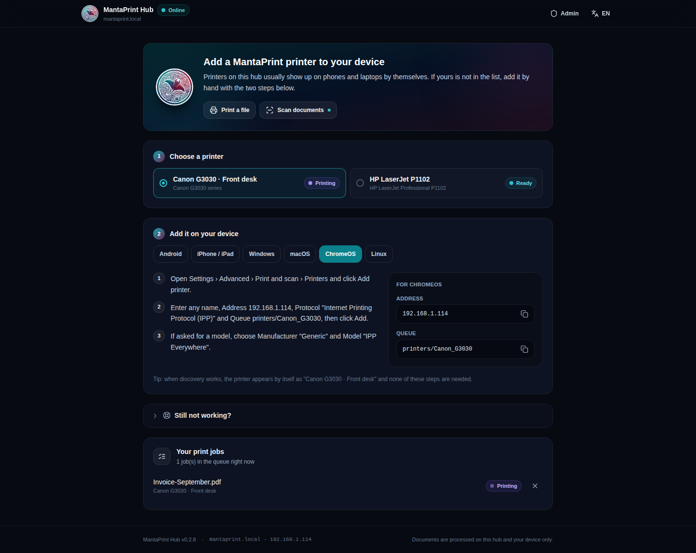
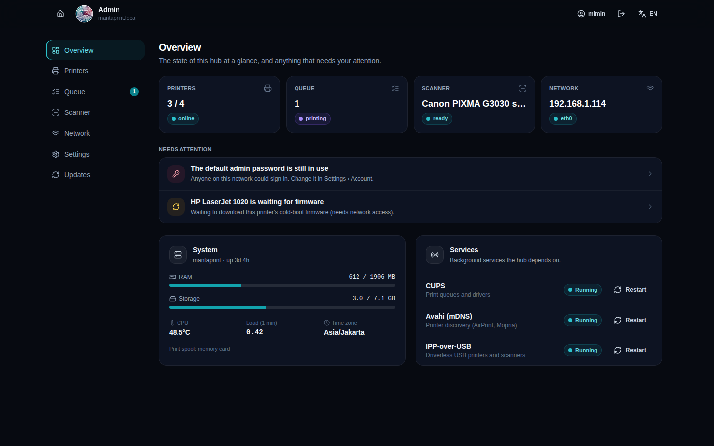
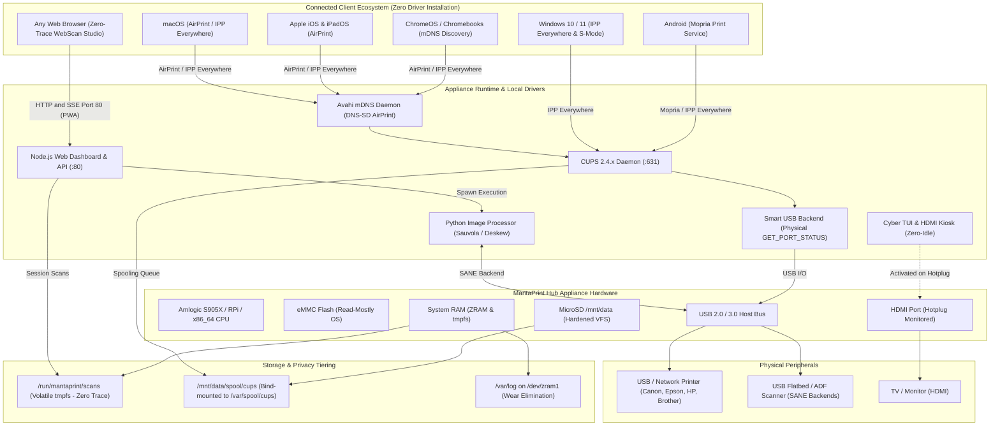

<p align="center">
  
</p>

<h1 align="center">MantaPrint Hub <sup>PROTOTYPE</sup></h1>

<p align="center">
  <strong>Universal Multi-Device USB-to-Wireless Print & Scan Hub</strong><br>
  Turns a TV Box/STB, Single-Board Computer, or Mini PC into an AirPrint/Mopria print server (experimental prototype). Revives legacy non-networked USB printers with concurrent multi-device spooling, Zero-Trace ephemeral WebScan Studio, and Cyber TUI.
</p>

<p align="center">
  <a href="https://github.com/mantaplex/mantaprint-prototype/releases"></a>
  <a href="SECURITY.md"></a>
  <a href="LICENSE"></a>
  
  
  
  
</p>

---

> [!CAUTION]
> ## ⚠️ This is a prototype. Use it at your own risk.
>
> MantaPrint (Hub, Scan Studio, Scanner PWA and MantaPool) is **experimental software with known,
> unfixed security weaknesses**. It has not been hardened, audited or penetration-tested.
>
> - Everything is served over **plain HTTP**: logins, admin tokens and scanned documents are unencrypted on the network.
> - Every install ships with the **same default admin password** until you change it.
> - **MantaPool** has incomplete authentication, signs in to hubs with default passwords and passes admin tokens in URLs.
> - **Updates are not signed**, and the installer runs the third-party NodeSource setup script without verification.
>
> **Do not use it** for personal or sensitive data (ID cards, bank, health or customer records), in
> production, financial or other regulated environments, or on networks reachable from the internet.
> If you try it, use an isolated lab network and change the default passwords immediately.
>
> Full list and mitigations: **[docs/KNOWN-LIMITATIONS.md](docs/KNOWN-LIMITATIONS.md)** · Reporting: **[SECURITY.md](SECURITY.md)**.
> Provided "AS IS", without warranty of any kind ([MIT License](LICENSE)).

---

## 📑 Table of Contents

- [⚠️ Prototype Status & Known Limitations](docs/KNOWN-LIMITATIONS.md)
- [Overview & Philosophy](#-overview--philosophy)
- [The Universal Driverless Bridge for Restricted OS](#-the-universal-driverless-bridge-for-restricted-os)
- [Key Features](#-key-features)
  - [1. Universal Multi-OS Driverless Printing & Multi-Device Hub](#1-universal-multi-os-driverless-printing--multi-device-hub)
  - [2. MantaPageScan Studio (`/scan`)](#2-mantapagescan-studio-scan)
  - [3. Zero-Trace Privacy Architecture](#3-zero-trace-privacy-architecture)
  - [4. Storage Tiering & Anti-Tampering VFS](#4-storage-tiering--anti-tampering-vfs)
  - [5. Modern Cyber TUI Console on HDMI](#5-modern-cyber-tui-console-on-hdmi)
  - [6. Multilingual Engine (English & Indonesian)](#6-multilingual-engine-english--indonesian)
  - [7. Simple Homepage & Admin Console](#7-simple-homepage--admin-console)
  - [8. MantaPageScan: Autonomous Scanner Studio & Offline PWA](#8-mantapagescan-autonomous-scanner-studio--offline-pwa)
  - [9. MantaPool Console: Centralized Multi-Hub Fleet Orchestration](#9-mantapool-console-centralized-multi-hub-fleet-orchestration)
  - [10. Hardware Concurrency Mutex & Multi-Client Lock](#10-hardware-concurrency-mutex--multi-client-lock)
- [Supported Printers & Scanners](#-supported-printers--scanners)
- [System Architecture](#-system-architecture)
- [Supported Hardware & Form Factors Matrix](#-supported-hardware--form-factors-matrix)
- [Quickstart & Installation](#-quickstart--installation)
- [Default Ports & Credentials](#-default-ports--credentials)
- [REST API Reference](#-rest-api-reference)
- [Developer CLI Tooling](#-developer-cli-tooling)
- [Contributing & Testing](#-contributing--testing)
- [License & Credits](#-license--credits)

---

## 💡 Overview & Philosophy

Modern printing and scanning in office environments, copy shops, schools, and homes remains plagued by driver incompatibilities, closed manufacturer ecosystems, privacy risks from stored customer copies, and the cost of dedicated print servers.

**MantaPrint Hub** is a turnkey, open-source Linux appliance that breathes new life into low-cost Single Board Computers (Amlogic S905X TV boxes, Raspberry Pi 3/4/5, repurposed x86 thin clients, or Intel/AMD Mini PCs). It bridges the gap between legacy USB printers/scanners and modern client devices:

- **Legacy USB Printer Revival**: Millions of rock-solid desktop printers (HP LaserJet 1020/P1102, Canon LBP2900/LBP6030, Epson L-series, Brother, and POS receipt printers) lack built-in Ethernet or Wi-Fi. MantaPrint Hub transforms these "dumb" USB-only printers into modern, wireless network-accessible printers without requiring expensive hardware replacements.
- **Concurrent Multi-Device USB Hub**: Run multiple USB printers and scanners concurrently from a single hub! Whether connected to onboard USB ports or an external powered USB hub, MantaPrint automatically provisions independent, non-blocking CUPS queues and Avahi mDNS broadcasts for each device. Print receipts to a thermal printer while concurrently sending high-volume documents to a laser printer.
- **Zero-Driver Requirement**: iOS, macOS, Android, Windows, and ChromeOS devices discover printers natively via Apple AirPrint and Mopria/IPP Everywhere. No app or CD installer needed.
- **Zero-Trace Privacy Commitment**: Every scanned document resides strictly in volatile RAM (`tmpfs`), auto-shredding on completion. Customer data never touches persistent flash memory.
- **Zero-Maintenance Longevity**: Storage tiering protects internal eMMC flash from wear by redirecting spools to MicroSD and logs to compressed ZRAM.
- **Zero-Idle Efficiency**: HDMI display compositors and TUI utilities run only when physical displays are connected, idling at 0.0% CPU and 0 MB RAM when detached.

---

## 🌐 The Universal Driverless Bridge for Restricted OS

> [!IMPORTANT]
> ### 🎯 Breaking the "Driver Barrier" on ChromeOS, Mobile & Locked Enterprise Systems
> **MantaPrint Hub is intentionally designed for operating systems that lack the ability or permission to install proprietary drivers at the OS level:**
>
> 1. **ChromeOS / Chromebooks**: Chromebooks dominate education and light enterprise setups, yet they cannot run proprietary Linux `.deb`/`.rpm`, Windows `.exe`, or macOS `.pkg` installer files. Hardware like Canon CAPT (LBP6030/LBP2900) or host-based HP lasers normally cannot function on ChromeOS at all.
> 2. **Apple iOS, iPadOS & Android**: Sandboxed mobile devices have locked filesystems with zero native driver installation support.
> 3. **Windows 10/11 in S-Mode & Corporate-Locked Laptops**: Enterprise IT policies, Active Directory Group Policies, or Windows S-Mode strictly forbid users from executing setup executables or modifying print spooler drivers.
> 4. **Cloud-First & Thin Client Deployments**: Modern thin clients with immutable, read-only root filesystems cannot maintain persistent local driver packages.
>
> #### 🌉 The Appliance Bridge Architecture
> ```
> ┌────────────────────────────────────────────────────────┐
> │   Driver-Restricted Clients (ChromeOS, iOS, Android)   │
> └──────────────────────────┬─────────────────────────────┘
>                            │ Native AirPrint / Mopria / IPP
>                            ▼
> ┌────────────────────────────────────────────────────────┐
> │                   MantaPrint Hub                       │
> │  - Executes proprietary drivers locally (CAPT, HPLIP)  │
> │  - Translates USB/IPP commands & manages print queues  │
> │  - Streams zero-trace scans via WebScan Studio PWA     │
> └──────────────────────────┬─────────────────────────────┘
>                            │ Raw USB 2.0 / IPP-over-USB
>                            ▼
> ┌────────────────────────────────────────────────────────┐
> │    Physical USB Hardware (Canon, Epson, HP, Brother)   │
> └────────────────────────────────────────────────────────┘
> ```
> **The Outcome**: Any Chromebook, iPad, Android phone, or locked Windows terminal detects printers and scanners **instantly, natively, and 100% driverless** over the local network.

---

## 🚀 Key Features

### 1. Universal Multi-OS Driverless Printing & Multi-Device Hub
* **Multi-Device USB Print Hub Architecture**:
  - **Turn Any Legacy USB Printer Wireless**: Revives older printers lacking Wi-Fi or Ethernet interfaces into modern, AirPrint/Mopria-capable networked devices.
  - **Concurrent Multi-Device Support**: Connect multiple USB printers and scanners concurrently to a single hub using onboard USB ports or powered USB 2.0/3.0 hubs.
  - **Independent Queue Isolation**: Automatically provisions dedicated, non-blocking CUPS queues (e.g., `Canon-LBP2900`, `Epson-L3110`, `Xprinter-XP58`) with independent Avahi mDNS broadcasts.
  - **Parallel Job Spooling**: High-volume laser printing or slow color photo jobs run concurrently without stalling fast thermal receipt printing on separate queues.
* **Native AirPrint & Mopria**: Immediate broadcast via Avahi mDNS with automated URF raster attribute synthesis. Works seamlessly with Apple iOS, macOS, Android, ChromeOS, and Linux.
* **Windows IPP Everywhere**: Automatically discovered as an IPP network printer on Windows 10/11 without requiring vendor-specific executable packages.
* **Smart CUPS USB Backend Wrapper (`mantaprint_smart_usb.c`)**:
  - Replaces default CUPS USB backend with a high-speed C wrapper (`<72 KB`, `<3 MB` RSS).
  - **Pre-flight Hardware Status Check**: Interrogates the printer via USB Control Transfer `GET_PORT_STATUS` (`0xA1, 1`). If the paper tray is empty, emits `STATE: +media-empty-warning` to pause spooling before a mechanical timeout occurs.
  - **Real-Time In-Flight Tracking**: Polls hardware status at 4 Hz during paper transit. Detects mid-job paper jams (`media-jam-error`) and reports them live via IPP RFC 8011.
  - **Physical Completion Guarantee**: Prevents prematurely marking print jobs as "Done" while pages are still physically traveling through the fuser rollers.
* **Dynamic Driver Resolver (`printer_manager.py`)**: Automatically matches IEEE 1284 device IDs across IPP Everywhere, Gutenprint, ESC/P-R, Canon CAPT, HPLIP, foo2zjs, and brlaser.
* **Hyphenated DNS-SD Naming**: Prevents mDNS printer name truncation on Windows and Android by enforcing standard hyphenated hostname identifiers (e.g. `Canon-LBP6030-192-168-1-114`).
* **Dynamic Netlink IP Watcher**: Listens directly to Linux kernel Netlink routing sockets to instantly republish mDNS records when DHCP renews or network cables swap.

### 2. MantaPageScan Studio (`/scan`)
Local-first scan and document workbench (React 18, Vite, Tailwind CSS). Pages are acquired from the hub scanner and then **processed and stored on the client device** (ChromeOS, desktop or phone); the hub keeps nothing. Screenshots and the full design are in [`docs/10-mantapagescan-studio.md`](docs/10-mantapagescan-studio.md).
* **Document library on the device**: every document (pages, order, edits) lives in the browser's IndexedDB with `navigator.storage.persist()`, so a job can be closed and picked up again later. Rename, pin, duplicate, delete, search, storage meter.
* **Workbench**: pages rail with multi-select, drag-and-drop reorder, bulk rotate/delete; zoomable stage (Ctrl+wheel, pinch, drag-to-pan); bottom tool dock with trays (Scan, Import, Enhance, Crop, Rotate, ID 2-in-1, Export, Print); undo/redo; autosave; keyboard shortcuts.
* **Non-destructive edits**: rotation, straighten (auto-deskew, <15ms projection profile), crop with handles, paper whitening, contrast/brightness and filter modes (clean, black & white, grayscale, text + stamps, vivid) are stored as parameters and rendered on export in a Web Worker.
* **Sauvola binarization, illumination whitening and dual-layer stamp preservation** run entirely in JavaScript on the client.
* **KTP / ID card 2-in-1**: mark front and back, cards are detected (CR80 ratio), cropped, tone-mapped and composed onto a white A4 sheet.
* **Export**: PDF (pdf-lib, fit-to-paper or true scan size), JPG/PNG (ZIP for several pages) and multi-page **TIFF (LZW, client-side encoder)**; saved through the File System Access API on Chromium or downloaded elsewhere. **Print** sends a PDF straight to the hub queue.
* Server-side processing endpoints (`/api/scanner/enhance`, `merge`, `ktp2in1`, `blank-detect`, `session-status`, `wipe-session`) are **deprecated** and answer with `Deprecation`/`Sunset` headers.

### 3. Zero-Trace Privacy Architecture
> [!NOTE]
> "Zero-Trace" describes how scans are **stored on the hub** (RAM only). Scans still travel to the browser over unencrypted HTTP and Scan Studio keeps documents unencrypted in the browser's storage. See [known limitations](docs/KNOWN-LIMITATIONS.md#2-scan-studio--scanner-pwa).

* **100% Volatile RAM Storage**: All scanner operations pipe directly to a volatile `tmpfs` RAM mount (`/run/mantaprint/scans`). Under no circumstances do customer documents touch eMMC or MicroSD flash memory.
* **5-Minute Auto-Shred Lifecycle**: Inactive scan sessions are purged automatically after 5 minutes of idle time.
* **Auto-Wipe on Download**: Endpoints support `?wipe=true` or the `X-Auto-Wipe: true` header to instantly shred files (`fs.unlinkSync`) the moment the download HTTP response stream terminates.
* **Anti-Symlink Traversal Shield**: Strictly verifies canonical paths and unlinks malicious symlinks on external storage, neutralizing directory traversal attacks.

### 4. Storage Tiering & Anti-Tampering VFS
* **eMMC Read-Mostly Wear Shield**: OS root, application binaries, and system libraries reside on internal eMMC flash (`/dev/mmcblk1p2`), completely shielded from continuous spooling cycles.
* **Hardened MicroSD Offload (`/mnt/data`)**: High-churn data (CUPS print spools, agent updates, and backups) writes to an endurance MicroSD mounted with strict kernel VFS flags:
  ```text
  rw,noexec,nosuid,nodev,noatime,nodiratime,commit=60,errors=continue
  ```
  *Any script or binary dropped by an attacker onto the writable storage partition is rejected with `EACCES (Permission denied)`.*
* **Automatic Fallback RAM-Spool**: If the MicroSD card is unplugged or corrupted, an in-memory 128MB `tmpfs` spool (`/tmp/spool`) provisions automatically to prevent service downtime.
* **ZRAM Compressed Log Tier**: System logging (`/var/log`) is mounted to a compressed ZRAM block device (`/dev/zram1`), eliminating log wear on flash chips.

### 5. Modern Cyber TUI Console on HDMI
* **Zero-Idle Display Lifecycle**: Linux kernel DRM hotplug udev rules start the graphical kiosk (`mantaprint-hdmi.service`) or terminal console (`mantaprint-tui.service`) only when an HDMI cable is inserted. When unplugged, services cleanly terminate, dropping resource consumption to **0.0% CPU and 0 MB RAM**.
* **1080p / 720p Resolution Clamping**: Displays are locked via `wlr-randr` to prevent GPU memory bus exhaustion on 4K TV sets.
* **Universal IR Remote & Keyboard FSM**: 3-tier Finite State Machine navigation allowing network setup, IP discovery, and diagnostics using either a standard TV remote (NEC / RC-5 protocols) or USB keyboard.
* **Ultra-Lightweight TUI Console**: Direct Linux virtual console interface (`/dev/tty1`) consuming merely **~28 MB RSS**, rendering real-time hardware telemetry (SoC temperature, RAM, Wi-Fi signal, and printer states).

### 6. Multilingual Engine (English & Indonesian)
* **Synchronized Bilingual Localization**: Instant language toggle between English and Indonesian (Bahasa Indonesia).
* Synced across the Web Dashboard, MantaPageScan Studio, Admin Management Console, and the Cyber TUI.

### 7. Simple Homepage & Admin Console
One web app, one design language (shared with MantaPageScan Studio). Details and screenshots: [`docs/11-hub-web-app-ui.md`](docs/11-hub-web-app-ui.md).

<p align="center">
  
  
</p>

* **Homepage (`http://<hub-ip>/`)** for devices that do not find the printers automatically (discovery blocked): pick a printer and follow the manual add-by-address steps for Android, iPhone/iPad (one-tap AirPrint profile), Windows, macOS, ChromeOS or Linux, with the exact addresses to copy. *Print a file* and *Scan documents* are buttons on the same page. Visitors only see their own print jobs — document names of other people are never shown.
* **Admin console (`http://<hub-ip>/admin`)** with seven sections: *Overview* (health and a "needs attention" list), *Printers* (share on the network, mDNS broadcast name, default, test page, add network printer), *Queue*, *Scanner* (access and paired devices), *Network*, *Settings* (hub name / mDNS hostname, language, time, admin account) and *Updates* (install from GitHub with snapshot rollback).
* Hub name and printer broadcast names are managed in the admin console only. Destructive queue actions require the admin password.

### 8. MantaPageScan: Autonomous Scanner Studio & Offline PWA (`apps/scanner-pwa`)
Autonomous, privacy-first Progressive Web App designed to connect locally and securely with MantaPrint Hub:
* **100% Client-Side In-Browser Processing**: All document image manipulation algorithms run directly inside the browser using HTML5 Canvas and pure JavaScript. Sauvola local adaptive binarization, rotation, KTP 2-in-1 layout, and multi-page PDF collation (`pdf-lib`) execute entirely on the client without sending image bytes over the internet.
* **Cryptographic 1-Time Capability Pairing**: Generates dynamic QR codes or 6-digit numeric PINs in the Admin Console (5-minute TTL). Durable HMAC-SHA256 capability tokens (`mp_tok_v1.<clientId>.<epoch>.<flags>.<hmac>`) persist in IndexedDB with `navigator.storage.persist()`, bypassing Apple Safari's 7-day ITP cache eviction.
* **3-Tiered Subnet Auto-Healing (`HubLocator`)**: Automatically discovers and reconnects to the Hub when router DHCP assigns a new IP (Stored IP -> mDNS `mantaprint.local` -> 16-worker parallel `/24` sweep in <1.2s matching constant `hub_uuid`).
* **Tell-Tale Fail-Safe Diagnostics**: Instantly transitions to diagnostic screens when credentials are revoked (`ERR_CLIENT_REVOKED`) or the Hub is offline, with full access to the offline document library.

### 9. MantaPool Console: Centralized Multi-Hub Fleet Orchestration (`apps/mantaman`)
Dedicated fleet management console for multi-hub deployments across distributed office branches and print-shops:
* **Fleet Matrix**: Real-time monitoring across hundreds of MantaPrint Hubs with live hardware vitals (CPU temp, RAM, online state, toner supplies).
* **Adoption Radar**: L2 mDNS & UDP broadcast discovery with automated subnet scanning and cryptographic mutual handshake.
* **Batch Operations**: Coordinated OTA updates and driver distribution with live terminal log streams.
* **Audit Ledger**: Immutable event trail tracking administrative actions across the fleet.

### 10. Hardware Concurrency Mutex & Multi-Client Lock
* **`ScannerHardwareLock` Engine**: Prevents simultaneous physical scanner access across multiple cashier stations or mobile devices (`LIBUSB_ERROR_BUSY`) by enforcing asynchronous mutual exclusion on SANE `scanimage` pipes.
* **Active Conflict Feedback**: Rejects overlapping requests with `HTTP 423 Locked`, providing the active holder's name and an estimated remaining duration (`Retry-After: 15`).
* **90-Second Watchdog Timer**: Automatically cleans up orphaned locks if a client connection drops abruptly or the scanning process hangs.

---

## 🖨️ Supported Printers & Scanners

MantaPrint Hub features automatic hardware provisioning via USB hotplug, instantly configuring print queues and mDNS service descriptors.

> 📖 **Full Device Matrix & Technical Details**: See [`docs/SUPPORTED_DEVICES.md`](docs/SUPPORTED_DEVICES.md) for detailed benchmarks, SANE backends, and IEEE 1284 descriptor mappings, and [`docs/12-driver-compatibility.md`](docs/12-driver-compatibility.md) for the readiness engine that verifies this at runtime instead of only asserting it here.

| Category / Family | Verified & Supported Models | Driver Stack | Capabilities | Connection | Status |
| :--- | :--- | :--- | :--- | :--- | :--- |
| **Canon PIXMA MegaTank** | **Canon G3030 series** (G3030, G3020, G3010, G2020, G2010, G1020, G1010) | IPP-over-USB + SANE `pixma`/`escl` | Print, Flatbed Scan, CMYK Ink Levels, Maintenance Box | USB / IPP-over-USB | **Hardware Verified & Benchmarked** |
| **Canon LBP Laser (UFR II LT & CAPT)** | **Canon LBP6030**, LBP6030w, LBP6230, LBP112, LBP2900, LBP3000, LBP6000 | Official UFR II LT (`rastertosfp`) & native CAPT (`rastertocapt`) + Smart USB Backend | High-speed monochrome laser, Toner status, Jam detection | USB | **Hardware Verified & Bundled** |
| **Universal Driverless IPP**| Any IPP 2.0+ compliant printer (Canon TS/TR, HP Smart Tank, Epson, Brother) | Driverless IPP Everywhere | Color/Mono Print, Supplies Telemetry, Duplex | USB / Network | **Plug-and-Play** |
| **Epson EcoTank & WorkForce**| L120, L210, L360, L3110, L3150, L3210, L3250, M1100, WF-7710 | CUPS `escpr` (ESC/P-R rasterizer) | High-resolution color inkjet, borderless, page fit | USB | **Auto-Provisioned** |
| **HP LaserJet & Smart Tank** | LaserJet 1018, 1020, P1005–P1505 (need a firmware upload every power-cycle, automated), P1102, P1102w, Pro M12a, M15a (no firmware needed), Smart Tank 500/600 | `foo2zjs` (auto-firmware via `getweb`) + `hpcups` | Host-based ZjStream & PCLm laser printing | USB | **Auto-Provisioned** |
| **Brother Laser & DCP** | HL-1110, HL-1210W, HL-L2300D, HL-L2350DW, DCP-1510, DCP-1610W | Open-source `brlaser` filter | Monochrome laser printing, Hardware Duplex | USB | **Auto-Provisioned** |
| **Office Copiers & Multifunction**| Ricoh Aficio/MP, Kyocera ECOSYS, Konica Minolta bizhub, Xerox WorkCentre | Generic PostScript / PCL 6 | High-volume network printing, Booklet, Finishing | Network / USB | **Supported** |
| **Multifunction & Flatbed Scanners**| Canon PIXMA, CanoScan LiDE (100, 110, 120, 300), Epson EcoTank/Perfection, HP MFP, Brother DCP | SANE `pixma`, `genesys`, `epson2`, `hpaio`, `brother4` | 75–2400 DPI Flatbed Scan, Deskew, Sauvola binarization, Zero-Firmware Plug & Play | USB / eSCL | **Plug-and-Play Native** |
| **High-Speed Duplex ADF Scanners**| Fujitsu ScanSnap (iX500, iX1500, S1300, S1300i, fi-6110, fi-7160), Epson DS-410, Canon DR-C225 | SANE `fujitsu`, `epjitsu`, `utsushi`, `canon_dr` | Multi-page feeder, 50-sheet duplex, Legal/F4 size, USB auto-sensing (<300ms) | USB / Network | **WebScan Studio Supported** |

---

## 🏗 System Architecture



---

## 💻 Supported Hardware & Form Factors Matrix

MantaPrint is hardware-agnostic and runs across ARM64, ARMv7, and x86_64 architectures:

| Platform / Form Factor | Target Devices | CPU / RAM Requirements | Storage Tiering | Target Use Case |
| :--- | :--- | :--- | :--- | :--- |
| **Amlogic ARM64 STB / TV Box** | S905X, S905W, S912 (HG680P, B860H) | Quad-Core Cortex-A53, 1GB–2GB RAM | eMMC (OS) + MicroSD (`/mnt/data`) | **Ultra-Low Cost (~$15–$25)** copy shops, schools, kiosks |
| **Raspberry Pi Series** | Raspberry Pi 3B+, 4B, 5 | Quad-Core ARMv8, 1GB–8GB RAM | MicroSD (`/mnt/data`) or USB SSD | Maker spaces, homelabs, standard office deployments |
| **x86_64 Thin Clients & Mini PCs** | HP T630, Dell Wyse, Intel NUC, Lenovo Tiny | Intel Celeron/Core, AMD GX, 2GB–8GB RAM | Internal SATA/NVMe + USB drive | High-volume enterprise print centers, shared copiers |
| **Rockchip / Allwinner SBCs** | Orange Pi 3/5, Banana Pi, Radxa | ARM64 Quad/Octa-Core, 1GB–4GB RAM | eMMC + MicroSD (`/mnt/data`) | Embedded OEM integrations |

---

## ⚡ Quickstart & Installation

### ⚠️ Install the prototype (at your own risk)
Read [docs/PROTOTYPE-NOTICE.txt](docs/PROTOTYPE-NOTICE.txt) first. On a fresh, **non-production** installation of **Debian (11/12/13)**, **Ubuntu (22.04/24.04)**, **Armbian**, or **Raspberry Pi OS**:

```bash
# Clone the repository
git clone https://github.com/mantaplex/mantaprint-prototype.git
cd mantaprint-prototype

# Run the appliance installer
sudo ./install.sh
```

Before it changes anything, the installer shows the prototype notice and asks you to type `y`, `yes`
or `ya` to accept the risk; any other answer exits without changes. Your acceptance is recorded in
`/etc/mantaprint/prototype-ack.json`. For unattended installs (no terminal), pass
`sudo ./install.sh --accept-prototype-risk` or set `MANTAPRINT_ACCEPT_RISK=yes`. The MantaPool
installer (`apps/mantaman/install-mantaman.sh`) works the same way.

### What `install.sh` Automatically Configures Out-of-the-Box:
1. **Host & Architecture Detection**: Auto-detects `arm64`, `x86_64`, or `armhf` and configures architecture-tailored driver binaries.
2. **Complete Driver Suite**: Installs CUPS 2.4+, SANE scanner backends, Avahi mDNS, Gutenprint, ESC/P-R (Epson), brlaser (Brother), Splix (Samsung), HPLIP, proprietary Canon UFR II LT (LBP6030, etc.), Canon CAPT (`rastertocapt`), and HP LaserJet cold-firmware (`foo2zjs getweb`).
3. **Kernel Hardening**: Automatically blacklists conflicting legacy `usblp` kernel module (`blacklist-usblp.conf`) so CUPS `libusb` maintains exclusive, crash-free bidirectional communication.
4. **Zero-eMMC Wear & RAM Privacy**: Provisions volatile RAM `tmpfs` mounts at `/run/mantaprint/scans` (256MB) and `/tmp`, plus ZRAM log and swap tiering.
5. **Appliance Service Deployment**: Compiles the native C USB monitoring backend, provisions CUPS backend delegation, and enables core systemd services (`mantaprint-web`, `mantaprint-agent`, `mantaprint-hotplug`, `mantaprint-storage-init`).
6. **Automated Instant Provisioning**: Auto-scans all currently attached USB printers, matches IEEE 1284 device IDs to genuine vendor PPDs, sets `printer-error-policy=abort-job`, and broadcasts AirPrint/Mopria DNS-SD services.
7. **Runtime Plug & Play**: Any printer or scanner plugged in at boot or hotplugged anytime later is provisioned automatically within seconds without requiring manual setup or terminal access.

---

## 🔑 Default Ports & Credentials

| Service | Protocol / Port | URL / Interface | Default Credentials | Description |
| :--- | :--- | :--- | :--- | :--- |
| **Web Dashboard** | HTTP / Port `80` | `http://<hub-ip>/` | *Public / No login required* | Customer portal, dropzone printing, live queue |
| **MantaPageScan Studio** | HTTP / Port `80` | `http://<hub-ip>/scan` (or `/scanner/`) | *Public / No login required* | Zero-Trace browser scanner & offline PWA |
| **Admin Console** | HTTP / Port `80` | `http://<hub-ip>/admin` | Username: `mantaprint`<br>Password: `mantapgan` | Wi-Fi, Ethernet, VLANs, Queues, Updates |
| **CUPS Daemon** | IPP / Port `631` | `http://<hub-ip>:631/` | System user / root | Raw CUPS print system administration |
| **MantaPool Console** | HTTP (no TLS) / Port `8443` | `http://<controller-ip>:8443/` | Username: `admin`<br>Password: `mantaprint2026!` | Fleet controller (formerly MantaMan) |
| **Setup Hotspot** | 802.11 b/g/n SoftAP | SSID: `MantaPrint-Setup` | Password: none (or configured) | Out-of-the-box Wi-Fi provisioning via AP |

> [!IMPORTANT]
> These defaults are identical on every install and all traffic is unencrypted HTTP. Change the default administrator passwords **immediately after installation** via the Web Admin Console (`/admin` -> *Infrastruktur* -> *Akun Admin & Keamanan*) or by setting environment variables `MANTAPRINT_ADMIN_USER` and `MANTAPRINT_ADMIN_PASS`.

---

## 📡 REST API Reference

The Node.js server provides a comprehensive RESTful API for integration, automation, and remote telemetry:

### Telemetry & Hardware Status
| Method | Endpoint | Auth | Description |
| :--- | :--- | :--- | :--- |
| `GET` | `/api/status` | Public | Returns system telemetry, CPU temperature, RAM usage, storage tier status, and printer ink markers. |
| `GET` | `/api/events` | Public | Real-time Server-Sent Events (SSE) stream broadcasting printer state and queue transitions. |
| `GET` | `/api/health` | Public | Fast health-check endpoint (`HTTP 200 OK`) used by watchdog monitors and updater polling. |

### Scanner Operations (Zero-Trace)
| Method | Endpoint | Auth | Description |
| :--- | :--- | :--- | :--- |
| `GET` | `/api/scanner/status` | Public | Queries SANE backend for connected USB/network scanners and capabilities. |
| `POST` | `/api/scanner/scan` | Token / Public | Initiates document scan into volatile RAM tmpfs (`/run/mantaprint/scans`). |
| `POST` | `/api/scanner/enhance` | Token / Public | Applies deskew, Sauvola binarization, background whitening, or stamp preservation. |
| `POST` | `/api/scanner/ktp2in1` | Token / Public | Merges front and back ID card scans onto a single centered A4 canvas. |
| `POST` | `/api/scanner/wipe-session`| Token / Public | Instantly shreds all temporary files associated with the active session in RAM. |
| `GET` | `/api/scanner/download/:file`| Token / Public | Downloads scan output. Pass `?wipe=true` to auto-shred immediately after download. |

### Scanner Capability Pairing & PWA Clients
| Method | Endpoint | Auth | Description |
| :--- | :--- | :--- | :--- |
| `POST` | `/api/scanner/pairing/generate` | Admin | Generates ephemeral dynamic QR payload and 6-digit PIN with a 5-minute TTL. |
| `POST` | `/api/scanner/pairing/verify` | Public | Verifies 6-digit PIN and issues signed HMAC-SHA256 capability token (`mp_tok_v1`). |
| `GET` | `/api/scanner/clients` | Admin | Lists all paired mobile and desktop clients with platform and authorization state. |
| `POST` | `/api/scanner/clients/:id/revoke` | Admin | Instantly revokes client token, blocking further scan requests with `HTTP 403`. |
| `POST` | `/api/scanner/clients/:id/reauthorize` | Admin | Restores revoked client access without requiring new QR pairing. |
| `POST` | `/api/scanner/clients/:id/rename` | Admin | Updates human-readable device nickname in paired client registry. |
| `DELETE` | `/api/scanner/clients/:id` | Admin | Permanently unlinks client registration and purges cryptographic records. |
| `GET` | `/api/scanner/config` | Public | Reads service toggles for WebScan portal (`/scan`) and Remote Scanner PWA API. |
| `POST` | `/api/scanner/config` | Admin | Updates service toggles for WebScan portal and Remote Scanner PWA API. |

### Print & Queue Management
| Method | Endpoint | Auth | Description |
| :--- | :--- | :--- | :--- |
| `POST` | `/api/print/upload` | Public | Uploads PDF/image for printing. Add `X-Wait-Job: true` for physical completion tracking. |
| `GET` | `/api/jobs` | Public | Lists active and completed print jobs with detailed state markers. |
| `GET` | `/api/jobs/:id` | Public | Retrieves live status, progress, and error conditions for a specific print job. |
| `POST` | `/api/printer/pause` | Admin | Pauses printer queue. |
| `POST` | `/api/printer/resume` | Admin | Resumes printer queue. |
| `POST` | `/api/printer/cancel-job` | Admin | Cancels specific print job by ID. |
| `POST` | `/api/printer/cancel-all` | Admin | Purges all pending and processing jobs. |
| `POST` | `/api/printer/test-page` | Admin | Synthesizes and prints the A4 MantaPrint diagnostic vector test page. |

### Multi-Printer & mDNS Broadcast Management
| Method | Endpoint | Auth | Description |
| :--- | :--- | :--- | :--- |
| `GET` | `/api/system/mdns` | Public | Retrieves Avahi mDNS hostname, domain, and per-printer broadcast alias overrides. |
| `POST` | `/api/system/mdns` | Admin | Configures appliance mDNS hostname and per-queue broadcast aliases. |
| `GET` | `/api/printers` | Public | Lists all CUPS queues with detailed classification (`active_usb`, `network`), URI, and broadcast status. |
| `POST` | `/api/printers/probe-network` | Admin | Probes network IP/port (RAW 9100 / IPP 631) for remote printer reachability. |
| `POST` | `/api/printers/add` | Admin | Creates and provisions a new network or USB CUPS printer queue. |
| `POST` | `/api/printers/update` | Admin | Modifies queue options, display name, location, or driver. |
| `DELETE/POST`| `/api/printers/:name` | Admin | Deletes an existing printer queue. |
| `POST` | `/api/printers/:name/broadcast` | Admin | Toggles mDNS Avahi AirPrint broadcast on/off for a specific queue. |
| `POST` | `/api/printers/:name/set-default`| Admin | Sets queue as system default destination. |
| `POST` | `/api/printers/:name/test-page` | Admin | Prints diagnostic test page to specific queue. |


### Appliance OTA Updates & Maintenance
| Method | Endpoint | Auth | Description |
| :--- | :--- | :--- | :--- |
| `GET` | `/api/system/version` | Public | Returns live appliance semantic version and installed component manifest. |
| `GET` | `/api/system/updates/check` | Public | Queries GitHub Releases for newer stable appliance versions. |
| `GET` | `/api/system/updates/stream` | Public | Real-time Server-Sent Events (SSE) stream for update progress and cyber terminal logs. |
| `POST` | `/api/system/updates/apply` | Admin | Triggers automated pre-update snapshot backup, asset download, and service restart. |
| `GET` | `/api/system/updates/backups` | Public | Lists available pre-update snapshots stored on endurance MicroSD (`/mnt/data/backups`). |
| `POST` | `/api/system/updates/rollback` | Admin | Restores previous appliance firmware and assets from a specified snapshot ID. |
| `POST` | `/api/system/restart-services` | Admin | Restarts core systemd daemons (`mantaprint-web`, `mantaprint-agent`, `cups`). |

### Network & Administration
| Method | Endpoint | Auth | Description |
| :--- | :--- | :--- | :--- |
| `POST` | `/api/auth/login` | Public | Authenticates administrator credentials and returns session token. |
| `GET` | `/api/network/wifi/scan` | Admin | Scans nearby 2.4 GHz and 5 GHz wireless networks. |
| `POST` | `/api/network/wifi/connect`| Admin | Connects to Wi-Fi SSID (supports WPA2/WPA3 and 802.1x Enterprise). |
| `POST` | `/api/network/ethernet/set`| Admin | Configures static IP or DHCP, DNS addresses, and optional 802.1Q tagged VLANs. |
| `POST` | `/api/system/timezone` | Admin | Updates system timezone and synchronizes NTP servers. |

---

## 🛠 Developer CLI Tooling

Local automation scripts are provided in the [`scripts/`](file:///home/dev/mantaprint/scripts) directory:

```bash
# 1. Inspect live hardware, RAM, disk endurance, and service health
./scripts/status.sh

# 2. Tail real-time service logs
./scripts/logs.sh web        # Node.js Web Server & API
./scripts/logs.sh agent      # Fleet Management Agent
./scripts/logs.sh hotplug    # USB Printer Detection & Avahi sync
./scripts/logs.sh cups       # CUPS Print Daemon
./scripts/logs.sh hdmi       # Wayland Cage & WPE WebKit Kiosk

# 3. Pull latest configuration and drivers from device (Read-only sync)
./scripts/sync-from-device.sh

# 4. Deploy changes to device with automatic remote backups
./scripts/deploy-to-device.sh web --dry-run   # Preview changes without writing
./scripts/deploy-to-device.sh all             # Full deployment (web, core, agent, systemd)
```

---

## 🧪 Contributing & Testing

We welcome community contributions! Please read our [CONTRIBUTING.md](CONTRIBUTING.md) guide before opening pull requests.

### Running Test Suites
```bash
# Run frontend React & image algorithm unit tests (12+ tests)
cd frontend
npm test

# Run Python image processing verification suite
python3 src/core/test_image_processor.py

# Run chaos and stress testing suite
python3 qa/run_full_qa.py
```

---

## 📄 License & Credits

MantaPrint Hub is open-source software licensed under the [MIT License](LICENSE).

> **Disclaimer:** MantaPrint is a prototype. It is provided "AS IS", without warranty of any kind,
> express or implied. The authors and contributors are not liable for any claim, damage, data loss,
> data leak or other liability arising from its use. You install and operate it entirely at your own
> risk. See [SECURITY.md](SECURITY.md) and [docs/KNOWN-LIMITATIONS.md](docs/KNOWN-LIMITATIONS.md).

**Authors & Maintainers:**
- **Mantaplex** – Architecture & Core Engine
- **MantaPrint Contributors** – Community enhancements, driver profiles, and translations

*Crafted with pride for high-efficiency, private, and universal printing.*
