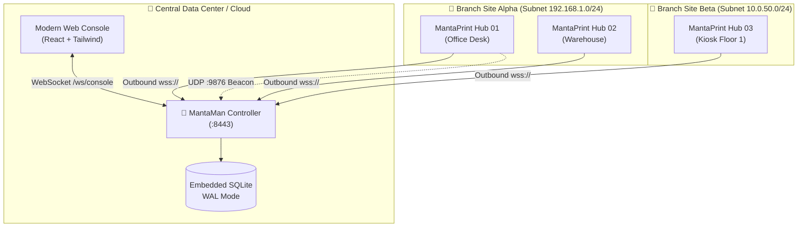

# 🌊 MantaPool Console (formerly MantaMan)

### Enterprise Fleet Orchestrator & Autonomous Adoption Console for MantaPrint Hubs

<div align="center">
  
  <p><strong>Universal Edge Print & Scan Appliance Fleet Management</strong></p>
</div>

---

> [!CAUTION]
> **PROTOTYPE - NOT FOR PRODUCTION OR SENSITIVE DATA.** MantaPool is part of the MantaPrint prototype and has known, unfixed security weaknesses. MantaPool in particular has incomplete API authentication, signs in to hubs with default passwords, passes hub admin tokens in URLs, uses a hard-coded enrollment token and an unencrypted agent channel.
> See [docs/KNOWN-LIMITATIONS.md](../../docs/KNOWN-LIMITATIONS.md) and [SECURITY.md](../../SECURITY.md). Provided "AS IS", without warranty of any kind.

> [!NOTE]
> **Ecosystem Nomenclature & Backward Compatibility**:
> As of release `v0.2.3`, **MantaMan** has been officially rebranded to **MantaPool Console** to reflect its role as the centralized coordinator and connection pool for enterprise MantaPrint Hub fleets.
> To ensure **100% backward compatibility** with existing installations, Ansible playbooks, and automation scripts:
> - The Linux system user remains `mantaman`.
> - The installation and data paths remain `/opt/mantaman` and `/var/lib/mantaman`.
> - The systemd service unit is installed as `mantapool.service` (with an automated symlink `mantaman.service -> mantapool.service`).
> - The Hub-side configuration file remains `/etc/mantaprint/console.json`.
> - Cryptographic fleet token prefixes remain `mp_flt_`.

---

## Overview

**MantaPool Console** (formerly **MantaMan**) is the centralized, enterprise-grade fleet orchestrator and management console designed specifically for distributed deployments of **MantaPrint Hub** STBs and SBCs. Built with a decoupled hybrid architecture (Fastify REST API + native WebSocket multiplexing) on port `8443` and embedded SQLite WAL persistence, MantaPool empowers enterprise administrators and IT technicians to manage, monitor, and provision hundreds of edge print appliances from a single pane of glass.

---

## Key Features

- **Autonomous L2/L3 Discovery & Zero-Touch Adoption**:
  - Automatically listens for edge hubs announcing via mDNS (`_mantaprint._tcp.local`) and Layer 2 UDP broadcast beacons (`0.0.0.0:9876`).
  - Active CIDR Subnet Sweeper (e.g., `192.168.1.0/24`) probing reachable MantaPrint appliances with bounded concurrency and sub-second detection.
  - UniFi-style 1-Click Cryptographic Adoption using ephemeral 6-digit challenge PINs displayed on the STB's HDMI kiosk or chassis.
- **Real-Time Telemetry & Health Monitoring**:
  - Persistent bidirectional WebSockets (`wss://<mantapool>:8443/ws/agent`) streaming SoC temperatures, RAM usage, storage health, CUPS daemon states, active job queues, and CMYK/Monochrome supply levels.
  - Debounced in-memory write coalescing (500ms batching) to prevent SQLite I/O bottlenecks when handling 500+ concurrent hubs.
- **Canary Rolling Rollouts & Batch Operations**:
  - Staggered firmware and OS OTA updates across enterprise sites with configurable concurrency pools.
  - Transactional printer driver and filter distribution matching `src/agent/agent.mjs` expectations (SHA-256 pre-verification, atomic staging, PPD validation, and CUPS rollbacks).
- **SQLite WAL Hardening & Atomic Snapshots**:
  - High-concurrency database writes protected by WAL mode with automated `PRAGMA wal_checkpoint(TRUNCATE)`.
  - Atomic online backups via `VACUUM INTO` and automatic purging of stale `.wal` / `.shm` files during snapshot rollback.
- **Integrated Self-Updating & Error Resilience**:
  - Built-in GitHub Releases updater (`manta-pool-updater.mjs`) supporting pre-update snapshots, atomic staging, and 1-click rollbacks.
  - Global React `ErrorBoundary` with cyber-industrial diagnostic report and defensive null safety across all dashboard components.
- **Zero-Trust Security & Cryptographic Audit Ledger**:
  - Mutual authentication using signed capability tokens (`mp_flt_<token>`) stored under strict `0o600` permissions.
  - Redaction of `auth_token_hash` from API responses to prevent accidental token exposure.
  - Strict 2MB request body ceiling preventing memory exhaustion attacks.
  - Outbound-only connectivity from Hubs (`wss://`), eliminating inbound WAN port forwarding and perimeter exposure.
  - Tamper-evident, cryptographically chained SHA-256 audit ledger meeting SOC 2 Type II and ISO/IEC 27001 requirements.
- **Multilingual from Day 1**:
  - Full first-class support for English (`en`) and Indonesian (`id`) across all views, modals, and telemetry labels.

---

## Architectural Topology



---

## Deployment & Installation

### Option 1: Standalone Linux Server (Debian / Ubuntu / Armbian)

Run the automated installer on your controller host:

```bash
sudo ./install-mantaman.sh
```

The installer automatically:
1. Validates and configures Node.js 20 LTS runtime.
2. Creates an unprivileged system user `mantaman`.
3. Provisions `/opt/mantaman` and persistent data directory `/var/lib/mantaman`.
4. Installs and launches the hardened `mantaman.service` systemd unit.

### Option 2: Docker Compose

```bash
docker-compose up -d --build
```

Access the Web Console at: `http://<server-ip>:8443`  
Default Credentials:
- **Username**: `admin`
- **Password**: `mantaprint2026!`

---

## Hard Isolation Guarantee

> [!IMPORTANT]
> MantaMan is completely decoupled from the edge MantaPrint Hub appliance. The Hub's `install.sh` exclusively provisions edge printing daemons (`/opt/mantaprint/web`, `/opt/mantaprint/agent`, `/opt/mantaprint/core`) and **will never install or configure MantaMan on Hub hardware**.

---

## Integrating a MantaPrint Hub with MantaPool Console

To configure a MantaPrint Hub to connect to MantaPool Console, provision `/etc/mantaprint/console.json` on the Hub:

```json
{
  "enabled": true,
  "server_url": "192.168.1.50:8443",
  "enrollment_token": "CORP-PROD-2026",
  "device_id": "mantaprint-c4e92a",
  "auth_token": "mp_flt_your_provisioned_token"
}
```

Then restart the edge agent service:

```bash
systemctl restart mantaprint-agent.service
```

---

## REST API Specification

### Fleet & Device Management
| Endpoint | Method | Description |
|---|---|---|
| `/api/v1/hubs` | `GET` | List all registered and discovered hubs (auth tokens redacted) |
| `/api/v1/hubs/:id` | `GET` | Retrieve detailed telemetry for a specific hub |
| `/api/v1/hubs/adopt` | `POST` | Adopt a pending hub using PIN or credentials |
| `/api/v1/hubs/:id/unadopt` | `POST` | Revoke a hub and return it to unmanaged mode |
| `/api/v1/hubs/:id/command` | `POST` | Dispatch management command (`test_print`, `restart_cups`, etc.) |
| `/api/v1/discovery/scan` | `POST` | Trigger an active CIDR subnet discovery sweep |
| `/api/v1/sites` | `GET`, `POST` | Manage enterprise site/branch groupings |
| `/api/v1/batch/tasks` | `GET`, `POST` | Queue and monitor canary batch operations |
| `/api/v1/audit/logs` | `GET` | Export cryptographically chained audit events |

### MantaPool Console System & Updates
| Endpoint | Method | Description |
|---|---|---|
| `/api/v1/system/version` | `GET` | Current MantaPool controller release and runtime versions |
| `/api/v1/system/updates/check` | `GET` | Check for updates against official GitHub Releases |
| `/api/v1/system/updates/install` | `POST` | Trigger automated update pipeline (backup -> download -> restart) |
| `/api/v1/system/updates/stream` | `GET` | Live SSE stream of update progress and terminal logs |
| `/api/v1/system/updates/backups` | `GET` | List available SQLite WAL database snapshot backups |
| `/api/v1/system/updates/rollback` | `POST` | Roll back database and assets to a specific backup snapshot |

---

## License
 
Licensed under the [MIT License](../../LICENSE).

