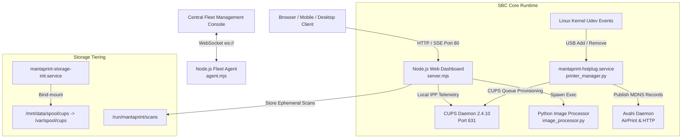

# Software Architecture & Services

## 1. Component Architecture

---

## 2. Systemd Service Breakdown

### 1. `mantaprint-web.service`
* **Unit File**: [`systemd/mantaprint-web.service`](file:///home/amri/print/systemd/mantaprint-web.service)
* **Binary / Entrypoint**: `/usr/bin/node --expose-gc --max-old-space-size=64 --max-semi-space-size=2 /opt/mantaprint/web/server/server.mjs`
* **Port**: `80`
* **Responsibilities**:
  * Real-time web dashboard & PWA interface ([`src/web/dist`](file:///home/amri/print/src/web/dist)).
  * Direct IPP-over-USB hardware telemetry (CMYK ink levels, maintenance cartridge box).
  * Server-Sent Events (SSE) stream for real-time status updates to connected clients.
  * Direct document printing (PDF, Images) with automatic fit-to-page scaling.
  * Memory governance: `--max-old-space-size=64` with systemd cgroups `MemoryHigh=150M` and `MemoryMax=200M` (tight 24MB baseline on constrained 1GB S905X STBs; 64MB ceiling for high-concurrency PDF/SSE streams).

### 2. `mantaprint-agent.service`
* **Unit File**: [`systemd/mantaprint-agent.service`](file:///home/amri/print/systemd/mantaprint-agent.service)
* **Binary / Entrypoint**: `/usr/bin/node --experimental-websocket --max-old-space-size=16 --max-semi-space-size=1 --expose-gc /opt/mantaprint/agent/agent.mjs`
* **Configuration**: [`config/console.json`](file:///home/amri/print/config/console.json) (`/etc/mantaprint/console.json`)
* **Responsibilities**:
  * Encrypted / authenticated WebSocket link to centralized fleet management consoles.
  * Device telemetry reporting (heartbeat, load, printer statuses).
  * Autonomous execution of remote administrative commands and fleet firmware updates.
  * Memory boundary: `MemoryMax=25M`, `Nice=5`.

### 3. `mantaprint-hotplug.service`
* **Unit File**: [`systemd/mantaprint-hotplug.service`](file:///home/amri/print/systemd/mantaprint-hotplug.service)
* **Trigger**: [`udev/99-mantaprint-hotplug.rules`](file:///home/amri/print/udev/99-mantaprint-hotplug.rules) (USB Printer class 0x07 / usblp)
* **Binary / Entrypoint**: `/usr/bin/python3 -c "import sys; sys.path.insert(0, '/opt/mantaprint'); import printer_manager; printer_manager.sync_all_printers()"`
* **Responsibilities**:
  * Zero-delay USB printer auto-detection.
  * Automatic driver resolution (Gutenprint, ESC/P-R, foo2zjs, brlaser, HPLIP, CAPT, generic).
  * Automatic CUPS queue creation and mDNS / Avahi publication for Apple AirPrint & ChromeOS.

### 4. `mantaprint-storage-init.service`
* **Unit File**: [`systemd/mantaprint-storage-init.service`](file:///home/amri/print/systemd/mantaprint-storage-init.service)
* **Script**: [`systemd/mantaprint-storage-init.sh`](file:///home/amri/print/systemd/mantaprint-storage-init.sh)
* **Responsibilities**:
  * Initializes storage media (`/dev/mmcblk0` or fallback storage devices).
  * Auto-partitions and formats storage if unformatted.
  * Mounts `/mnt/data` and bind-mounts `/mnt/data/spool/cups` to `/var/spool/cups`.

### 5. `mantaprint-tui.service` (HDMI Cyber Console)
* **Unit File**: [`systemd/mantaprint-tui.service`](file:///home/amri/print/systemd/mantaprint-tui.service)
* **Entrypoint**: `/usr/bin/node /opt/mantaprint/tui/app.mjs`
* **Responsibilities**:
  * Renders a lightweight, high-refresh terminal UI directly on TTY1/HDMI out.
  * Displays real-time device telemetry, IP addresses, QR code setup, Wi-Fi scanner, and queue status.
  * Multilingual synchronization reacting to administrative language toggles.
