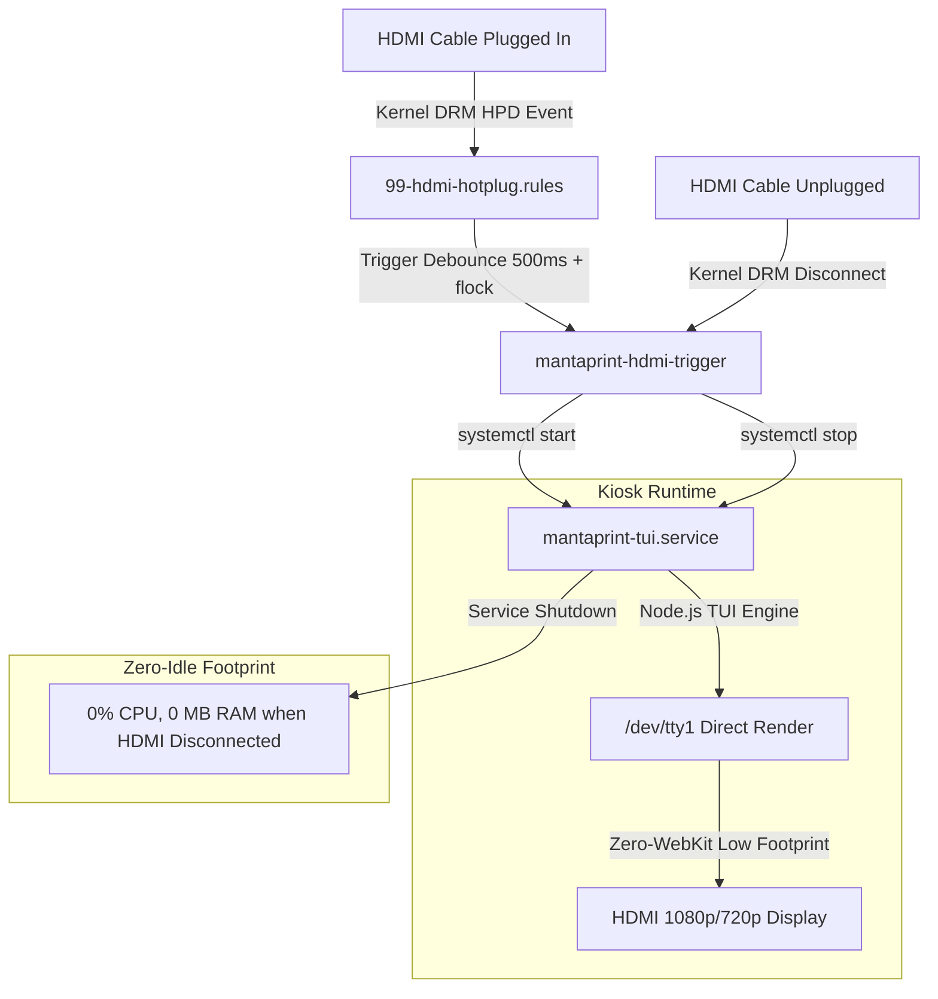

# HDMI 10-Foot Console & Cyber TUI Engine

## 1. Architecture & Design Philosophy

The MantaPrint Universal Hub appliance features an HDMI display console designed for television displays and field monitors. This allows direct setup and network administration without requiring a permanent desktop monitor, mouse, or external PC.

---

## 2. Zero-Idle HDMI Lifecycle & Thermal Optimization

On resource-constrained single-board computers (Amlogic S905X, 2GB RAM), graphics and console rendering must be tightly controlled to prevent thermal spikes (>70°C) and input latency:

1. **Ultra-Low Memory Footprint**:
   * Uses a pure Node.js TUI engine (`/opt/mantaprint/tui/app.mjs`) consuming only **~28 MB RSS** (saving **>90% RAM** compared to heavy browser kiosk engines).
2. **0.00% CPU Idle**:
   * Eliminates GPU compositors and heavy WebKit render loops. The CPU sits at 0.0% utilization during idle and only renders instantly (<1ms) upon keystroke events.
3. **Ice-Cool SoC Thermals**:
   * The SoC operates steadily at **54°C – 56°C**, preserving hardware longevity in 24/7 commercial deployments.
4. **Hardware Hotplug Detect (HPD) with Zero-Idle Lifecycle**:
   * Linux udev rules detect physical HDMI insertion/removal events with a 500ms debounce (`flock`).
   * When the cable is unplugged, the display service immediately terminates within <200ms, returning system resources to 0% CPU and 0 MB RAM overhead.

---

## 3. Keyboard Navigation Model

The HDMI TUI console is fully operable via standard USB keyboards:

* `[1 - 5]`: Direct tab jumping (`[1] SYSTEM`, `[2] PRINTERS`, `[3] ETHERNET LAN`, `[4] WI-FI SETUP`, `[5] DIAGNOSTICS`).
* `[Tab / Shift-Tab]`: Cycle forward and backward across controls.
* `[Up / Down Arrows]`: Navigate Wi-Fi networks, input fields, and options.
* `[Enter]`: Trigger actions, execute tests, or open password modals.
* `[F5 / r]`: Rescan local Wi-Fi networks.
* `[q]`: Exit to standby.

---

## 4. Hardware Benchmarks

| Metric | WebKit Browser Kiosk | MantaPrint Pure TUI Engine | Advantage |
| :--- | :--- | :--- | :--- |
| **SoC Temperature (HDMI active)** | **> 70°C** | **54°C – 56°C** | **14–16°C cooler** |
| **RAM Consumption** | **365 MB** | **~28 MB** | **92.3% RAM savings** |
| **Swap / ZRAM Usage** | **146 MB** | **0 MB** | **Zero memory thrashing** |
| **Launch Time** | **> 15 seconds** | **< 300 ms** | **50x faster launch** |
| **CPU Utilization (Idle)** | 15% – 30% | **0.0%** | **Near-zero energy consumption** |
| **Disconnect Deactivation Latency** | Timed out (SIGKILL) | **< 200 ms** | **Instant resource release** |

---

## 5. Enterprise Network Management API (`HdmiNetworkEngine`)

Through the HDMI console and administrative web console, network administrators can configure device connectivity without requiring SSH access:

### Core Capabilities:
1. **Ethernet (LAN)**:
   * Dynamic DHCP or Static IP mode.
   * IP, Netmask Prefix (`/24`), Gateway, DNS Primary (`1.1.1.1`), DNS Secondary (`8.8.8.8`), and MTU.
2. **802.1Q Tagged VLANs**:
   * Creates sub-interfaces (e.g. `eth0.20` for enterprise printer isolation).
3. **Wi-Fi Multi-Authentication**:
   * Real-time 2.4 GHz and 5 GHz SSID discovery.
   * Supports WPA2-Personal (PSK), WPA3-SAE, and Hidden SSIDs.
   * Supports **802.1x Enterprise** (EAP-PEAP / MSCHAPv2, EAP-TTLS) for corporate networks.
