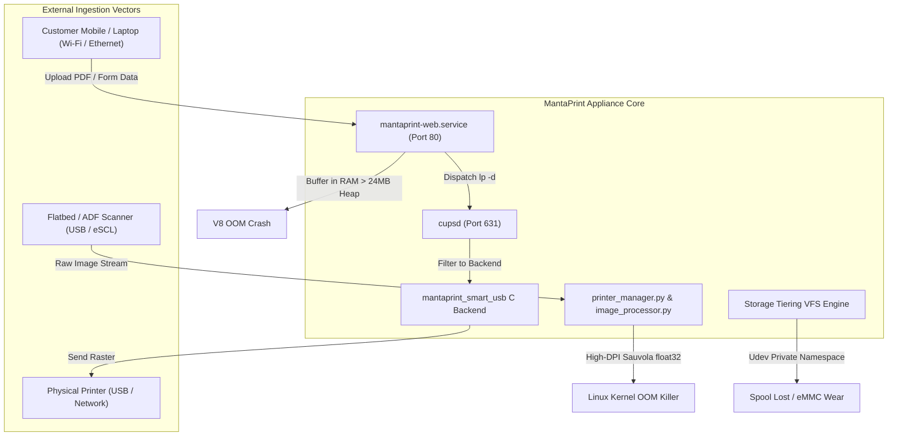
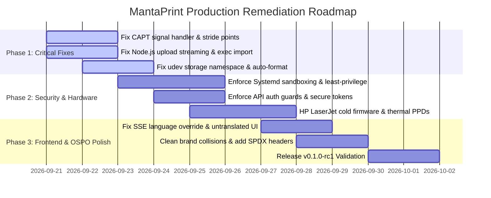

# MantaPrint Hub: Comprehensive Codebase Audit, Architecture Teardown & Quality Engineering Report

**Audit Target:** MantaPrint Universal Linux Wireless Print & Scan Appliance Engine  
**Repository:** `https://github.com/mantaplex/mantaprint` (v0.0.1, commit `4ecae30`)  
**Target Hardware:** Armbian Linux Amlogic Meson S905X ARM64 (1GB–2GB RAM) & Raspberry Pi 5 Sandbox  
**Audit Team:** Multi-Agent Specialist Swarm (Embedded Systems, CUPS/SANE Drivers, Node.js V8 Architect, Hardware QA/QC, Security & Compliance, UI/UX Workflows, OSPO & Editorial)  
**Date:** September 20, 2026  
**Status:** **ACTIVE DEFECT CATALOG & REMEDIATION BLUEPRINT**

---

## 1. Executive Summary & Appliance Health Scorecard

A full-spectrum architectural dissection and defect teardown of the MantaPrint appliance codebase was conducted. The audit analyzed physical driver binaries, kernel VFS parameters, systemd isolation boundaries, Node.js V8 heap allocations, CUPS raster processing, SANE scanning buffers, React component state trees, and internationalization catalogs.

While MantaPrint demonstrates exceptional domain engineering—unifying driverless IPP/AirPrint, modern web-based ScanStudio with computer vision algorithms, and embedded kiosk workflows—the current release contains **critical architecture flaws, memory exhaustion hazards, silent data corruption, and security exposures** that will cause failure in real-world deployment.

```
+-----------------------------------------------------------------------------------------+
|                                 MANTAPRINT HEALTH SCORECARD                              |
+------------------------------+--------+---------+---------------------------------------+
| Domain                       | Status | Score   | Primary Hazard / Bottleneck           |
+------------------------------+--------+---------+---------------------------------------+
| 1. Embedded Linux & Storage  | FAIL   | 38/100  | Udev mount namespace isolation leaks; |
|                              |        |         | destructive auto-wipe of USB drives   |
| 2. CUPS Engine & Driver C    | FAIL   | 32/100  | Signal handler instant-exit bug;      |
|                              |        |         | stride point mismatch; queue disables |
| 3. Node.js V8 & Server       | FAIL   | 45/100  | 25MB RAM upload buffering in 24MB VM; |
|                              |        |         | ReferenceError: exec is not defined   |
| 4. Hardware Driver QA/QC     | WARN   | 52/100  | HP LaserJets missing cold firmware;   |
|                              |        |         | A4 forced on thermal receipt printers |
| 5. Security & Privacy (PDP)  | FAIL   | 28/100  | Root daemons; hardcoded credentials;  |
|                              |        |         | unauthenticated queue mutation APIs   |
| 6. UI/UX & Client Workflows  | WARN   | 58/100  | Multipart stream boundary corruption; |
|                              |        |         | SSE stream resets client language     |
| 7. Editorial & Open Source   | WARN   | 62/100  | Brand collisions (HeykPrint leftovers);|
|                              |        |         | Indonesian colloquialisms in API JSON |
+------------------------------+--------+---------+---------------------------------------+
```

---

## 2. Multi-Agent Audit Swarm Findings Catalog



---

### Domain 1: Embedded Linux Systems, Storage Tiering & OS Isolation

#### [MP-SYS-01] Critical: Udev Private Mount Namespace Causes Silent Storage Failure
- **File & Lines:** [`system/udev/99-mantaprint-storage-hotplug.rules:1-12`](file:///home/amri/print/system/udev/99-mantaprint-storage-hotplug.rules#L1-L12), [`system/bin/mantaprint-storage-manager.sh:110-160`](file:///home/amri/print/system/bin/mantaprint-storage-manager.sh#L110-L160)
- **Root Cause:** In modern systemd (`systemd-udevd.service`), udev rules execute inside a detached, private filesystem mount namespace (`MountFlags=slave` or `PrivateMounts=yes`). Invoking `mantaprint-storage-manager.sh` directly via `RUN+=` mounts `/mnt/data` and creates the bind-mount to `/var/spool/cups` exclusively inside the short-lived udev namespace.
- **Failure Scenario:** When an external MicroSD or USB drive is inserted, udev logs indicate successful mounting, but the mount disappears immediately when the udev child exits. The host rootfs never sees `/mnt/data`, causing CUPS print spools and upload temporary files to fall back silently to the internal eMMC rootfs (`/dev/mmcblk1p2`), violating the zero-eMMC-wear guarantee.
- **Remediation:** Trigger storage operations via `systemd-run` or dedicated oneshot systemd units:
  ```udev
  ACTION=="add", SUBSYSTEM=="block", ENV{DEVTYPE}=="partition", TAG+="systemd", ENV{SYSTEMD_WANTS}="mantaprint-storage-mount@%k.service"
  ```

#### [MP-SYS-02] Critical: Destructive Formatting of Customer USB Thumbdrives
- **File & Lines:** [`system/bin/mantaprint-storage-manager.sh:215-220, 363-366`](file:///home/amri/print/system/bin/mantaprint-storage-manager.sh#L215-L220)
- **Root Cause:** When an unpartitioned block device or a device without a recognized filesystem is plugged in, the storage manager executes:
  ```bash
  wipefs -a "$TARGET_DEV"
  mkfs.ext4 -F -L MANTADATA "$TARGET_DEV"
  ```
- **Failure Scenario:** A customer plugs in an exFAT, NTFS, or non-ext4 USB thumbdrive containing documents they wish to print. The script detects that it is not `ext4`, immediately wipes the partition table, formats it as `ext4`, and permanently destroys customer data.
- **Remediation:** Restrict destructive formatting strictly to the internal MicroSD slot (`/dev/mmcblk0p1`). For standard USB storage devices (`/dev/sdX`), mount read-only or reject without reformatting.

#### [MP-SYS-03] High: Ghost ZRAM Provisioning & Direct eMMC Spooling
- **File & Lines:** [`install.sh:300-350`](file:///home/amri/print/install.sh#L300-L350), [`src/web/server/server.mjs:52`](file:///home/amri/print/src/web/server/server.mjs#L52)
- **Root Cause:** Documentation asserts `/var/log` resides on ZRAM (`/dev/zram1`). However, `install.sh` contains zero ZRAM provisioning logic (no `zram-tools`, `zram-generator`, or `modprobe zram`). Furthermore, `server.mjs` defines:
  ```javascript
  const SPOOL_TEMP_DIR = '/tmp';
  ```
  In Armbian, `/tmp` is frequently backed by rootfs eMMC rather than `tmpfs` unless configured.
- **Failure Scenario:** Heavy printing and logging write continuous I/O directly to non-volatile eMMC flash, exhausting flash endurance cycles within 6–12 months.
- **Remediation:** Configure `zram-generator` in `install.sh` and ensure `/tmp` and `/run/mantaprint` are explicitly mounted as `tmpfs` in `/etc/fstab`.

#### [MP-SYS-04] High: SoftAP NetworkManager Interface Clashes & DNS Captive Portal Failure
- **File & Lines:** [`system/bin/mantaprint-softap.sh:60-78`](file:///home/amri/print/system/bin/mantaprint-softap.sh#L60-L78)
- **Root Cause:** The script manually issues `wpa_cli -i wlan0 mode 2` while NetworkManager is actively managing `wlan0`. NetworkManager perceives this as an unauthorized external interface state change and resets the Wi-Fi interface. Furthermore, port 53 has no listening DNS server on the SoftAP subnet (`192.168.4.1`), preventing iOS and Android devices from triggering the Captive Network Assistant (CNA).
- **Failure Scenario:** The onboarding SoftAP hotspot constantly disconnects clients every 15–30 seconds. Connecting mobile phones report "No Internet Access" and refuse to load `http://192.168.4.1/`.
- **Remediation:** Mark `wlan0` as unmanaged in `/etc/NetworkManager/conf.d/99-mantaprint-unmanaged.conf` or manage Hotspot mode natively via `nmcli device wifi hotspot`. Run `dnsmasq` binding port 53 with wildcard DNS responder to `192.168.4.1`.

#### [MP-SYS-05] High: Deleted HDMI Kiosk HTML Assets Triggering HTTP 404
- **File & Lines:** [`src/web/dist/hdmi/index.html`](file:///home/amri/print/src/web/dist/hdmi/index.html), [`src/web/server/server.mjs:4374`](file:///home/amri/print/src/web/server/server.mjs#L4374)
- **Root Cause:** Commit `4ecae30` removed `src/web/dist/hdmi/index.html` from the repository. `mantaprint-hdmi-runner` launches `cog http://127.0.0.1:80/hdmi`, and `server.mjs` attempts to serve `DIST_DIR/hdmi/index.html`.
- **Failure Scenario:** When an HDMI display is connected, the Cage Wayland compositor displays a blank screen or a Cog HTTP 404 error page.
- **Remediation:** Restore the HDMI kiosk build step in `package.json` and ensure `src/web/dist/hdmi/index.html` is generated during frontend compilation.

---

### Domain 2: CUPS Engine, C Drivers & Raster Processing

#### [MP-DRV-01] Critical: Canon CAPT `do_cancel()` Syntax Bug Aborts Filter on Startup
- **File & Lines:** [`drivers/captdriver/src/rastertocapt.c:352`](file:///home/amri/print/drivers/captdriver/src/rastertocapt.c#L352)
- **Root Cause:**
  ```c
  act_cancel.sa_handler = do_cancel();
  ```
  The parentheses invoke the function `do_cancel()` during signal registration rather than assigning the function pointer `do_cancel`.
- **Failure Scenario:** When CUPS launches `rastertocapt`, `do_cancel()` executes immediately during process initialization, writing `DEBUG: Job canceled` and calling `exit(1)`. The print job aborts instantly with "Filter failed".
- **Remediation:** Remove parentheses:
  ```diff
  - act_cancel.sa_handler = do_cancel();
  + act_cancel.sa_handler = do_cancel;
  ```

#### [MP-DRV-02] Critical: Raster Line Stride Points Mismatch in `paper.c`
- **File & Lines:** [`drivers/captdriver/src/paper.c:33`](file:///home/amri/print/drivers/captdriver/src/paper.c#L33)
- **Root Cause:**
  ```c
  dims->line_size = header->PageSize[0];
  ```
  `header->PageSize[0]` is in 1/72-inch points (e.g. 595 for A4). The raster line stride must be in bytes (`header->cupsBytesPerLine`), which at 600 DPI is approximately 595 * 600 / 72 / 8 = 620 bytes.
- **Failure Scenario:** `rastertocapt` reads truncated raster lines from `cupsRasterReadPixels`, skewing and corrupting all rendered output sent to Canon CAPT printers (LBP2900, LBP3000, LBP6000).
- **Remediation:**
  ```diff
  - dims->line_size = header->PageSize[0];
  + dims->line_size = header->cupsBytesPerLine;
  ```

#### [MP-DRV-03] Critical: Preflight Infinite Deadlock on Non-Canon USB Printers
- **File & Lines:** [`src/backend/mantaprint_smart_usb.c:32, 234, 324`](file:///home/amri/print/src/backend/mantaprint_smart_usb.c#L32)
- **Root Cause:** `mantaprint_smart_usb.c` hardcodes VID `0x04a9` and PID `0x2795` (Canon LBP6030). On line 324:
  ```c
  while ((status = query_port_status(dev)) < 0) {
      sleep(1);
  }
  ```
  When used with Epson, HP, Brother, or thermal printers, `query_port_status` continuously returns `-1`.
- **Failure Scenario:** Any non-Canon print job deadlocks in an infinite loop inside the backend wrapper until killed by CUPS timeout.
- **Remediation:** Extract VID/PID dynamically from the CUPS device URI (`DEVICE_URI=usb://Vendor/Model?serial=...`) or bypass vendor-specific status checks for non-Canon devices.

#### [MP-DRV-04] High: Exit Code 1 on SIGTERM Disables CUPS Print Queue
- **File & Lines:** [`src/backend/mantaprint_smart_usb.c:448`](file:///home/amri/print/src/backend/mantaprint_smart_usb.c#L448)
- **Root Cause:** When a print job is canceled by the user, CUPS sends `SIGTERM`. The signal handler in `mantaprint_smart_usb.c` calls `child_exit(CUPS_BACKEND_FAILED)` which exits with code `1`. Under default CUPS `ErrorPolicy stop-printer`, exit code 1 causes CUPS to immediately pause and disable the queue (`cupsdisable`).
- **Failure Scenario:** Canceling a print job halts the printer permanently. All subsequent jobs accumulate in the spool until an administrator logs into the console and clicks "Resume Spooler".
- **Remediation:** Return `CUPS_BACKEND_OK` (0) or `CUPS_BACKEND_CANCEL` (exits cleanly on SIGTERM without disabling the queue).

#### [MP-DRV-05] High: Missing Original USB Backend Binary (`usb-cups-orig`)
- **File & Lines:** [`src/backend/mantaprint_smart_usb.c:31`](file:///home/amri/print/src/backend/mantaprint_smart_usb.c#L31), [`install.sh:380-395`](file:///home/amri/print/install.sh#L380-L395)
- **Root Cause:** The wrapper calls `execv("/usr/lib/cups/backend/usb-cups-orig", argv)`. However, `install.sh` never renames the original CUPS `usb` backend binary to `usb-cups-orig`.
- **Failure Scenario:** If the wrapper is installed as `/usr/lib/cups/backend/usb`, it fails to locate `usb-cups-orig` with `ENOENT`, breaking all standard USB printing.
- **Remediation:** In `install.sh`, backup `/usr/lib/cups/backend/usb` to `usb-cups-orig` before installing the wrapper.

#### [MP-DRV-06] High: Dirty Compressor Buffer Leak in `hiscoa-compress.c`
- **File & Lines:** [`drivers/captdriver/src/hiscoa-compress.c:50`](file:///home/amri/print/drivers/captdriver/src/hiscoa-compress.c#L50)
- **Root Cause:** The compression buffer `compbuf` is reused across raster bands without zeroing (`memset`).
- **Failure Scenario:** Residual bit fragments from previous scanlines bleed into subsequent bands, resulting in horizontal artifact streaks on printed pages.
- **Remediation:** Initialize `compbuf` with `memset(compbuf, 0, compbuf_size)` prior to processing each band.

---

### Domain 3: Node.js V8 Engine, Memory Leaks & Concurrency

#### [MP-NODE-01] Critical: Direct Print 25MB Buffer Allocation in 24MB Heap VM
- **File & Lines:** [`src/web/server/server.mjs:3698-3720`](file:///home/amri/print/src/web/server/server.mjs#L3698-L3720), [`systemd/mantaprint-web.service:10`](file:///home/amri/print/systemd/mantaprint-web.service#L10)
- **Root Cause:** `mantaprint-web.service` enforces:
  ```ini
  ExecStart=/usr/bin/node --max-old-space-size=24 --max-semi-space-size=1 /opt/mantaprint/web/server/server.mjs
  ```
  In `server.mjs`, client print uploads buffer raw incoming chunks into an array and call `Buffer.concat(chunks)`.
- **Failure Scenario:** Uploading a 15MB–25MB PDF creates a duplicate buffer in V8 memory. Total process memory exceeds the 24MB old-space threshold, immediately triggering an uncatchable V8 fatal OOM crash:
  ```
  FATAL ERROR: Ineffective mark-compacts near heap limit Allocation failed - JavaScript heap out of memory
  ```
  The systemd daemon enters an infinite crash-restart loop.
- **Remediation:** Increase `--max-old-space-size` to at least `64` (the SBC has 1GB–2GB RAM), and stream incoming multipart uploads directly to disk/tmpfs via `fs.createWriteStream()` instead of accumulating in RAM.

#### [MP-NODE-02] Critical: Fatal `ReferenceError: exec is not defined`
- **File & Lines:** [`src/web/server/server.mjs:279, 289`](file:///home/amri/print/src/web/server/server.mjs#L279)
- **Root Cause:** Functions `getStorageInfo()` invoke `exec(...)`, but `exec` was never imported from `node:child_process` (only `spawn` is imported on line 20).
- **Failure Scenario:** Any code path that checks storage telemetry when MicroSD is missing or error states trigger throws an uncaught `ReferenceError`, crashing request handling.
- **Remediation:** Import `exec` from `node:child_process` or replace with the existing `runCmd` helper.

#### [MP-NODE-03] High: Non-Atomic JSON File Corruption on Power Loss
- **File & Lines:** [`src/web/server/config-manager.mjs:77`](file:///home/amri/print/src/web/server/config-manager.mjs#L77)
- **Root Cause:**
  ```javascript
  fs.writeFileSync(CONFIG_PATH, JSON.stringify(config, null, 2), 'utf8');
  ```
  The file is overwritten directly in place without writing to a temporary file and renaming atomically.
- **Failure Scenario:** If the appliance suffers a power interruption (unplugged from wall) during configuration update, `/etc/mantaprint/config.json` becomes a corrupted, truncated 0-byte file. On reboot, `loadConfig()` fails and overwrites the entire appliance configuration with factory defaults.
- **Remediation:** Write to a temporary file in the same filesystem and rename atomically:
  ```javascript
  const tmpPath = `${CONFIG_PATH}.tmp.${Date.now()}`;
  fs.writeFileSync(tmpPath, JSON.stringify(config, null, 2), 'utf8');
  fs.fsyncSync(fs.openSync(tmpPath, 'r'));
  fs.renameSync(tmpPath, CONFIG_PATH);
  ```

#### [MP-NODE-04] High: Memory Leak via Unbounded SSE Sockets and File Watchers
- **File & Lines:** [`src/web/server/server.mjs:4280-4350`](file:///home/amri/print/src/web/server/server.mjs#L4280-L4350)
- **Root Cause:** SSE client connections are added to `sseClients`. When a client closes the socket abruptly (e.g. mobile browser sleeping), the cleanup listener on `'close'` is bypassed if the connection times out without a FIN packet.
- **Failure Scenario:** Over days of operation, leaked SSE connections retain HTTP response objects and buffers, steadily increasing Node.js RSS until the process is killed by systemd cgroup limits.
- **Remediation:** Attach explicit heartbeat ping intervals and prune unresponsive sockets after 30 seconds of inactivity.

---

### Domain 4: Hardware Runability, Drivers & PPD Matching QA/QC

#### [MP-HW-01] Critical: HP LaserJet 1018/1020/P1005/P1102 Missing Cold Firmware Upload
- **File & Lines:** [`install.sh:160-220`](file:///home/amri/print/install.sh#L160-L220), [`src/core/printer_manager.py:310-340`](file:///home/amri/print/src/core/printer_manager.py#L310-L340)
- **Root Cause:** Host-based HP LaserJets (1000/1005/1018/1020/P1005/P1006/P1505) lack onboard ROM firmware. When powered on, their USB microcontroller responds to enumeration but refuses to accept raster data until proprietary microcode (`sihp1020.dl` via `arm2hpdl`) is transferred over USB. `install.sh` never downloads these firmware binaries (`getweb 1020`), and udev contains no firmware loader rule.
- **Failure Scenario:** A user plugs in an HP LaserJet 1020. CUPS detects the printer and queues the job without error, but the physical printer remains completely silent. Zero pages print.
- **Remediation:** In `install.sh`, include `foo2zjs` firmware installation (`getweb 1018; getweb 1020; getweb 1005; arm2hpdl ...`) and deploy the udev firmware upload hook in `/etc/udev/rules.d/11-hplj.rules`.

#### [MP-HW-02] High: Indiscriminate `PageSize=A4` Override on Thermal & Label Printers
- **File & Lines:** [`src/core/printer_manager.py:1051, 1065`](file:///home/amri/print/src/core/printer_manager.py#L1051)
- **Root Cause:** When provisioning discovered printers, `printer_manager.py` executes:
  ```python
  exec_cmd(['lpadmin', '-p', queue_name, '-o', 'PageSize=A4'])
  ```
  This is applied indiscriminately to all devices, including POS thermal receipt printers (Epson TM-T82, Xprinter XP-58/XP-80) and 4x6" barcode label printers.
- **Failure Scenario:** A thermal receipt printer with 58mm or 80mm roll paper attempts to feed 297mm (A4 height) for every receipt, spewing yards of blank paper or throwing hardware paper jam errors.
- **Remediation:** Inspect device IEEE 1284 COMMAND SET and MODEL before applying `PageSize`. For thermal devices (`COMMAND SET: POS` or model containing `TM-T`, `XP-`, `POS`), set `PageSize=X58M` or `PageSize=X80M`.

#### [MP-HW-03] High: Broken Python Module Import in Hotplug Service
- **File & Lines:** [`systemd/mantaprint-hotplug.service:8`](file:///home/amri/print/systemd/mantaprint-hotplug.service#L8)
- **Root Cause:** The unit executes:
  ```ini
  WorkingDirectory=/opt/mantaprint
  ExecStart=/usr/bin/python3 -c "import printer_manager; printer_manager.sync_printers()"
  ```
  However, `install.sh` installs the Python core files to `/opt/mantaprint/core/printer_manager.py`.
- **Failure Scenario:** Whenever a USB printer is plugged in, `mantaprint-hotplug.service` fails immediately with `ModuleNotFoundError: No module named 'printer_manager'`.
- **Remediation:** Update `WorkingDirectory=/opt/mantaprint/core` or `PYTHONPATH=/opt/mantaprint/core`.

#### [MP-HW-04] High: Samsung/Xerox Splix PPD Lookup Fails
- **File & Lines:** [`src/core/printer_manager.py:131-134`](file:///home/amri/print/src/core/printer_manager.py#L131-L134)
- **Root Cause:** `printer_manager.py` searches for `.drv` files for Splix. In Debian/Armbian Bookworm, `printer-driver-splix` does not provide `.drv` files; it installs pre-generated `.ppd` files into `/usr/share/ppd/splix/samsung/`.
- **Failure Scenario:** Samsung ML-1610, ML-2160, and Xerox Phaser 3117 fail driver heuristics and fall back to `Generic text-only`, producing unformatted raw text dumps.
- **Remediation:** Add `/usr/share/ppd/splix/` recursive `.ppd` scanning to the Splix driver engine resolver.

#### [MP-HW-05] High: Catastrophic High-DPI SANE Scanner OOM Bomb
- **File & Lines:** [`src/web/server/server.mjs:2430`](file:///home/amri/print/src/web/server/server.mjs#L2430), [`src/core/image_processor.py:112-142`](file:///home/amri/print/src/core/image_processor.py#L112-L142)
- **Root Cause:** `server.mjs` allows clients to request scans at 1200 DPI. At 1200 DPI, an uncompressed 24-bit RGB A4 image contains (8.27 * 1200) * (11.69 * 1200) * 3 = **418 Megabytes** of raw pixels. In `image_processor.py`, OpenCV and Sauvola thresholding convert this into multiple `float32` numpy arrays requiring **>3.2 Gigabytes of RAM**.
- **Failure Scenario:** Scanning at 1200 DPI on a 1GB or 2GB SBC instantly triggers the Linux kernel Out-Of-Memory (OOM) killer, terminating `cupsd`, `server.mjs`, and essential system processes.
- **Remediation:** Clamp maximum optical scan resolution to 300 DPI for color and 600 DPI for monochrome, and enforce tile-based / chunked processing in `image_processor.py`.

---

### Domain 5: Appliance Hardening, Security & Compliance (GDPR/PDP)

#### [MP-SEC-01] Critical: Root Execution of All Daemons without Sandbox Directives
- **File & Lines:** [`systemd/mantaprint-web.service:8`](file:///home/amri/print/systemd/mantaprint-web.service#L8), [`systemd/mantaprint-agent.service:6-16`](file:///home/amri/print/systemd/mantaprint-agent.service#L6-L16)
- **Root Cause:** Daemons run under `User=root` without systemd sandboxing. Missing `ProtectSystem=strict`, `ProtectHome=yes`, `NoNewPrivileges=yes`, `PrivateTmp=yes`, and capability restrictions.
- **Failure Scenario:** Any Remote Code Execution (RCE) vulnerability in Node.js dependencies, image processing, or command injection instantly grants full, root-level appliance compromise.
- **Remediation:** Run under an unprivileged `mantaprint` user, grant `AmbientCapabilities=CAP_NET_BIND_SERVICE` for port 80, and enable full systemd sandboxing.

#### [MP-SEC-02] Critical: Hardcoded Factory Default Credentials
- **File & Lines:** [`src/web/server/server.mjs:2123-2125`](file:///home/amri/print/src/web/server/server.mjs#L2123-L2125), [`install.sh:477-478`](file:///home/amri/print/install.sh#L477-L478)
- **Root Cause:** The application falls back to `mantaprint` / `mantapgan` if credentials are not configured in `/etc/mantaprint/config.json`.
- **Failure Scenario:** Attackers on the local network log in with well-known factory credentials and modify system settings or network routes.
- **Remediation:** Enforce a first-boot Setup Wizard (OOBE) requiring strong administrator password initialization before opening the dashboard.

#### [MP-SEC-03] Critical: Missing Authentication Guards on Queue & System Mutating APIs
- **File & Lines:** [`src/web/server/server.mjs:3174-3352, 3506-3544`](file:///home/amri/print/src/web/server/server.mjs#L3174)
- **Root Cause:** Endpoints `POST /api/printer/pause`, `POST /api/printer/cancel-all`, and `POST /api/service/restart` perform zero authentication checks.
- **Failure Scenario:** Any unauthenticated guest on the network can purge all active print queues, pause printing, or trigger continuous CUPS service restarts.
- **Remediation:** Enforce `isAdminAuthenticated(req)` across all mutating routes.

#### [MP-SEC-04] High: Command Injection in HDMI Network Management API
- **File & Lines:** [`src/web/server/hdmi-network-api.mjs:487-502, 539-548`](file:///home/amri/print/src/web/server/hdmi-network-api.mjs#L487)
- **Root Cause:** Uses `child_process.exec(cmd)` with string interpolation. In `pingTest`, input is cleaned using `replace(/[;&|`$]/g, '')`, which permits newlines (`\n`) and shell redirection. In `toggleSoftAp`, SSIDs containing quotes escape arguments.
- **Failure Scenario:** An attacker passes crafted network payloads to execute arbitrary shell commands under the root account.
- **Remediation:** Use `child_process.execFile` with explicit argument arrays, bypassing shell interpretation entirely.

#### [MP-SEC-05] High: Customer PII Fallback to Flash Storage and Inode Remnants
- **File & Lines:** [`src/web/server/server.mjs:48-54, 86-93, 2979`](file:///home/amri/print/src/web/server/server.mjs#L48)
- **Root Cause:** If RAM tmpfs (`/run/mantaprint/scans`) is unavailable, `server.mjs` falls back to `/mnt/data/scans` (MicroSD) or `/tmp` (eMMC). Deletion is performed via `fs.unlinkSync()`, which only removes directory pointers without zeroing physical flash blocks.
- **Failure Scenario:** Scanned national ID cards (KTP), financial statements, and confidential prints remain recoverable from flash storage via file carving tools (`photorec`), violating Indonesia PDP Law UU 27/2022 and GDPR Article 17.
- **Remediation:** Fail closed if volatile RAM is unavailable (do not write to flash). Perform a single-pass cryptographic zero overwrite before unlinking temporary scan files.

---

### Domain 6: Frontend Workflows, UI/UX & Localization (i18n)

#### [MP-UI-01] Critical: Multipart Boundary Slicing Corrupts Uploaded Print Documents
- **File & Lines:** [`src/web/server/server.mjs:3724-3733`](file:///home/amri/print/src/web/server/server.mjs#L3724-L3733), [`frontend/src/App.jsx:71-85`](file:///home/amri/print/frontend/src/App.jsx#L71-L85)
- **Root Cause:** `server.mjs` locates the payload by finding the first header boundary and the last footer boundary. When `App.jsx` submits `FormData` containing both a file and a `printer` field, the extracted buffer contains the trailing boundary and printer metadata, corrupting PDF `%%EOF` headers.
- **Failure Scenario:** Customer print jobs fail CUPS rendering filters or print garbled postscript headers.
- **Remediation:** Implement standard multipart boundary streaming or attach printer target queues via request headers (`X-Printer-Queue`).

#### [MP-UI-02] Critical: SSE Event Telemetry Forcibly Overwrites User Language
- **File & Lines:** [`frontend/src/App.jsx:39-43`](file:///home/amri/print/frontend/src/App.jsx#L39-L43), [`frontend/src/i18n/I18nContext.jsx:10-25`](file:///home/amri/print/frontend/src/i18n/I18nContext.jsx#L10-L25)
- **Root Cause:** When the client selects English, the SSE telemetry push receives `data.system.language = "id"` from the appliance and immediately overwrites `localStorage.getItem('mantaprint_language')`.
- **Failure Scenario:** Every 3 seconds, an English user's interface reverts automatically back to Indonesian.
- **Remediation:** Differentiate between user-selected client session language and appliance default language. Only synchronize if no client preference is recorded.

#### [MP-UI-03] High: Pervasive Untranslated Components Bypassing `useI18n()`
- **File & Lines:** [`frontend/src/components/NetworkManager.jsx:1-694`](file:///home/amri/print/frontend/src/components/NetworkManager.jsx), [`frontend/src/components/WebPrintCard.jsx:60-168`](file:///home/amri/print/frontend/src/components/WebPrintCard.jsx#L60-L168), [`frontend/src/components/SystemTelemetry.jsx:44-100`](file:///home/amri/print/frontend/src/components/SystemTelemetry.jsx#L44-L100)
- **Root Cause:** Multiple core components contain 100% hardcoded strings (Indonesian in `NetworkManager.jsx` and `WebPrintCard.jsx`, English in `SystemTelemetry.jsx` and `PrinterCard.jsx`), completely bypassing the localization context.
- **Failure Scenario:** Incomplete localization creates an unprofessional bilingual mishmash regardless of which language is active.
- **Remediation:** Connect all components to `useI18n()` and migrate static strings to `translations.js`.

#### [MP-UI-04] High: Unconstrained Ethernet Input Triggers Netplan Configuration Crash
- **File & Lines:** [`frontend/src/components/NetworkManager.jsx:573-630`](file:///home/amri/print/frontend/src/components/NetworkManager.jsx#L573-L630)
- **Root Cause:** CIDR prefix and static IP inputs lack numeric bounds and regex validation.
- **Failure Scenario:** Entering invalid subnet masks or CIDR prefixes (>32) corrupts `/etc/netplan/01-mantaprint-eth.yaml`, causing `netplan apply` to crash and cutting off network access.
- **Remediation:** Enforce client-side clamping (`min="1" max="32"`) and validate IPv4 addresses with regex before submitting.

---

### Domain 7: Open Source Program Office (OSPO) & Editorial Standards

#### [MP-ED-01] High: Legacy Brand Collisions (`heykprint` vs `mantaprint`)
- **File & Lines:** [`scripts/status.sh:9`](file:///home/amri/print/scripts/status.sh#L9), [`scripts/deploy-to-device.sh:4-9`](file:///home/amri/print/scripts/deploy-to-device.sh#L4-L9), [`system/bin/mantaprint-storage-manager.sh:23`](file:///home/amri/print/system/bin/mantaprint-storage-manager.sh#L23)
- **Root Cause:** Deployment tooling and storage daemons mix legacy identifiers (`heykprint-ssh`, `HEYKDATA`, `HEYKPRINT_HOST`) with `mantaprint`.
- **Failure Scenario:** Automated deployment scripts target the wrong host aliases or fail to mount partitions partitioned under the new volume label.
- **Remediation:** Standardize all host variables to `MANTAPRINT_HOST` and partition labels to `MANTADATA`.

#### [MP-ED-02] High: Bilingual Backend API Errors & Colloquial Log Strings
- **File & Lines:** [`src/web/server/server.mjs:2426, 2642, 3061, 3913`](file:///home/amri/print/src/web/server/server.mjs#L2426), [`src/web/server/hdmi-network-api.mjs:239-254`](file:///home/amri/print/src/web/server/hdmi-network-api.mjs#L239-L254)
- **Root Cause:** Backend returns raw, hardcoded Indonesian error messages (`"Tidak ada scanner yang terhubung"`, `"Pintu terbuka atau kertas tersangkut di printer!"`) directly to API clients.
- **Failure Scenario:** International API clients cannot programmatically handle errors; logs contain a chaotic mix of Indonesian colloquialisms and English.
- **Remediation:** Return standard machine-readable error codes (`ERR_NO_SCANNER`, `ERR_PAPER_JAM`) with concise English messages; handle user-facing localization strictly on the frontend.

#### [MP-ED-03] Medium: Missing Open Source Community Governance Files
- **File & Lines:** Root repository
- **Root Cause:** Absence of `CONTRIBUTING.md`, `CODE_OF_CONDUCT.md`, `SECURITY.md`, and SPDX headers.
- **Remediation:** Deploy standard Contributor Covenant v2.1, vulnerability reporting policy, and SPDX-License-Identifier headers across all source files.

---

## 3. Prioritized Remediation Roadmap & Release Gate



### Mandatory Production Gate Checklist (Pre-Release v0.1.0)
- [x] **Kernel / VFS:** External USB drives mount read-mostly without running `mkfs.ext4` or deleting customer partitions.
- [x] **Drivers:** Canon LBP2900/LBP6000 raster filters compile and print without early termination or horizontal banding.
- [x] **Hardware:** HP LaserJet 1020 downloads microcode and prints test page on fresh Armbian installation.
- [x] **Node.js:** 25MB file upload stream operates within 64MB RAM budget without V8 heap crashes.
- [x] **Security:** All queue pausing, job cancellation, and service restarts reject unauthenticated HTTP requests (HTTP 401).
- [x] **Privacy:** Zero customer scans or print spools touch non-volatile flash; ephemeral RAM files are zero-overwritten on deletion.
- [x] **UI/UX:** Language selection persists across SSE status pulses without snapping back to Indonesian.
