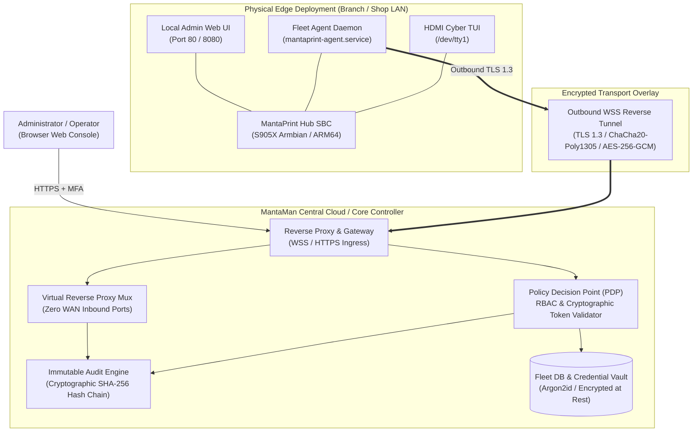
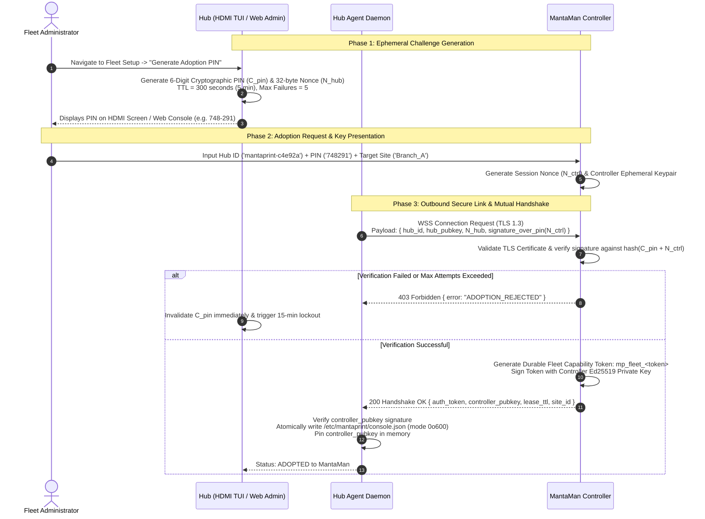
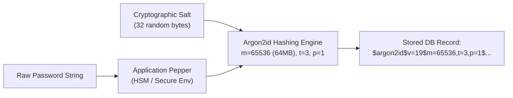
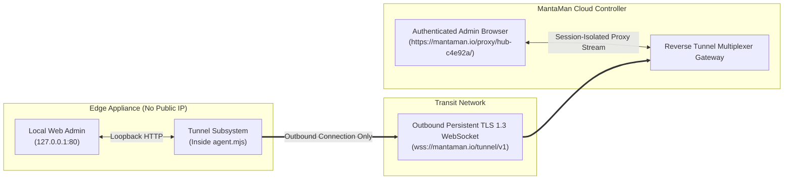
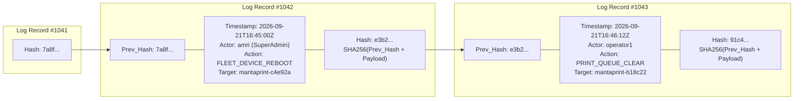

# MantaMan (Manta Manager): Zero-Trust Fleet Security Specification & Defensive Blueprint
**Document Version:** 1.0.0-PROD  
**Target Platform:** MantaPrint Universal Hub (Armbian Linux S905X / ARM64) & MantaMan Cloud/On-Premises Controller  
**Classification:** Production Engineering & Security Standard  
**Authors:** Senior Security Architect & Embedded Systems Engineering Group  

---

> [!NOTE]
> **Rebranding & Backward Compatibility Note (v0.2.3)**:
> As of release `v0.2.3`, **MantaMan** is officially rebranded to **MantaPool Console**. All cryptographic specifications, token structures (`mp_flt_`), mutual authentication protocols, and systemd service models remain 100% backward compatible.

---

## Executive Summary & Threat Landscape

**MantaPool Console** (formerly **MantaMan**) is the centralized fleet management, telemetry ingestion, and orchestration controller for distributed MantaPrint Hub edge appliances. Because MantaPrint Hubs operate in physically and logically untrusted environments—ranging from shared retail print shops and university campuses to remote corporate branch offices—the management plane cannot rely on perimeter defenses or implicit trust.

This specification establishes an exhaustive, end-to-end **Zero-Trust Architecture (ZTA)** conforming to **NIST SP 800-207**, enforcing mutual cryptographic verification, least privilege, ephemeral access, and immutable auditability.



---

## 1. Focus Area 1: Cryptographic Adoption & Handshake Protocol

### 1.1 Formal Threat Model & Adversarial Analysis

| Threat Identifier | Adversary Capability | Attack Vector | Security Impact | Defensive Guarantee (MantaMan ZTA) |
| :--- | :--- | :--- | :--- | :--- |
| **THREAT-01: Rogue Controller Hijack** | Malicious server on LAN or public Internet | Scans network, broadcasts discovery beacons, attempts to send adopt/command frames to Hubs. | Remote code execution, rogue driver deployment, unauthorized print eavesdropping. | **Strict Outbound-Only Pull**: Hub never listens for remote management commands. Hub adopts **only** upon operator physical PIN/Admin challenge validation. Controller identity is permanently pinned via Ed25519 public key. |
| **THREAT-02: Rogue Hub Spoofing** | Attacker deploys rogue Linux machine or clone Hub | Spoofs MAC address, serial number, or hostname to register with MantaMan. | Telemetry poisoning, receipt of confidential customer print queues, license fraud. | **Mutual Cryptographic Identity**: Every Hub must sign the initial handshake challenge with an ephemeral PIN or private key. MantaMan validates possession before registering Hub in database. |
| **THREAT-03: Man-in-the-Middle (MITM) & Replay** | Attacker on transit network (ARP spoofing, DNS poisoning, rogue Wi-Fi) | Intercepts WebSocket handshake or telemetry frames; replays old valid commands (`clear_queue`, `reboot`). | Disruption of service, execution of superseded state transitions. | **TLS 1.3 Transport Encryption** with pinned CA/leaf certificates + Nonce/Epoch counters on every JSON-RPC frame. Replayed nonces are rejected. |
| **THREAT-04: Compromised Token Persistence** | Attacker extracts persistent capability token from discarded or stolen Hub | Uses extracted token to connect to MantaMan or issue commands. | Unauthorized fleet telemetry extraction or administrative impersonation. | **1-Click Cryptographic Revocation**: Controller checks live CRL / Redis bloom filter on every socket frame. Instant cryptographic invalidation across the entire cluster. |

---

### 1.2 Two-Way Mutual Cryptographic Handshake Workflow

Adoption is a strict, two-way ceremony requiring physical or local administrative presence at the Hub.



---

### 1.3 Cryptographic Capability Token Specification: `mp_fleet_<token>`

MantaMan capability tokens are structured, tamper-evident cryptographic tokens designed for high performance and zero-dependency verification on embedded Linux nodes.

#### Token Structure & Encoding
The token uses a deterministic, dot-delimited format:
```text
mp_flt_v1.<hub_id>.<tenant_id>.<site_id>.<capability_mask>.<issued_epoch>.<expiry_epoch>.<hmac_signature>
```

Where:
1. `prefix`: Constant `mp_flt_v1` identifying token schema and version.
2. `hub_id`: Canonical unique hardware ID (e.g. `mantaprint-c4e92a`, derived from SHA-256 of `/etc/machine-id` or primary MAC).
3. `tenant_id`: Multi-tenant organization UUID (e.g. `ten_8f2b1a`).
4. `site_id`: Logical deployment branch (e.g. `site_jkt_01`).
5. `capability_mask`: 16-character hexadecimal bitmask defining permitted operational scopes:
   - `0x0001`: `TELEMETRY_STREAM` (send metrics, ink levels, temperatures)
   - `0x0002`: `JOB_STATUS_QUERY` (read print job count and status)
   - `0x0004`: `QUEUE_CONTROL` (clear, cancel, resume print spooler)
   - `0x0008`: `DRIVER_PROVISION` (download and install transactional drivers)
   - `0x0010`: `SYSTEM_POWER` (trigger appliance reboot)
   - `0x0020`: `REVERSE_TUNNEL` (open interactive admin proxy stream)
   - `0x0040`: `FIRMWARE_OTA` (execute signed operating system / software update)
6. `issued_epoch`: Unix timestamp in seconds of token generation.
7. `expiry_epoch`: Unix timestamp in seconds of token expiration (typically 90 days with rolling renewal).
8. `hmac_signature`: 64-character lowercase hex HMAC-SHA256 computed over the payload string:
   $$\text{HMAC-SHA256}_{K_{\text{fleet}}}(\text{prefix} \mathbin{\Vert} \text{hub\_id} \mathbin{\Vert} \text{tenant\_id} \mathbin{\Vert} \text{site\_id} \mathbin{\Vert} \text{mask} \mathbin{\Vert} \text{issued} \mathbin{\Vert} \text{expiry})$$

#### Ed25519 Asymmetric Variant (Enterprise Multi-Controller Deployment)
In high-security enterprise installations, the trailing HMAC is replaced with an **Ed25519 signature** (`sig_ed25519`):
$$\text{Signature} = \text{Sign}_{\text{Ed25519-SK}_{\text{MantaMan}}}(\text{PayloadBytes})$$
This guarantees that even if a Hub appliance is physically compromised and its storage dumped, the extracted public key cannot be used by the adversary to forge valid tokens for any other Hub in the fleet.

---

### 1.4 Hardened Token Storage & Linux VFS Permissions

To comply with the MantaPrint Storage Tiering & Anti-Tampering architecture:

1. **Path Isolation**:
   - Primary Configuration: `/etc/mantaprint/console.json` (Internal read-mostly eMMC, writable only during administrative transactions).
   - Backup Snapshot: `/mnt/data/config/console.json` (MicroSD storage tier).
2. **POSIX File Permissions**:
   ```bash
   # Ownership: strictly root:root
   chown root:root /etc/mantaprint/console.json
   # Permissions: 0o600 (-rw-------)
   chmod 600 /etc/mantaprint/console.json
   # Parent directory permissions: 0o700 (drwx------)
   chmod 700 /etc/mantaprint
   ```
3. **Atomic Safe Persistence Engine**:
   To prevent corrupt or partial writes on sudden power loss (e.g. power plug pulled), updates MUST be written to an ephemeral scratch file on the same mount point, flushed via `fsync()`, and atomically renamed:
   ```javascript
   import fs from 'node:fs';
   import path from 'node:path';

   export function writeHardenedConfig(filePath, dataObj) {
     const dir = path.dirname(filePath);
     const tempPath = path.join(dir, `.tmp_cfg_${process.pid}_${Date.now()}`);
     const serialized = JSON.stringify(dataObj, null, 2);

     const fd = fs.openSync(tempPath, 'w', 0o600);
     fs.writeSync(fd, serialized, 0, 'utf8');
     fs.fsyncSync(fd);
     fs.closeSync(fd);

     fs.renameSync(tempPath, filePath);
   }
   ```

---

### 1.5 1-Click Cryptographic Unadoption & Revocation Protocol

Revocation must be immediate and bilateral:

1. **Controller-Initiated Revocation**:
   - Operator clicks **"Unadopt / Revoke Hub"** on MantaMan Web Console.
   - MantaMan writes `hub_id` and token hash to the **Revocation Bloom Filter** and database CRL.
   - MantaMan sends an authenticated termination frame over WebSocket:
     ```json
     {
       "type": "fleet_revocation",
       "reason": "ADMIN_OPERATOR_REVOKED",
       "timestamp": 1726938400,
       "signature": "<Ed25519_Signature_over_timestamp_and_reason>"
     }
     ```
   - MantaMan forcefully terminates the WebSocket connection (`TCP RST` / WebSocket Close code `1008 Policy Violation`).
   - Hub agent verifies controller signature, unlinks stored token, wipes credentials, and transitions to Autonomous Standalone Mode:
     ```json
     {
       "enabled": false,
       "server_url": "",
       "auth_token": "",
       "device_id": "mantaprint-c4e92a",
       "controller_pubkey": null
     }
     ```
2. **Hub-Initiated Physical Revocation (Panic Button)**:
   - On-site technician navigates to HDMI TUI -> Tab 5 (DIAGNOSTICS) -> **"Disconnect from Central Fleet"**.
   - Hub immediately sends a signed `unadopt_request` notification to MantaMan.
   - Hub wipes `/etc/mantaprint/console.json` and in-memory cryptographic state.
   - Local printing, local CUPS, and local WebAdmin continue operating autonomously without disruption.

---

## 2. Focus Area 2: Web Console Security & Role-Based Access Control (RBAC)

### 2.1 Password Hashing & Credential Storage

MantaMan console enforces strict, memory-hard credential hashing to protect administrative accounts from offline dictionary and GPU rainbow table attacks.



#### Cryptographic Parameters
- **Primary Algorithm**: **Argon2id** (v19)
  - Memory Cost ($m$): $65536\text{ KiB}$ ($64\text{ MB}$ RAM budget per derivation)
  - Time Cost ($t$): $3\text{ iterations}$
  - Parallelism ($p$): $1\text{ thread}$
  - Salt Length: $32\text{ bytes}$ (cryptographically secure via CSPRNG)
  - Hash Length: $32\text{ bytes}$ ($256\text{ bits}$)
- **Fallback / Embedded Compatibility**: **Bcrypt** with Work Factor $12$ ($2^{12} = 4096$ rounds) and explicit timing-safe equality comparison.
- **Timing Attack Defense**:
  All string, token, and hash verifications MUST execute through constant-time algorithms (`crypto.timingSafeEqual`). If length mismatch occurs, a dummy comparison against a pre-computed constant buffer must execute to avoid leaking length over side channels.

```javascript
import crypto from 'node:crypto';

export function constantTimeCompare(a, b) {
  if (typeof a !== 'string' || typeof b !== 'string') return false;
  const bufA = Buffer.from(a, 'utf8');
  const bufB = Buffer.from(b, 'utf8');
  if (bufA.length !== bufB.length) {
    // Execute dummy comparison to defeat timing oracle
    crypto.timingSafeEqual(bufA, bufA);
    return false;
  }
  return crypto.timingSafeEqual(bufA, bufB);
}
```

---

### 2.2 Enterprise Role-Based Access Control (RBAC) Matrix

Access permissions follow the principle of least privilege (PoLP).

| Feature / Operation | Action Key | SuperAdmin | SiteAdmin (Scoped) | Viewer / Operator |
| :--- | :--- | :---: | :---: | :---: |
| **Fleet Overview & Global Telemetry** | `fleet:read` | :white_check_mark: All Hubs | :white_check_mark: Assigned Sites Only | :white_check_mark: Assigned Sites Only |
| **View Printer Status, Toner, Ink** | `printer:read` | :white_check_mark: All Hubs | :white_check_mark: Assigned Sites Only | :white_check_mark: Assigned Sites Only |
| **Send Calibration / Test Print** | `printer:test_print` | :white_check_mark: Allowed | :white_check_mark: Assigned Sites Only | :x: Denied |
| **Clear / Cancel Print Spool Queue** | `queue:clear` | :white_check_mark: Allowed | :white_check_mark: Assigned Sites Only | :x: Denied |
| **Reboot Hub Appliance** | `system:reboot` | :white_check_mark: Allowed | :white_check_mark: Assigned Sites Only | :x: Denied |
| **Install / Rollback Printer Drivers**| `driver:deploy` | :white_check_mark: Allowed | :x: Denied (Read-only) | :x: Denied |
| **OTA Firmware / OS Update** | `system:firmware_update`| :white_check_mark: Allowed | :x: Denied | :x: Denied |
| **Adopt / Provision New Hub** | `fleet:adopt` | :white_check_mark: Allowed | :white_check_mark: Assigned Sites Only | :x: Denied |
| **Revoke / Unadopt Hub** | `fleet:unadopt` | :white_check_mark: Allowed | :x: Denied | :x: Denied |
| **Launch Remote Reverse Proxy UI** | `tunnel:proxy` | :white_check_mark: Allowed | :white_check_mark: Assigned Sites Only | :x: Denied |
| **Manage Users & Role Assignment** | `iam:manage` | :white_check_mark: Allowed | :x: Denied | :x: Denied |
| **Export Immutable Audit Logs** | `audit:read` | :white_check_mark: Global Logs | :white_check_mark: Site Logs Only | :x: Denied |

#### Policy Decision Point (PDP) Enforcement Middleware
Every request evaluates a triple `(Subject, Resource, Action)`:

```javascript
export function enforceRbac(action) {
  return (req, res, next) => {
    const user = req.user;
    if (!user) return res.status(401).json({ error: 'UNAUTHENTICATED' });

    // 1. SuperAdmin bypasses site boundary
    if (user.role === 'SuperAdmin') return next();

    // 2. Validate Role Permissions
    const rolePermissions = ROLE_MAP[user.role] || [];
    if (!rolePermissions.includes(action)) {
      return res.status(403).json({ 
        error: 'FORBIDDEN', 
        message: `Role ${user.role} is not permitted to execute ${action}` 
      });
    }

    // 3. Validate Scope / Site Boundary
    const targetSiteId = req.params.siteId || req.body?.site_id || req.hub?.site_id;
    if (user.role === 'SiteAdmin' && targetSiteId) {
      if (!user.assignedSites.includes(targetSiteId)) {
        return res.status(403).json({ 
          error: 'OUT_OF_SCOPE', 
          message: `Access denied to site ${targetSiteId}` 
        });
      }
    }

    next();
  };
}
```

---

### 2.3 Session Management & Transport Hardening

1. **Session Identifiers**:
   - Generated with $256\text{ bits}$ of CSPRNG entropy (`crypto.randomBytes(32).toString('hex')`).
   - Prefix: `mpsess_`.
2. **HTTP Cookie Security Flags**:
   ```http
   Set-Cookie: mman_session=mpsess_7b198c0a4e...; Path=/; Max-Age=28800; HttpOnly; Secure; SameSite=Strict
   ```
   - `HttpOnly`: Completely blocks JavaScript `document.cookie` access, preventing Cross-Site Scripting (XSS) session theft.
   - `Secure`: Transmitted **exclusively** over verified TLS connections.
   - `SameSite=Strict`: Withholds cookie on all cross-site navigations, providing native defense against CSRF.
3. **Session Lifecycle Clamps**:
   - **Absolute Expiration**: $8\text{ hours}$ maximum lifetime. Automatic forced re-authentication.
   - **Idle Expiration**: $30\text{ minutes}$ of inactivity invalidates the session token.
   - **Session Re-Generation**: Fresh session token generated upon login and privilege escalation to prevent session fixation attacks.

---

### 2.4 Rate Limiting, Brute-Force Protection, and HTTP Security Headers

1. **Adaptive Leaky Bucket Rate Limiter**:
   - `/api/auth/login`: Maximum $5\text{ attempts per }5\text{ minutes}$ per IP and per username.
   - Exponential Delay Throttling: On consecutive failures, response injection delay increases ($500\text{ms} \to 1000\text{ms} \to 2000\text{ms} \to 4000\text{ms}$).
   - 6th consecutive failure triggers a temporary **$15\text{-minute IP lock}$**.
2. **Double-Submit CSRF Guard**:
   For state-changing requests (`POST`, `PUT`, `DELETE`), client must transmit the cryptographically generated CSRF token in header `X-CSRF-Token`, matching the signed value stored in session state.
3. **Strict HTTP Defense Headers**:
   ```http
   Strict-Transport-Security: max-age=63072000; includeSubDomains; preload
   X-Content-Type-Options: nosniff
   X-Frame-Options: DENY
   Referrer-Policy: strict-origin-when-cross-origin
   Permissions-Policy: camera=(), microphone=(), geolocation=(), payment=()
   Content-Security-Policy: default-src 'self'; script-src 'self'; style-src 'self' 'unsafe-inline'; img-src 'self' data:; connect-src 'self' wss://mantaman.local; frame-ancestors 'none'; object-src 'none'; base-uri 'self';
   ```

---

## 3. Focus Area 3: Secure Remote Tunneling (Reverse Proxy Architecture)

### 3.1 Zero-WAN Inbound Architecture

MantaPrint Hub appliances operate behind strict NAT, firewall, and 4G/5G mobile router connections. Inbound port forwarding (UPnP or public WAN port openings) is strictly prohibited as it exposes edge appliances to mass port scanning and zero-day vulnerabilities.



---

### 3.2 Virtual Multiplexing Framing Protocol

All proxied HTTP requests are serialized into discrete binary or JSON frames over the persistent WebSocket connection:

#### Frame Format:
```json
{
  "type": "tunnel_stream",
  "stream_id": "strm_04a8f9",
  "method": "POST",
  "path": "/api/system/network/wifi/scan",
  "headers": {
    "accept": "application/json",
    "content-type": "application/json",
    "user-agent": "MantaMan-Tunnel/1.0"
  },
  "body": "{\"band\":\"5ghz\"}"
}
```

#### Return Frame Format:
```json
{
  "type": "tunnel_response",
  "stream_id": "strm_04a8f9",
  "status": 200,
  "headers": {
    "content-type": "application/json"
  },
  "body": "{\"success\":true,\"networks\":[...]}"
}
```

---

### 3.3 Session Isolation & Security Fencing

When an administrator interacts with a remote Hub's Web UI through MantaMan:

1. **Origin Isolation**:
   - Proxy requests MUST be sandboxed under dedicated subdomains or strictly scoped paths:
     `https://<hub_id>.proxy.mantaman.example.com/`
   - This prevents cookies and LocalStorage items of `Hub-A` from being readable by `Hub-B` or the core MantaMan application.
2. **Header Sanitization & Cookie Stripping**:
   - The reverse proxy gateway strips browser cookies (`mman_session`) before forwarding frames to the Hub.
   - The proxy injects a short-lived, ephemeral proxy bearer token (`X-Hub-Proxy-Auth: ephem_tok_...`) generated on-the-fly and accepted only by the local Hub loopback interface.
3. **Path Traversal & Request Injection Shield**:
   - The Hub-side tunnel client enforces strict validation before dispatching to `127.0.0.1`:
     - Reject paths containing `..`, `%2e%2e`, null-bytes (`\0`), or multiple consecutive slashes (`//`).
     - Reject access to CUPS raw daemon (`localhost:631`) or debug interfaces unless specifically routed through validated admin endpoints.
     - Enforce maximum payload size: $10\text{ MB}$ for document uploads, $64\text{ KB}$ for JSON REST calls.

---

## 4. Focus Area 4: Compliance & Immutable Audit Logging

### 4.1 Cryptographic Hash-Chained Audit Ledger

To satisfy **SOC 2 Type II (Trust Services Criteria CC6.1 - CC6.8)** and **ISO/IEC 27001:2022 (Control A.8.15 - Logging)**, MantaMan incorporates an append-only, tamper-evident audit log ledger utilizing sequential cryptographic hash chaining.



Every record is linked to its predecessor. If an attacker gains database write access and modifies an action (e.g. changing who initiated a reboot or driver install), the hash chain breaks, immediately triggering an automated alert during integrity audits.

---

### 4.2 Standard Audit Event Schema

```json
{
  "$schema": "https://json-schema.org/draft/2020-12/schema",
  "event_id": "aud_01J8F3G9B2C4D6E7F8G9H0J1K2",
  "sequence_number": 1042,
  "timestamp": "2026-09-21T16:45:00.124Z",
  "prev_record_hash": "7a8f12b694d93214c77e8b91c28f731201948ba5e3178c52084c98e134b2f150",
  "actor": {
    "user_id": "usr_9921",
    "username": "amri",
    "role": "SuperAdmin",
    "source_ip": "192.168.1.111",
    "user_agent": "Mozilla/5.0 (X11; Linux x86_64) AppleWebKit/537.36"
  },
  "action": "FLEET_DEVICE_REBOOT",
  "category": "HARDWARE_ORCHESTRATION",
  "target": {
    "type": "HUB_APPLIANCE",
    "hub_id": "mantaprint-c4e92a",
    "site_id": "site_jakarta_hq",
    "hostname": "heykprint-ssh",
    "ip_address": "192.168.1.114"
  },
  "parameters": {
    "force": false,
    "delay_sec": 5,
    "reason": "Scheduled routine kernel maintenance"
  },
  "execution_result": {
    "status": "DISPATCHED",
    "code": 200,
    "agent_ack_latency_ms": 42
  },
  "record_hash": "e3b2a59f81bc20419d854ce4b9872e41103984af593284029bc489a2b5301824"
}
```

---

### 4.3 Mandatory Audited Fleet Operations

The following security-critical actions MUST be cryptographically recorded in the ledger:

1. **Identity & Access Management (IAM)**:
   - User login success, login failure, MFA challenges, account lockouts.
   - User creation, role changes (`SiteAdmin` $\to$ `SuperAdmin`), and password updates.
2. **Fleet Enrollment & Topology**:
   - Ephemeral adoption PIN generation and pairing consumptions.
   - Hub capability token issuance, renewal, and 1-click revocations.
3. **Remote Hardware Operations**:
   - Appliance reboot requests (`systemctl reboot`).
   - CUPS print spooler service restarts (`systemctl restart cups`).
   - Print queue purge operations (`cancel -a -x`).
4. **Driver & Binary Provisioning**:
   - PPD driver downloads, SHA-256 verification results, and transactional deployments.
   - Automatic rollback triggers upon `cupstestppd` validation failure.
5. **Firmware & OS Updates**:
   - Initiation of MantaPrint Hub system upgrades, pre-flight checks, and post-install verifications.

---

### 4.4 External SIEM Export & Archival (WORM Compliance)

To prevent log tampering even in the event of total server compromise:
- **Syslog Forwarding**: Immediate streaming via RFC 5424 over mutual TLS (mTLS) to remote SIEM aggregators (Wazuh, Splunk, Elastic, or AWS CloudWatch).
- **Write-Once-Read-Many (WORM) Archival**: Nightly cryptographic snapshots signed with an offline key and pushed to an immutable object storage bucket (S3 Object Lock / GCS Bucket Retention Policy).

---

## 5. Architectural Implementation Blueprint for MantaPrint Hub & MantaMan

### 5.1 Directory & File Layout on MantaPrint Hub

```text
/etc/mantaprint/
├── console.json              # Mode 0o600, root:root. Stores server_url, auth_token, device_id
├── hub_identity.key          # Mode 0o600, root:root. Ed25519 appliance private key
├── hub_identity.pub          # Mode 0o644, root:root. Ed25519 appliance public key
└── controller.pub            # Mode 0o644, root:root. Pinned MantaMan Root Public Key

/mnt/data/config/
├── console.json.bak          # Automatic backup copy on high-endurance MicroSD
└── admin_auth.json           # Scrypt/Argon2 local admin credentials (mode 0o600)
```

### 5.2 Verification Checklist for Production Readiness

- [ ] **Mutual Authentication**: Hub verifies MantaMan Ed25519 public signature; MantaMan validates Hub capability token on every WebSocket frame.
- [ ] **Cryptographic PIN Safeguard**: Ephemeral pairing PIN auto-expires in 300 seconds and locks after 5 consecutive failed attempts.
- [ ] **Hardened File System Permissions**: `/etc/mantaprint/console.json` strictly set to `0o600` owned by `root:root`.
- [ ] **1-Click Revocation**: Instant token invalidation via WebSocket frame and server-side revocation list.
- [ ] **Argon2id Password Storage**: Memory cost $\ge 64\text{ MB}$, time cost $\ge 3$ iterations for Web Console credentials.
- [ ] **Role Enforcement**: `SuperAdmin`, `SiteAdmin`, and `Viewer` policies strictly enforced across all REST and WebSocket endpoints.
- [ ] **Reverse Tunnel Isolation**: Zero open WAN ports on Hub; reverse proxy isolates origins and scrubs browser authentication cookies.
- [ ] **Immutable Hash-Chained Audit Ledger**: All fleet interventions logged with SHA-256 parent chaining and RFC 5424 SIEM replication.

---

## Conclusion

This security specification bridges the unique physical and hardware constraints of the MantaPrint Hub STB appliance (embedded flash longevity, restricted 24MB/60MB RAM ceilings, and hostile physical deployments) with enterprise-grade Zero-Trust Controller design. By implementing mutual cryptographic verification, outbound-only reverse tunneling, strictly scoped RBAC, and an immutable hash-chained audit ledger, MantaMan achieves a hardened, resilient, and compliant fleet management architecture.
