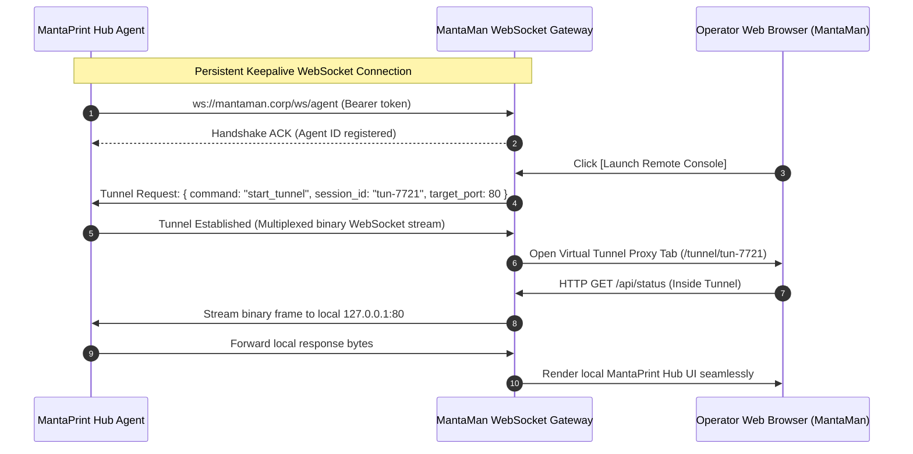

# MantaMan (Manta Manager) Web Console
## Exhaustive UI/UX Wireframe & Multilingual (i18n) Specification
**Document Version:** 1.0.0-PROD  
**Target Appliance:** MantaPrint Hub Fleet Orchestration  
**Default Language:** English (`en`) | **First-Class Peer:** Indonesian (`id`)  
**Design Paradigm:** Enterprise Cyber-Industrial Dark Theme  

---

> [!NOTE]
> **Rebranding & Backward Compatibility Note (v0.2.3)**:
> As of release `v0.2.3`, **MantaMan** is officially rebranded to **MantaPool Console** to reflect its role as the centralized fleet coordinator. All architectural references, wireframes, and design tokens specified in this document apply to MantaPool Console. System identifiers (`mantaman.service`, `/opt/mantaman`, `mp_flt_` tokens) remain identical for 100% backward compatibility.

---

## 1. Executive Architecture & Design Philosophy

### 1.1 Purpose & Scope
**MantaPool Console** (formerly **MantaMan**) is the centralized enterprise fleet orchestration console for **MantaPrint Hub** appliances. It provides mission-critical command, control, adoption, telemetry monitoring, remote tunneling, and mass software distribution across distributed MantaPrint STBs and SBCs (e.g., Amlogic S905X ARM64, Raspberry Pi 5).

### 1.2 Cyber-Industrial Design Pillars
1. **Operator-Centric High Contrast**: Engineered for 24/7 Network Operations Centers (NOC), logistics warehouses, and IT helpdesks. Dark obsidian surfaces reduce eye fatigue while neon status accents instantly draw attention to hardware failures.
2. **Dense Information Scaffolding**: Maximum information density without visual clutter. Tabular figures, micro-gauges, and structured metadata tables provide immediate hardware state awareness.
3. **Deterministic Visual Language**: Consistent semantic coloring (Cyan for network links, Emerald for healthy/verified, Amber for warnings/low supplies, Rose for hardware faults/jams, Indigo for cryptographic/deployment pipelines).
4. **Zero-Lag Telemetry**: UI elements anticipate rapid WebSocket state transitions (10s polling interval, silent half-open detection). Micro-animations are limited to subtle pulse beacons and high-speed data updates.
5. **Zero Hardcoded Strings**: 100% internationalized UI from Day 1. English (`en`) and Bahasa Indonesia (`id`) maintain complete feature and vocabulary parity.

---

## 2. Design Tokens, Cyber-Industrial Theme & Branding

### 2.1 Color Palette & Token Hierarchy

```css
:root {
  /* Surface & Base (Obsidian Cyber-Industrial) */
  --bg-primary: #070A0F;        /* Deepest obsidian background */
  --bg-surface: #0B0F19;        /* Panel and card background */
  --bg-surface-raised: #121826; /* Elevated modals, tooltips, dropdowns */
  --bg-surface-hover: #192236;  /* Interactive hover states */
  --border-subtle: #1E293B;     /* Slate-800 subtle partition borders */
  --border-medium: #334155;     /* Slate-700 active borders */
  --border-highlight: #475569;  /* Slate-600 focus rings */

  /* Cyber Accents */
  --accent-cyan: #06B6D4;       /* Primary digital conduit, active connections */
  --accent-cyan-glow: rgba(6, 182, 212, 0.25);
  --accent-emerald: #10B981;    /* Online, Healthy, Signed, Verified */
  --accent-emerald-glow: rgba(16, 185, 129, 0.25);
  --accent-amber: #F59E0B;      /* Warning, Low Toner, High Temp, Throttling */
  --accent-amber-glow: rgba(245, 158, 11, 0.25);
  --accent-rose: #F43F5E;       /* Paper Jam, Offline, Error, Security Breach */
  --accent-rose-glow: rgba(244, 63, 94, 0.25);
  --accent-indigo: #6366F1;     /* Firmware Rollout, Drivers, Cryptography */
  --accent-indigo-glow: rgba(99, 102, 241, 0.25);

  /* Typography Colors */
  --text-high-contrast: #F8FAFC;/* Primary headings and vital telemetry */
  --text-normal: #CBD5E1;       /* Body copy, labels, table cells */
  --text-muted: #64748B;        /* Secondary metadata, serial numbers, units */
  --text-dim: #475569;          /* Disabled states, inactive icons */

  /* Cyber Industrial Monospace */
  --font-sans: 'Inter', -apple-system, BlinkMacSystemFont, "Segoe UI", Roboto, sans-serif;
  --font-mono: 'JetBrains Mono', 'Fira Code', ui-monospace, SFMono-Regular, monospace;
}
```

### 2.2 Tailwind CSS Configuration Extension (`tailwind.config.js`)

```javascript
export default {
  darkMode: 'class',
  theme: {
    extend: {
      colors: {
        cyber: {
          bg: '#070A0F',
          surface: '#0B0F19',
          elevated: '#121826',
          hover: '#192236',
          border: '#1E293B',
          cyan: '#06B6D4',
          emerald: '#10B981',
          amber: '#F59E0B',
          rose: '#F43F5E',
          indigo: '#6366F1',
        }
      },
      fontFamily: {
        sans: ['Inter', 'sans-serif'],
        mono: ['JetBrains Mono', 'Fira Code', 'monospace']
      },
      boxShadow: {
        'cyan-glow': '0 0 15px -3px rgba(6, 182, 212, 0.35)',
        'emerald-glow': '0 0 15px -3px rgba(16, 185, 129, 0.35)',
        'rose-glow': '0 0 15px -3px rgba(244, 63, 94, 0.35)',
        'amber-glow': '0 0 15px -3px rgba(245, 158, 11, 0.35)',
      }
    }
  }
}
```

### 2.3 Lucide Icon Mapping

| Category | Lucide Icon Component | UI Context |
| :--- | :--- | :--- |
| **Branding & System** | `Shield`, `Cpu`, `Layers`, `Radio` | Console Header, Hardware Spec, Cluster Status |
| **Fleet Navigation** | `LayoutGrid`, `Table`, `Building2`, `GitBranch` | Matrix View, High-Density Table, Site Groups |
| **Printers & Supplies** | `Printer`, `ScanLine`, `Droplets`, `AlertOctagon` | CUPS queue, Scanner PWA, Toner gauges, Paper Jam |
| **Adoption & Security** | `UserPlus`, `Key`, `Fingerprint`, `CheckCircle2` | Adoption Center, PIN Modal, mTLS Handshake |
| **Batch Operations** | `Terminal`, `Rocket`, `DownloadCloud`, `FileCode` | Firmware rollout wizard, Driver push, Live CLI |
| **Telemetry & Tunnel** | `Activity`, `Wifi`, `ExternalLink`, `Sliders` | Telemetry drawer, Remote console launcher |
| **Localization & Admin**| `Globe`, `UserCog`, `History`, `FileSpreadsheet` | Language switcher, Operator RBAC, Audit Logs |

### 2.4 Official Manta Logo Integration
The logo maintains visual parity with MantaPrint Hub's hardware and web assets (`mantaprint.png` and laser-bed vector SVG):
- **Desktop Nav Header**: 36×36px Manta emblem inside a squircle container with cyan/emerald dual-orbit status border.
- **Heartbeat Indicator**: An active 3px cyan pulse at the manta ray's cephalic crest lights up in sync with WebSocket incoming telemetry frames.
- **Empty & Error States**: Watermark background (15% opacity SVG vector) embedded in the adoption and terminal views.

---

## 3. Multilingual Engine Architecture (`en` & `id`)

### 3.1 Design Rules
1. **First-Class Parity**: Every new feature, modal, button, and error string MUST be defined simultaneously in `en` and `id`.
2. **Persistent Language Storage**: Stored under key `mantaman_ui_lang` in `localStorage`. Defaults to `en` if not present.
3. **Zero Hardcoded Strings**: All labels, tooltips, validation messages, and server statuses are rendered via `t('key.path', { params })`.
4. **Fallback Safety**: If an `id` translation key is missing during rapid development, the engine smoothly falls back to `en`, then to the raw key path without throwing exceptions.
5. **Pluralization & Parametric Interpolation**: Dynamic counters (e.g. `{count} Hubs`, `{used}MB of {total}MB`) use mustache-style `{var}` replacement.

### 3.2 Reactive i18n Context (`I18nContext.jsx`)
```javascript
import React, { createContext, useContext, useState, useEffect } from 'react';
import { catalog } from './catalog.js';

const I18nContext = createContext(null);

export function I18nProvider({ children }) {
  const [lang, setLangState] = useState(() => {
    if (typeof window !== 'undefined') {
      const saved = localStorage.getItem('mantaman_ui_lang');
      if (saved && ['en', 'id'].includes(saved)) return saved;
    }
    return 'en';
  });

  const setLanguage = (newLang) => {
    const valid = ['en', 'id'].includes(newLang) ? newLang : 'en';
    setLangState(valid);
    if (typeof window !== 'undefined') {
      localStorage.setItem('mantaman_ui_lang', valid);
    }
  };

  const t = (keyPath, params = {}) => {
    if (!keyPath) return '';
    const keys = keyPath.split('.');
    let curr = catalog[lang] || catalog.en;
    let found = true;

    for (const k of keys) {
      if (curr && typeof curr === 'object' && k in curr) {
        curr = curr[k];
      } else {
        found = false;
        break;
      }
    }

    if (!found) {
      let enCurr = catalog.en;
      for (const k of keys) {
        if (enCurr && typeof enCurr === 'object' && k in enCurr) {
          enCurr = enCurr[k];
        } else {
          curr = keyPath;
          break;
        }
      }
      if (typeof enCurr === 'string') curr = enCurr;
    }

    if (typeof curr === 'string') {
      return curr.replace(/{([^{}]+)}/g, (_, k) => (params[k] !== undefined ? params[k] : `{${k}}`));
    }
    return typeof curr === 'string' ? curr : keyPath;
  };

  return (
    <I18nContext.Provider value={{ lang, setLanguage, t, isId: lang === 'id', isEn: lang === 'en' }}>
      {children}
    </I18nContext.Provider>
  );
}

export const useI18n = () => useContext(I18nContext);
```

---

## 4. Information Architecture & Navigation

### 4.1 Structural Site Map

```
MantaMan Web Console
├── Global App Shell
│   ├── Collapsible Cyber Sidebar
│   ├── Global Command Palette (Cmd+K / Search)
│   ├── Cluster Status Ticker (Total Hubs, Online, Active Jobs, Alerts)
│   └── Top Bar (Language Selector [EN/ID], Alerts Tray, Operator Profile)
│
├── 1. Fleet Overview Matrix (/fleet)
│   ├── View Switcher: Card Grid vs High-Density Table
│   ├── Filter & Scope Bar (Site filter, Health pill filter, Search)
│   ├── Device Cards / Rows (Real-time telemetry, Supplies, Print state)
│   └── Quick Action Tray (Reboot, Restart CUPS, Clear Spool, Inspect)
│
├── 2. Adoption Center (/adoption)
│   ├── Discovery Radar (Active mDNS + WebSocket enrollment listener)
│   ├── Discovered Nodes Table (IP, MAC, Architecture, Detected USB Devices)
│   └── 1-Click Adopt Modal (PIN challenge, Site assign, Friendly name)
│
├── 3. Sites & Branches Hierarchy (/sites)
│   ├── Tree View & Spatial Hierarchy (HQ -> Branch -> Floor/Kiosk Zone)
│   ├── Site Health Summary Cards
│   └── Site-Scoped Bulk Actions (Rolling Update, Driver Sync, Mass Restart)
│
├── 4. Batch Operations Wizard (/batch)
│   ├── Step 1: Target Node Query / Selector
│   ├── Step 2: Deployment Payload (Firmware OTA vs PPD Driver Package)
│   ├── Step 3: Rolling Canary Policy & Concurrency Configuration
│   └── Step 4: Live ANSI Terminal Stream & Rollback Monitor
│
├── 5. Hub Detail & Remote Tunnel (Slide-over Drawer)
│   ├── Header: Device Hostname, Status Pill, Hardware Spec, Quick Actions
│   ├── Tab A: Hardware Telemetry (CPU Temp, RAM, Storage eMMC/MicroSD)
│   ├── Tab B: CUPS Queue & Printers (Jobs list, Cancel, Raw Print Test)
│   ├── Tab C: Driver Catalog & PPD Inspector
│   └── Tab D: Remote Reverse Console (Webpty terminal & 1-click Web Forward)
│
└── 6. System Settings & Audit Logs (/settings)
    ├── User Management & RBAC Roles (Admin, Operator, Auditor)
    ├── Security, mTLS CA, & Enrollment Token Management
    └── Immutable Audit Log (Timestamped operator actions, Cryptographic hashes)
```

---

## 5. UI/UX Wireframe Specifications

### 5.1 Global App Shell & Navigation Wireframe

```
+----------------------------------------------------------------------------------------------------------------------+
| [Manta Logo] MantaMan v1.0.0-PROD | [Q Search Fleet... (Ctrl+K)] | Hubs: 48/50 Online | Jobs: 14 Active | [EN|ID] [User] |
+------------------+---------------------------------------------------------------------------------------------------+
| [NAV SIDEBAR]    | BREADCRUMB: Fleet Management > Global Overview                                                    |
|                  +---------------------------------------------------------------------------------------------------+
| [=] Fleet Matrix | [Filter: All Sites v] [Status: All v] [Search: MAC / IP / Printer...]   [:: Grid] [= Table] [Refresh] |
| [?] Adoption (3) +---------------------------------------------------------------------------------------------------+
| [#] Sites / Tree |                                                                                                   |
| [>] Batch Ops    | (Main View Area - dynamically populated by active route)                                          |
| [*] Settings     |                                                                                                   |
| [!] Audit Logs   |                                                                                                   |
|                  |                                                                                                   |
|                  |                                                                                                   |
|                  |                                                                                                   |
| ---------------- |                                                                                                   |
| Cluster Health   |                                                                                                   |
| CPU Avg: 34%     |                                                                                                   |
| RAM Avg: 41%     |                                                                                                   |
| Agent WS: OK     |                                                                                                   |
+------------------+---------------------------------------------------------------------------------------------------+
```

---

### 5.2 View 1: Fleet Overview Matrix

#### Wireframe: Card Grid Mode

```
+----------------------------------------------------------------------------------------------------------------------+
| FILTERS: [Site: All Sites v] [Health: [All (50)] [* Healthy (42)] [~ Warning (4)] [! Fault (1)] [- Offline (3)] ]     |
+----------------------------------------------------------------------------------------------------------------------+
| +--------------------------------------+ +--------------------------------------+ +----------------------------------+
| | HUB: mantaprint-3a9f1b               | | HUB: mantaprint-88c012               | | HUB: mantaprint-10ae44           |
| | Site: Central Office (2nd Floor)     | | Site: Kiosk Branch 1 (Cashier 01)    | | Site: Warehouse B (Loading Bay)  |
| | IP: 192.168.1.114  | MAC: b8:27:eb:..| | IP: 192.168.1.118  | MAC: e4:5f:01:..| | IP: 192.168.1.140 | MAC: ..      |
| | [● HEALTHY]        Uptime: 14d 6h    | | [● PRINTING]       Uptime: 2d 11h    | | [▲ PAPER JAM]      Uptime: 8h 12m  |
| |--------------------------------------| |--------------------------------------| |----------------------------------|
| | Attached: Canon LBP6030 (USB)        | | Attached: Epson L3110 (USB)          | | Attached: HP LaserJet P1102      |
| | State: Idle                          | | State: Processing Job #104 (Page 3/8)| | State: Stopped / Error           |
| | Toner / Ink Supply:                  | | Toner / Ink Supply:                  | | Toner / Ink Supply:              |
| | [KKKKKKKKKKKKKKKKKKKKKKKKK....] 84%  | | C:[|||||..] M:[||||||.] Y:[|||...] K | | [KKKKKK...............] 32%      |
| | Hardware Telemetry:                  | | Hardware Telemetry:                  | | Hardware Telemetry:              |
| | CPU: 48.2°C [||||.....] RAM: 248/1918| | CPU: 56.1°C [||||||...] RAM: 310/1918| | CPU: 62.4°C [|||||||..] RAM: 420 |
| | Storage: MicroSD OK (Wear: 2%)       | | Storage: MicroSD OK (Wear: 5%)       | | Storage: MicroSD OK (Wear: 12%)  |
| |--------------------------------------| |--------------------------------------| |----------------------------------|
| | [Inspect Drawer] [Test Print] [...]  | | [Inspect Drawer] [Cancel Job] [...]  | | [Inspect Drawer] [Clear Jam] [...]|
| +--------------------------------------+ +--------------------------------------+ +----------------------------------+
+----------------------------------------------------------------------------------------------------------------------+
```

#### Wireframe: High-Density Table Mode

```
+-----------------------------------------------------------------------------------------------------------------------------------------+
| [ ] | Node Name / ID     | Site Group       | IP / MAC Address         | Attached Device         | Supplies  | CPU / RAM    | Status    | Actions |
|-----+--------------------+------------------+--------------------------+-------------------------+-----------+--------------+-----------+---------|
| [ ] | mantaprint-3a9f1b  | Central Office   | 192.168.1.114 / b8:27:eb | Canon LBP6030 (Mono)    | [K 84%]   | 48°C / 248MB | [HEALTHY] | [>>] [:]|
| [ ] | mantaprint-88c012  | Branch 1 Cashier | 192.168.1.118 / e4:5f:01 | Epson L3110 (Color)     | [CMYK OK] | 56°C / 310MB | [PRINTING]| [>>] [:]|
| [ ] | mantaprint-10ae44  | Warehouse Bay    | 192.168.1.140 / 00:1e:06 | HP LaserJet P1102 (Mono)| [K 32%]   | 62°C / 420MB | [JAMMED]  | [>>] [:]|
| [ ] | mantaprint-f41190  | Kiosk Floor 3    | 192.168.1.155 / dc:a6:32 | Canon MF3010 (Printer)  | [K 12% !] | 51°C / 280MB | [WARNING] | [>>] [:]|
| [ ] | mantaprint-992bc1  | Remote Depot     | 10.8.0.42     / b8:27:eb | None (Awaiting USB)     | [N/A]     | 45°C / 190MB | [OFFLINE] | [>>] [:]|
+-----------------------------------------------------------------------------------------------------------------------------------------+
| Showing 1 - 5 of 50 Hubs | Selected: 0 Hubs | [Batch Action: Reboot v] [Apply to Selected]                 |< <  [1]  2   3  > >|
+-----------------------------------------------------------------------------------------------------------------------------------------+
```

---

### 5.3 View 2: Adoption Center (Zero-Touch Staged Discovery)

#### Wireframe: Pending Hubs Radar & Discovery Matrix

```
+----------------------------------------------------------------------------------------------------------------------+
| ADOPTION RADAR: 3 Unadopted MantaPrint Hubs detected via mDNS / Enrollment Beacon                                    |
| [Listening on interface: br0 / eth0 / overlay-mesh] [Filter by Architecture: All v]                   [Refresh Radar] |
+----------------------------------------------------------------------------------------------------------------------+
| NODE MAC           | DISCOVERY IP  | BOARD ARCHITECTURE       | USB PERIPHERALS DETECTED    | FIRST SEEN   | ACTION        |
|--------------------+---------------+--------------------------+-----------------------------+--------------+---------------|
| b8:27:eb:91:33:aa  | 192.168.1.192 | Amlogic S905X (ARM64)    | Canon LBP2900 (CAPT Driver) | 2 mins ago   | [Adopt Hub]   |
| e4:5f:01:2b:88:cd  | 192.168.1.195 | Raspberry Pi 5 (ARM64)   | EPSON L3210 + SANE Scanner  | 8 mins ago   | [Adopt Hub]   |
| 00:1e:06:44:fe:10  | 10.0.4.55     | Rockchip RK3328 (ARM64)  | Generic ESC/POS Receipt USB | 14 mins ago  | [Adopt Hub]   |
+----------------------------------------------------------------------------------------------------------------------+

                             [MODAL: 1-Click Adopt Hub]
  +----------------------------------------------------------------------------------+
  | [UserPlus] ADOPT MANTAPRINT HUB APPLIANCE                                    [X] |
  | Hardware Identifier: mantaprint-9133aa (MAC: b8:27:eb:91:33:aa)                  |
  +----------------------------------------------------------------------------------+
  | 1. Hub Friendly Display Name:                                                    |
  |    [ Branch 2 - Front Desk Printer Hub                                     ]     |
  |                                                                                  |
  | 2. Assign Target Site / Branch:                                                  |
  |    [ Branch 2 (Bandung Distribution Center)                              v ]     |
  |                                                                                  |
  | 3. Security Pairing PIN (Displayed on STB HDMI Kiosk screen or chassis label):   |
  |    [ 8  4  1  9  2  0 ]  <-- 6-digit numeric hardware PIN challenge             |
  |                                                                                  |
  | 4. Initial Provisioning Policy:                                                  |
  |    [*] Automatically download and compile Universal CUPS Drivers                 |
  |    [*] Enable Zero-Trace Ephemeral Scan Buffer (tmpfs RAM)                       |
  |    [*] Enforce 30s Heartbeat Telemetry & Silent Half-Open Watchdog               |
  |                                                                                  |
  | Mutual mTLS Handshake Token: CORP-PROD-2026-X992 (Generated)                     |
  +----------------------------------------------------------------------------------+
  | [Cancel]                                            [Confirm & Complete Adoption]|
  +----------------------------------------------------------------------------------+
```

---

### 5.4 View 3: Sites & Branches Hierarchy

#### Wireframe: Spatial Tree & Group Orchestration

```
+----------------------------------------------------------------------------------------------------------------------+
| SITE HIERARCHY & PHYSICAL TOPOLOGY                                                 [+ Create New Site] [Bulk Actions] |
+----------------------------------------------------------------------------------------------------------------------+
| [-] Global Organization: Manta Logistics Corp                                                                       |
|     +-- [+] Region Jakarta (3 Sites, 28 Hubs)                                                                       |
|     |-- [-] Region Surabaya (2 Sites, 14 Hubs)                                                                      |
|     |   |-- [=] Warehouse SBY-01 (10 Hubs) [Health: 100% OK] [Bulk: Driver Sync | Rolling Restart | Mute Alerts]     |
|     |   |   |-- Hub 01 (Dock A) - Canon LBP6030                                                                     |
|     |   |   |-- Hub 02 (Dock B) - Canon LBP6030                                                                     |
|     |   |   \-- Hub 03 (Manifest Office) - HP LaserJet                                                              |
|     |   \-- [=] Branch Retail Gubeng (4 Hubs) [Health: 75% - 1 Jam]                                                  |
|     \-- [+] Region Bandung (1 Site, 8 Hubs)                                                                         |
+----------------------------------------------------------------------------------------------------------------------+
| SELECTED SITE SUMMARY: Warehouse SBY-01                                                                              |
| Total Hubs: 10 Active | Printers Connected: 12 | Scanners: 2 | Daily Spool Count: 1,482 jobs | Supply Alerts: 0     |
| Assigned Subnet: 192.168.40.0/24 | Gateway: 192.168.40.1 | Site Admin: bpk.hadi@mantaprint.local                    |
| [Site Actions] --> [Deploy Driver to Site]  [Trigger Site Firmware Update]  [Download Diagnostics Pack]             |
+----------------------------------------------------------------------------------------------------------------------+
```

---

### 5.5 View 4: Batch Operations Wizard & Live Terminal Output

#### Wireframe: 4-Step Rollout Wizard & Live Terminal Stream

```
+----------------------------------------------------------------------------------------------------------------------+
| BATCH OPERATIONS WIZARD: Rolling Firmware OTA & Mass Driver Distribution                                             |
| [ (1) Target Scope ] ======= [ (2) Select Payload ] ======= [ (3) Canary Policy ] ======= [* (4) Live Execution *]   |
+----------------------------------------------------------------------------------------------------------------------+
| TARGETS: 14 Nodes in "Region Surabaya" | PAYLOAD: MantaPrint OS v0.1.5 (SHA: 4fa9b01..) | CANARY: 20% -> 50% -> 100%  |
| STATUS: RUNNING (Batch Job #BO-2026-0921)                                          [Pause Rollout] [Abort & Rollback] |
+----------------------------------------------------------------------------------------------------------------------+
| ROLLOUT PROGRESS: [============================================....................] 64% (9/14 Hubs Upgraded)        |
+----------------------------------------------------------------------------------------------------------------------+
| LIVE TERMINAL LOG STREAM (WebSocket: ws://mantaman.local/ws/batch/log)                                              |
| +------------------------------------------------------------------------------------------------------------------+ |
| | [2026-09-21 16:44:01] [CANARY BATCH 1] Completed on 3 nodes (mantaprint-3a9f1b, mantaprint-88c012, node-03).    | |
| | [2026-09-21 16:44:03] [CANARY BATCH 2] Initiating rollout to next 6 nodes...                                    | |
| | [2026-09-21 16:44:05] [node-04:mantaprint-10ae44] Downloading package mantaprint-v0.1.5-arm64.tar.gz...          | |
| | [2026-09-21 16:44:08] [node-04:mantaprint-10ae44] Verifying SHA-256 checksum: 4fa9b01f92e... MATCH [OK]         | |
| | [2026-09-21 16:44:10] [node-04:mantaprint-10ae44] Validating PPD compatibility via cupstestppd... PASS [OK]     | |
| | [2026-09-21 16:44:12] [node-04:mantaprint-10ae44] Atomic backup created at /var/cache/mantaprint/staging/backups | |
| | [2026-09-21 16:44:14] [node-04:mantaprint-10ae44] Symlinking /usr/share/cups/model/mantaprint...                | |
| | [2026-09-21 16:44:16] [node-04:mantaprint-10ae44] Triggering safe CUPS daemon reload...                          | |
| | [2026-09-21 16:44:18] [node-04:mantaprint-10ae44] Node health check passed. Return code: 0 [SUCCESS]           | |
| | [2026-09-21 16:44:20] [node-05:mantaprint-c4199a] Verifying filter binary /usr/lib/cups/filter/rastertocapt...   | |
| +------------------------------------------------------------------------------------------------------------------+ |
+----------------------------------------------------------------------------------------------------------------------+
```

---

### 5.6 View 5: Hub Detail & Remote Tunnel Slide-Over Drawer

#### Wireframe: Slide-Over Drawer Component (Width: 680px)

```
+--------------------------------------------------------------------+
| [X] HUB TELEMETRY & MANAGEMENT: mantaprint-3a9f1b                  |
| Site: Central Office (2nd Floor) | Status: [● HEALTHY / ONLINE]    |
+--------------------------------------------------------------------+
| [ Tab: Telemetry ] [ Tab: CUPS Queue ] [ Tab: Drivers ] [ Tab: Tunnel ]
+--------------------------------------------------------------------+
| TAB CONTENT: REMOTE REVERSE CONSOLE & TUNNEL                       |
|                                                                    |
| Direct Encrypted Reverse Proxy to MantaPrint Hub Appliance         |
| Active Tunnel: Disconnected (On-Demand WebSocket Proxy)            |
|                                                                    |
| [1-Click Launch Web Console]      [1-Click Launch Webpty Terminal] |
|                                                                    |
| Tunnel Details:                                                    |
| - Target Local Port: 80 (HTTP Web GUI) / 22 (SSH Webpty)          |
| - Encryption: TLS 1.3 / ChaCha20-Poly1305 End-to-End               |
| - Session Expiry: 15 minutes idle timeout                          |
| - Audit State: All commands logged to MantaMan Security Log        |
|                                                                    |
| +----------------------------------------------------------------+ |
| | EMBEDDED WEBPTY TERMINAL (root@mantaprint-3a9f1b:~#)           | |
| |                                                                | |
| | Linux mantaprint 6.6.16-current-meson64 aarch64                | |
| | Last login: Mon Sep 21 16:40:11 2026 from 127.0.0.1           | |
| | root@mantaprint:~# lpstat -p -d                                | |
| | printer Canon_LBP6030 is idle. enabled since Mon Sep 21 16:30 | |
| | system default destination: Canon_LBP6030                      | |
| | root@mantaprint:~# cat /sys/class/thermal/thermal_zone0/temp   | |
| | 48200                                                          | |
| | root@mantaprint:~# _                                           | |
| +----------------------------------------------------------------+ |
|                                                                    |
| Quick Hub Actions:                                                 |
| [Restart CUPS]  [Purge Spool]  [Print Test Page]  [Reboot Hub STB] |
+--------------------------------------------------------------------+
```

---

### 5.7 View 6: System Settings, Certificates & Security Audit Log

#### Wireframe: RBAC, mTLS Certificate Authority & Audit Log Table

```
+----------------------------------------------------------------------------------------------------------------------+
| SYSTEM SETTINGS & ENTERPRISE SECURITY AUDIT                                                                          |
| [ Sub-Tab: Role-Based Access ]  [ Sub-Tab: mTLS Certificates ]  [* Sub-Tab: Security Audit Log *]                     |
+----------------------------------------------------------------------------------------------------------------------+
| FILTERS: [Actor: All Users v] [Action Type: All v] [Time Range: Last 24 Hours v]               [Export CSV] [Export JSON] |
+----------------------------------------------------------------------------------------------------------------------+
| TIMESTAMP (UTC)     | ACTOR / USER          | ACTION PERFORMED     | TARGET HUB / SITE  | IP ADDRESS    | RESULT / HASH|
|---------------------+-----------------------+----------------------+--------------------+---------------+--------------|
| 2026-09-21 16:42:10 | admin@mantaprint.corp | ADOPT_HUB            | mantaprint-9133aa  | 192.168.1.50  | SUCCESS 8fa2 |
| 2026-09-21 16:38:44 | operator_surabaya     | BATCH_DRIVER_PUSH    | Region Surabaya    | 192.168.40.12 | SUCCESS e01b |
| 2026-09-21 16:15:02 | technician_jkt        | PURGE_PRINT_SPOOL    | mantaprint-10ae44  | 10.0.1.201    | SUCCESS 4d89 |
| 2026-09-21 15:50:11 | system_watchdog       | HALF_OPEN_DISCONNECT | mantaprint-992bc1  | 10.8.0.42     | RECONNECTING |
| 2026-09-21 15:10:09 | superadmin            | ROTATE_ENROLL_TOKEN  | Global Cluster     | 192.168.1.50  | KEY-2026-X99 |
+----------------------------------------------------------------------------------------------------------------------+
| Audit Log Integrity: SHA-256 HMAC Chained | Immutable Ledger: ACTIVE | Retain Days: 365 Days                       |
+----------------------------------------------------------------------------------------------------------------------+
```

---

## 6. Complete Internationalization (i18n) Catalog Schema

The following dictionary is exhaustive, covering every module, screen, modal, error string, and telemetry unit in both English (`en`) and Bahasa Indonesia (`id`).

```json
{
  "en": {
    "common": {
      "appName": "MantaMan",
      "appSubtitle": "Enterprise Fleet Orchestration for MantaPrint Hub",
      "version": "v1.0.0-PROD",
      "loading": "Loading...",
      "refresh": "Refresh",
      "save": "Save Changes",
      "cancel": "Cancel",
      "apply": "Apply",
      "delete": "Delete",
      "confirm": "Confirm",
      "close": "Close",
      "search": "Search...",
      "searchPlaceholder": "Search by Hostname, MAC, IP, or Attached Printer (Ctrl+K)...",
      "actions": "Actions",
      "status": "Status",
      "all": "All",
      "none": "None",
      "online": "Online",
      "offline": "Offline",
      "healthy": "Healthy",
      "warning": "Warning",
      "error": "Error",
      "idle": "Idle",
      "active": "Active",
      "busy": "Busy",
      "success": "Success",
      "failed": "Failed",
      "completed": "Completed",
      "reboot": "Reboot",
      "rebooting": "Rebooting system...",
      "rebootConfirm": "Are you sure you want to reboot target appliance {id}?",
      "uptime": "Uptime",
      "days": "d",
      "hours": "h",
      "minutes": "m",
      "seconds": "s",
      "copied": "Copied to clipboard",
      "copy": "Copy"
    },
    "nav": {
      "fleet": "Fleet Matrix",
      "adoption": "Adoption Center",
      "sites": "Sites & Branches",
      "batch": "Batch Operations",
      "settings": "System Settings",
      "audit": "Audit Logs",
      "terminal": "Terminal",
      "docs": "Documentation",
      "collapseSidebar": "Collapse Sidebar",
      "expandSidebar": "Expand Sidebar",
      "userProfile": "Operator Profile",
      "logout": "Sign Out",
      "language": "Language",
      "clusterStatus": "Cluster Health"
    },
    "statusPills": {
      "healthy": "Healthy",
      "printing": "Printing",
      "paperJam": "Paper Jam",
      "warning": "Warning",
      "offline": "Offline",
      "stopped": "Queue Stopped",
      "unadopted": "Unadopted",
      "adopting": "Adopting..."
    },
    "fleet": {
      "title": "Fleet Overview Matrix",
      "subtitle": "Real-time health, CUPS spools, and hardware telemetry across all active Hubs",
      "totalHubs": "Total Hubs",
      "onlineHubs": "Online",
      "activeJobs": "Active Spool Jobs",
      "alertsCount": "Hardware Alerts",
      "viewGrid": "Card Grid",
      "viewTable": "High-Density Table",
      "filterSite": "Filter by Site",
      "allSites": "All Sites",
      "filterHealth": "Filter by Health",
      "sortBy": "Sort By",
      "sortName": "Hostname",
      "sortUptime": "Uptime",
      "sortTemp": "CPU Temperature",
      "sortSupplies": "Supply Level",
      "nodeCard": {
        "mac": "MAC",
        "ip": "IP Address",
        "attachedPrinter": "Attached Printer",
        "noPrinter": "No USB Printer Detected",
        "state": "Print State",
        "supplies": "Supply Levels",
        "hardware": "Hardware Telemetry",
        "cpuTemp": "CPU Temp",
        "ram": "RAM Usage",
        "storage": "MicroSD I/O",
        "inspect": "Inspect Telemetry",
        "testPrint": "Send Test Page",
        "restartCups": "Restart CUPS",
        "clearSpool": "Purge Spool",
        "quickActions": "Quick Commands"
      },
      "table": {
        "colNode": "Node ID / Hostname",
        "colSite": "Site Group",
        "colNetwork": "IP & MAC Address",
        "colPrinter": "Connected Printer",
        "colSupplies": "Supplies",
        "colTelemetry": "CPU / RAM / Uptime",
        "colStatus": "State",
        "colActions": "Actions",
        "selectedCount": "{count} Hub(s) Selected",
        "batchReboot": "Reboot Selected",
        "batchCupsRestart": "Restart CUPS on Selected",
        "batchPurge": "Purge Spool on Selected"
      }
    },
    "adoption": {
      "title": "Adoption Center",
      "subtitle": "Zero-Touch discovery & cryptographically verified pairing for new MantaPrint Hubs",
      "radarListening": "mDNS / WebSocket Enrollment Radar Active",
      "discoveredCount": "{count} Pending Appliance(s) Discovered",
      "emptyRadar": "Scanning network... No unadopted MantaPrint Hubs currently detected.",
      "colMac": "Hardware MAC",
      "colIp": "Discovered IP",
      "colArch": "Board Architecture",
      "colPeripherals": "Detected USB Devices",
      "colSeen": "First Seen",
      "colAction": "Onboarding",
      "adoptBtn": "Adopt Hub",
      "modalTitle": "Adopt MantaPrint Hub Appliance",
      "modalSubtitle": "Pair hardware node {id} with MantaMan Central Fleet Controller",
      "friendlyNameLabel": "Hub Display Name",
      "friendlyNamePlaceholder": "e.g. Branch 2 - Front Desk Hub",
      "siteLabel": "Assign Target Site / Branch",
      "selectSitePlaceholder": "Choose a physical site...",
      "pinLabel": "Security Pairing PIN",
      "pinHelp": "Enter the 6-digit numeric PIN shown on the STB HDMI Kiosk display or chassis label",
      "policyHeader": "Initial Provisioning Policies",
      "policyDrivers": "Automatically download & verify universal printer drivers",
      "policyTmpfs": "Enforce zero-trace ephemeral RAM scan spools (tmpfs)",
      "policyWatchdog": "Activate 30s TCP keepalive and silent half-open watchdog",
      "confirmAdopt": "Confirm & Complete Adoption",
      "adoptSuccess": "Hub {name} ({id}) successfully adopted into fleet!",
      "adoptFailed": "Failed to adopt hub: {error}"
    },
    "sites": {
      "title": "Sites & Branch Hierarchy",
      "subtitle": "Geographic and operational clustering of MantaPrint Hubs with bulk controls",
      "createSite": "New Branch Site",
      "siteName": "Site Name",
      "region": "Region / Zone",
      "hubsCount": "{count} Hubs",
      "healthyCount": "{count} Healthy",
      "issuesCount": "{count} Alerts",
      "subnet": "Assigned Subnet",
      "gateway": "Gateway",
      "siteLead": "Technical Lead",
      "bulkOperations": "Site Bulk Operations",
      "deployDriverSite": "Mass Driver Push",
      "firmwareUpdateSite": "Rolling Firmware Update",
      "restartSiteCups": "Restart All CUPS daemons",
      "downloadDiagnostics": "Download Site Diagnostics Pack"
    },
    "batch": {
      "title": "Batch Operations Wizard",
      "subtitle": "Atomic driver deployment and canary firmware updates with real-time CLI stream",
      "step1": "1. Target Nodes",
      "step2": "2. Select Payload",
      "step3": "3. Canary Strategy",
      "step4": "4. Live Execution",
      "targetHeader": "Select Target Hub Appliances",
      "selectAll": "Select Entire Fleet ({count} nodes)",
      "selectBySite": "Target by Specific Sites",
      "payloadHeader": "Choose Deployment Payload",
      "payloadTypeDriver": "Printer Driver Package (PPD + Filters)",
      "payloadTypeOta": "MantaPrint OS Rolling Firmware (OTA)",
      "uploadArchive": "Upload Driver Archive (.tar.gz / .zip)",
      "sha256": "Package SHA-256 Checksum",
      "canaryHeader": "Canary Rollout Policy",
      "canaryStages": "Staging Stages (e.g. 10% -> 30% -> 100%)",
      "concurrency": "Maximum Concurrent Nodes",
      "autoRollback": "Automatic Rollback on cupstestppd failure",
      "executeBatch": "Start Batch Deployment",
      "terminalTitle": "Live ANSI Terminal Log Stream",
      "progressLabel": "Overall Rollout Progress",
      "pause": "Pause Rollout",
      "resume": "Resume Rollout",
      "abort": "Abort & Trigger Rollback"
    },
    "hubDetail": {
      "title": "Hub Telemetry & Management",
      "tabTelemetry": "Hardware Telemetry",
      "tabQueue": "CUPS Queue",
      "tabDrivers": "Installed Drivers",
      "tabTunnel": "Remote Tunnel",
      "hardwareSpecs": "Hardware Specifications",
      "soc": "SoC Architecture",
      "kernel": "Linux Kernel",
      "thermal": "SoC Thermal State",
      "thermalNormal": "Nominal",
      "thermalThrottled": "Thermal Throttling Detected",
      "ramUsage": "RAM Memory Budget",
      "storageTiering": "Storage Tiering & Endurance",
      "emmcState": "Internal eMMC (Read-Mostly System)",
      "microSdState": "MicroSD Endurance (/mnt/data)",
      "wearLevel": "Wear Level",
      "queueTitle": "Active & Historical Print Jobs",
      "clearAllJobs": "Cancel All Jobs",
      "jobId": "Job ID",
      "document": "Document Name",
      "user": "Client / IP",
      "size": "File Size",
      "pages": "Pages",
      "submitted": "Submitted",
      "cancelJob": "Cancel Job",
      "tunnelHeader": "Zero-Trust Reverse Admin Tunnel",
      "tunnelDesc": "Securely access this Hub's local Web GUI or SSH Shell through MantaMan without port forwarding.",
      "launchWebGui": "Launch Web Console",
      "launchTerminal": "Launch Webpty Shell",
      "tunnelDisconnected": "Tunnel Inactive",
      "tunnelConnected": "Tunnel Connected via ChaCha20-Poly1305"
    },
    "settings": {
      "title": "System Settings & Security",
      "subtitle": "Role-Based Access Control, Mutual TLS Certificates, and Security Audit Logs",
      "tabUsers": "User Management & RBAC",
      "tabCertificates": "mTLS & Security",
      "tabAudit": "Security Audit Log",
      "roleAdmin": "Super Administrator",
      "roleOperator": "Fleet Operator",
      "roleAuditor": "Compliance Auditor",
      "addUser": "Add User",
      "enrollmentToken": "Global Hub Enrollment Token",
      "rotateToken": "Rotate Enrollment Token",
      "caCert": "Fleet Root Certificate Authority",
      "exportLogsCsv": "Export to CSV",
      "exportLogsJson": "Export to JSON",
      "colTimestamp": "Timestamp (UTC)",
      "colActor": "Operator / Actor",
      "colAction": "Action Type",
      "colTarget": "Target Node / Scope",
      "colClientIp": "Client IP",
      "colDigest": "HMAC Verification"
    }
  },
  "id": {
    "common": {
      "appName": "MantaMan",
      "appSubtitle": "Orkestrasi Armada Enterprise untuk MantaPrint Hub",
      "version": "v1.0.0-PROD",
      "loading": "Memuat...",
      "refresh": "Segarkan",
      "save": "Simpan Perubahan",
      "cancel": "Batal",
      "apply": "Terapkan",
      "delete": "Hapus",
      "confirm": "Konfirmasi",
      "close": "Tutup",
      "search": "Cari...",
      "searchPlaceholder": "Cari berdasarkan Nama Host, MAC, IP, atau Printer Terhubung (Ctrl+K)...",
      "actions": "Tindakan",
      "status": "Status",
      "all": "Semua",
      "none": "Tidak Ada",
      "online": "Online",
      "offline": "Offline",
      "healthy": "Sehat",
      "warning": "Peringatan",
      "error": "Kesalahan",
      "idle": "Siaga",
      "active": "Aktif",
      "busy": "Sibuk",
      "success": "Berhasil",
      "failed": "Gagal",
      "completed": "Selesai",
      "reboot": "Mulai Ulang",
      "rebooting": "Memulai ulang sistem...",
      "rebootConfirm": "Apakah Anda yakin ingin memulai ulang perangkat {id}?",
      "uptime": "Waktu Aktif",
      "days": "h",
      "hours": "j",
      "minutes": "m",
      "seconds": "d",
      "copied": "Disalin ke papan klip",
      "copy": "Salin"
    },
    "nav": {
      "fleet": "Matriks Armada",
      "adoption": "Pusat Adopsi",
      "sites": "Lokasi & Cabang",
      "batch": "Operasi Massal",
      "settings": "Pengaturan Sistem",
      "audit": "Log Audit",
      "terminal": "Terminal",
      "docs": "Dokumentasi",
      "collapseSidebar": "Ciutkan Bilah Samping",
      "expandSidebar": "Perluas Bilah Samping",
      "userProfile": "Profil Operator",
      "logout": "Keluar",
      "language": "Bahasa",
      "clusterStatus": "Kesehatan Klaster"
    },
    "statusPills": {
      "healthy": "Sehat",
      "printing": "Mencetak",
      "paperJam": "Kertas Macet",
      "warning": "Peringatan",
      "offline": "Terputus",
      "stopped": "Antrean Berhenti",
      "unadopted": "Belum Diadopsi",
      "adopting": "Mengadopsi..."
    },
    "fleet": {
      "title": "Matriks Ikhtisar Armada",
      "subtitle": "Kesehatan waktu nyata, antrean CUPS, dan telemetri perangkat keras di seluruh Hub aktif",
      "totalHubs": "Total Hub",
      "onlineHubs": "Terhubung",
      "activeJobs": "Tugas Cetak Aktif",
      "alertsCount": "Peringatan Perangkat Keras",
      "viewGrid": "Kisi Kartu",
      "viewTable": "Tabel Kepadatan Tinggi",
      "filterSite": "Filter Lokasi",
      "allSites": "Semua Lokasi",
      "filterHealth": "Filter Kesehatan",
      "sortBy": "Urutkan Berdasarkan",
      "sortName": "Nama Host",
      "sortUptime": "Waktu Aktif",
      "sortTemp": "Suhu CPU",
      "sortSupplies": "Sisa Tinta/Toner",
      "nodeCard": {
        "mac": "Alamat MAC",
        "ip": "Alamat IP",
        "attachedPrinter": "Printer Terhubung",
        "noPrinter": "Tidak Ada Printer USB Terdeteksi",
        "state": "Status Cetak",
        "supplies": "Sisa Tinta / Toner",
        "hardware": "Telemetri Perangkat Keras",
        "cpuTemp": "Suhu CPU",
        "ram": "Penggunaan RAM",
        "storage": "Kesehatan MicroSD",
        "inspect": "Inspeksi Telemetri",
        "testPrint": "Kirim Halaman Uji",
        "restartCups": "Mulai Ulang CUPS",
        "clearSpool": "Kosongkan Antrean",
        "quickActions": "Perintah Cepat"
      },
      "table": {
        "colNode": "ID Node / Nama Host",
        "colSite": "Grup Lokasi",
        "colNetwork": "Alamat IP & MAC",
        "colPrinter": "Printer Terpasang",
        "colSupplies": "Toner / Tinta",
        "colTelemetry": "CPU / RAM / Waktu Aktif",
        "colStatus": "Status",
        "colActions": "Tindakan",
        "selectedCount": "{count} Hub Dipilih",
        "batchReboot": "Mulai Ulang Pilihan",
        "batchCupsRestart": "Mulai Ulang CUPS Pilihan",
        "batchPurge": "Kosongkan Antrean Pilihan"
      }
    },
    "adoption": {
      "title": "Pusat Adopsi",
      "subtitle": "Penemuan Zero-Touch & pemasangan terverifikasi kriptografis untuk MantaPrint Hub baru",
      "radarListening": "Radar Pendaftaran mDNS / WebSocket Aktif",
      "discoveredCount": "{count} Perangkat Baru Terdeteksi",
      "emptyRadar": "Memindai jaringan... Tidak ada MantaPrint Hub baru yang terdeteksi saat ini.",
      "colMac": "MAC Perangkat Keras",
      "colIp": "IP Terdeteksi",
      "colArch": "Arsitektur Papan",
      "colPeripherals": "Perangkat USB Terdeteksi",
      "colSeen": "Pertama Dilihat",
      "colAction": "Pendaftaran",
      "adoptBtn": "Adopsi Hub",
      "modalTitle": "Adopsi Perangkat MantaPrint Hub",
      "modalSubtitle": "Pasangkan node perangkat keras {id} dengan Pengontrol Pusat MantaMan",
      "friendlyNameLabel": "Nama Tampilan Hub",
      "friendlyNamePlaceholder": "cth. Cabang 2 - Hub Meja Depan",
      "siteLabel": "Tentukan Lokasi / Cabang",
      "selectSitePlaceholder": "Pilih lokasi fisik...",
      "pinLabel": "PIN Keamanan Pemasangan",
      "pinHelp": "Masukkan 6 digit angka PIN yang tampil pada layar Kios HDMI STB atau label sasis",
      "policyHeader": "Kebijakan Awal Penyediaan",
      "policyDrivers": "Unduh & verifikasi driver universal printer secara otomatis",
      "policyTmpfs": "Wajibkan buffer pemindaian efemeral tanpa jejak di RAM (tmpfs)",
      "policyWatchdog": "Aktifkan keepalive TCP 30 detik dan pengawas silent half-open",
      "confirmAdopt": "Konfirmasi & Selesaikan Adopsi",
      "adoptSuccess": "Hub {name} ({id}) berhasil diadopsi ke dalam armada!",
      "adoptFailed": "Gagal mengadopsi hub: {error}"
    },
    "sites": {
      "title": "Hierarki Lokasi & Cabang",
      "subtitle": "Pengelompokan geografis dan operasional MantaPrint Hub dengan kontrol massal",
      "createSite": "Lokasi Cabang Baru",
      "siteName": "Nama Lokasi",
      "region": "Wilayah / Zona",
      "hubsCount": "{count} Hub",
      "healthyCount": "{count} Sehat",
      "issuesCount": "{count} Peringatan",
      "subnet": "Subnet Alokasi",
      "gateway": "Gateway",
      "siteLead": "Penanggung Jawab Teknis",
      "bulkOperations": "Operasi Massal Lokasi",
      "deployDriverSite": "Distribusi Driver Massal",
      "firmwareUpdateSite": "Pembaruan Firmware Bergulir",
      "restartSiteCups": "Mulai Ulang Semua Daemon CUPS",
      "downloadDiagnostics": "Unduh Paket Diagnostik Lokasi"
    },
    "batch": {
      "title": "Panduan Operasi Massal",
      "subtitle": "Distribusi driver atomik dan pembaruan firmware kenari dengan terminal langsung",
      "step1": "1. Target Node",
      "step2": "2. Pilih Muatan",
      "step3": "3. Strategi Kenari",
      "step4": "4. Eksekusi Langsung",
      "targetHeader": "Pilih Perangkat Hub Target",
      "selectAll": "Pilih Seluruh Armada ({count} node)",
      "selectBySite": "Targetkan Berdasarkan Lokasi Tertentu",
      "payloadHeader": "Pilih Muatan Distribusi",
      "payloadTypeDriver": "Paket Driver Printer (PPD + Filter)",
      "payloadTypeOta": "Firmware Bergulir MantaPrint OS (OTA)",
      "uploadArchive": "Unggah Arsip Driver (.tar.gz / .zip)",
      "sha256": "Checksum SHA-256 Paket",
      "canaryHeader": "Kebijakan Peluncuran Kenari (Canary)",
      "canaryStages": "Tahapan Peluncuran (cth. 10% -> 30% -> 100%)",
      "concurrency": "Maksimal Node Bersamaan",
      "autoRollback": "Rollback otomatis jika cupstestppd gagal",
      "executeBatch": "Mulai Distribusi Massal",
      "terminalTitle": "Aliran Log Terminal ANSI Langsung",
      "progressLabel": "Kemajuan Peluncuran Keseluruhan",
      "pause": "Jeda Peluncuran",
      "resume": "Lanjutkan Peluncuran",
      "abort": "Hentikan & Picu Rollback"
    },
    "hubDetail": {
      "title": "Telemetri & Manajemen Hub",
      "tabTelemetry": "Telemetri Perangkat",
      "tabQueue": "Antrean CUPS",
      "tabDrivers": "Driver Terpasang",
      "tabTunnel": "Terowongan Jarak Jauh",
      "hardwareSpecs": "Spesifikasi Perangkat Keras",
      "soc": "Arsitektur SoC",
      "kernel": "Kernel Linux",
      "thermal": "Kondisi Suhu SoC",
      "thermalNormal": "Normal",
      "thermalThrottled": "Pembatasan Termal (Throttling) Terdeteksi",
      "ramUsage": "Alokasi Memori RAM",
      "storageTiering": "Tingkatan & Ketahanan Penyimpanan",
      "emmcState": "eMMC Internal (Sistem Baca-Saja)",
      "microSdState": "Ketahanan MicroSD (/mnt/data)",
      "wearLevel": "Tingkat Keausan",
      "queueTitle": "Tugas Cetak Aktif & Riwayat",
      "clearAllJobs": "Batalkan Semua Tugas",
      "jobId": "ID Tugas",
      "document": "Nama Dokumen",
      "user": "Klien / IP",
      "size": "Ukuran File",
      "pages": "Halaman",
      "submitted": "Diajukan",
      "cancelJob": "Batalkan Tugas",
      "tunnelHeader": "Terowongan Admin Reverse Zero-Trust",
      "tunnelDesc": "Akses Web GUI lokal atau Shell SSH Hub ini secara aman melalui MantaMan tanpa port forwarding.",
      "launchWebGui": "Buka Konsol Web",
      "launchTerminal": "Buka Shell Webpty",
      "tunnelDisconnected": "Terowongan Tidak Aktif",
      "tunnelConnected": "Terowongan Terhubung via ChaCha20-Poly1305"
    },
    "settings": {
      "title": "Pengaturan Sistem & Keamanan",
      "subtitle": "Kontrol Akses Berbasis Peran, Sertifikat Mutual TLS, dan Log Audit Keamanan",
      "tabUsers": "Manajemen Pengguna & RBAC",
      "tabCertificates": "mTLS & Keamanan",
      "tabAudit": "Log Audit Keamanan",
      "roleAdmin": "Administrator Utama",
      "roleOperator": "Operator Armada",
      "roleAuditor": "Auditor Kepatuhan",
      "addUser": "Tambah Pengguna",
      "enrollmentToken": "Token Pendaftaran Hub Global",
      "rotateToken": "Rotasi Token Pendaftaran",
      "caCert": "Otoritas Sertifikat Akar Armada",
      "exportLogsCsv": "Ekspor ke CSV",
      "exportLogsJson": "Ekspor ke JSON",
      "colTimestamp": "Waktu (UTC)",
      "colActor": "Operator / Pelaku",
      "colAction": "Jenis Tindakan",
      "colTarget": "Node Target / Cakupan",
      "colClientIp": "IP Klien",
      "colDigest": "Verifikasi HMAC"
    }
  }
}
```

---

## 7. Zero-Trust Remote Tunnel & Reverse Proxy Architecture

### 7.1 Problem Statement
Hub appliances run in branch offices, retail counters, and logistics warehouses behind NAT, cellular routers (4G/5G), and corporate firewalls without public IP addresses or open inbound ports.

### 7.2 MantaMan Tunnel Protocol


---

## 8. Rollout & Quality Assurance Verification Matrix

| Area | Verification Test | Expected Standard |
| :--- | :--- | :--- |
| **Theme & Contrast** | WCAG 2.1 AAA Contrast Ratio on cyber-dark backgrounds | Contrast > 7.0:1 on all text strings; status neon colors clearly distinguishable |
| **i18n Completeness** | Automated lint checking for raw strings in JSX/HTML | 0 hardcoded strings; 100% key parity between `en` and `id` catalogs |
| **Language Persistence** | Set to `id`, refresh browser, inspect `localStorage` | UI boots instantly in Indonesian; no layout shift or English flash |
| **Zero-Trace Scan Buffer** | Inspect `/run/mantaprint/scans` on Hub via Remote Tunnel | Memory tmpfs mounted; 0 customer documents written to MicroSD or eMMC |
| **Transactional Driver Rollback** | Push intentionally corrupted PPD archive to canary group | `cupstestppd` aborts deployment; staging auto-cleans; CUPS restored to backup snapshot |
| **Half-Open TCP Handling** | Disconnect WAN gateway silently for 35s | Watchdog triggers terminal reconnect; UI pills switch from Healthy to Offline |

---
**Approved for Engineering Implementation**  
*MantaPrint Systems Architecture Team*
