# MantaPageScan Studio — Local-first Scan Workbench (`/scan`)

MantaPageScan Studio is the document scanning and editing workbench served by the hub at `/scan`. It is **local-first**: the hub only acquires a page from the USB scanner and prints; everything else — rendering, enhancement, cropping, ID-card composition, export and **storage** — happens in the browser on the client device (ChromeOS, desktop or phone). A document can be closed and reopened later on the same device.

The workbench patterns (document header, pages rail, tool dock with trays, zoom engine, touch model, file-system saving, recent files) follow MantaPDF.

## Screens

| | |
|---|---|
| 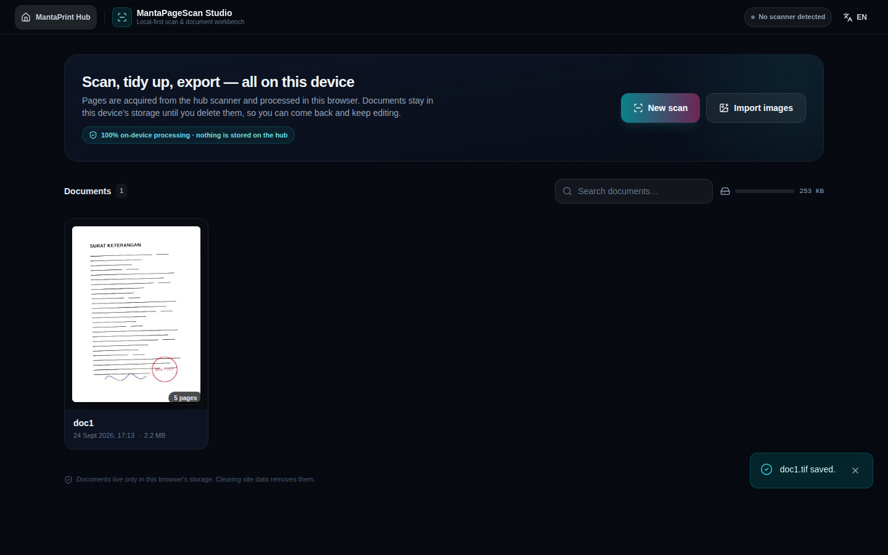 | 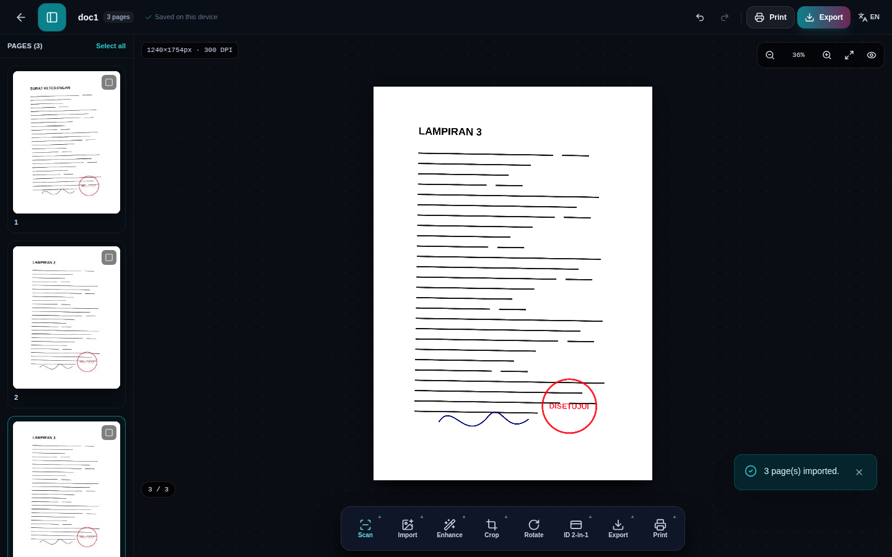 |
| **Library** — documents stored on this device | **Workbench** — pages rail, stage, tool dock |
| 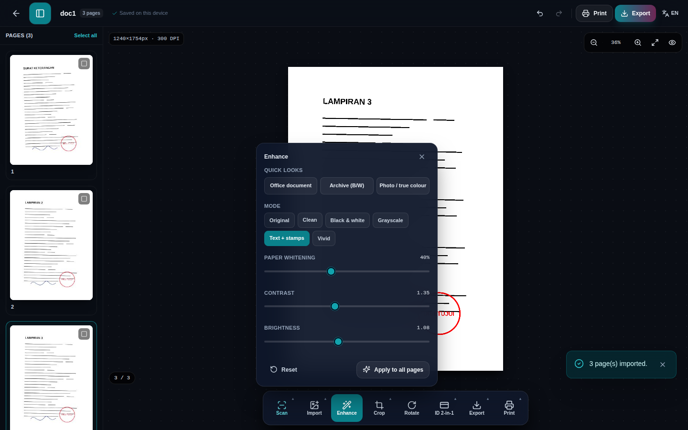 | 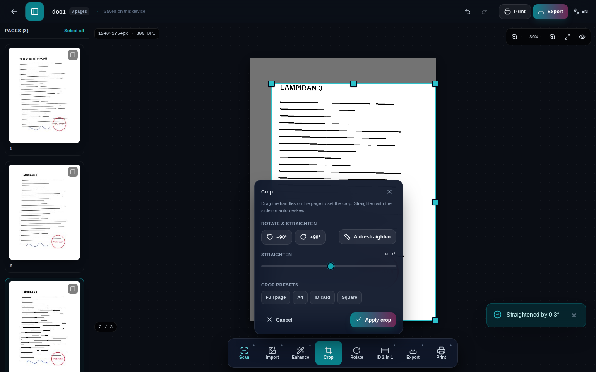 |
| **Enhance tray** — filter modes and live sliders | **Crop & straighten** — handles on the page, auto-deskew |
| 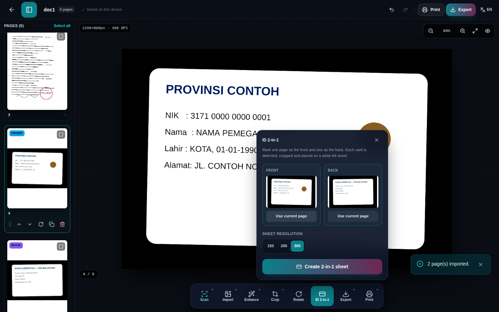 | 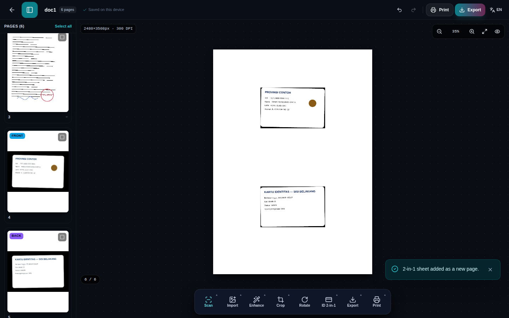 |
| **ID 2-in-1** — front/back assignment | **Composed A4 sheet** (cards detected and tone-mapped) |
| 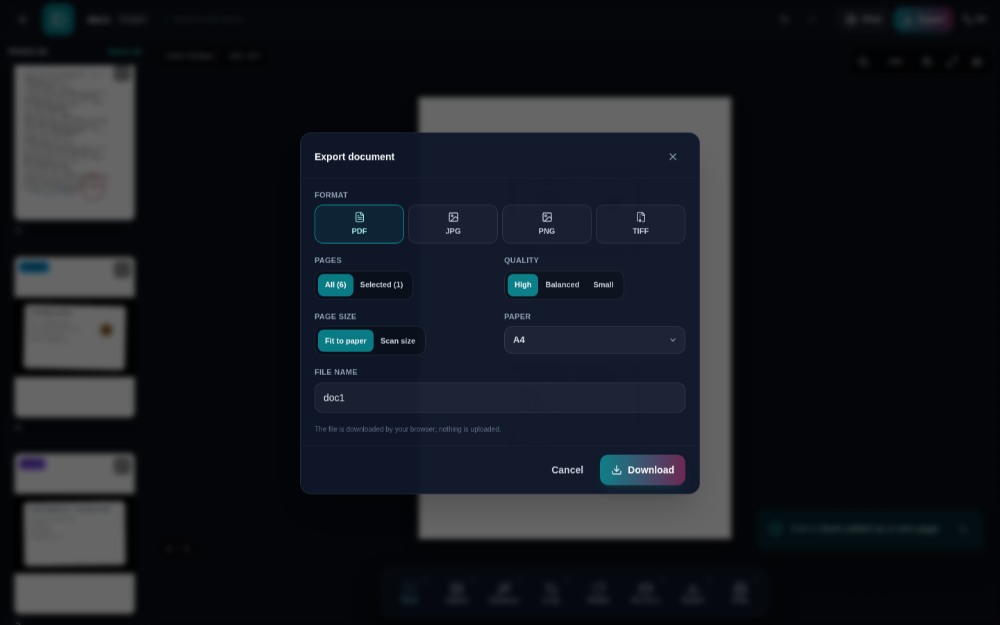 | 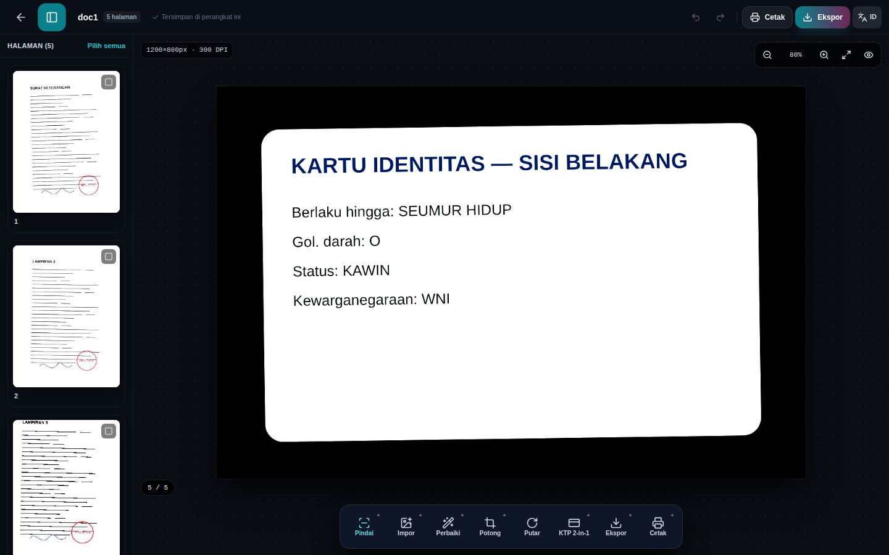 |
| **Export** — PDF / JPG / PNG / TIFF, Save as… | **Bahasa Indonesia** |

<p>
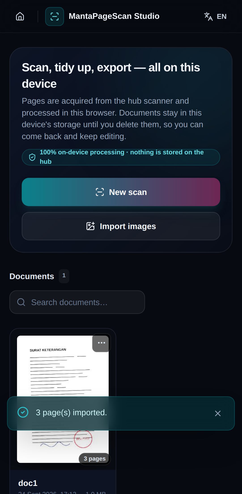 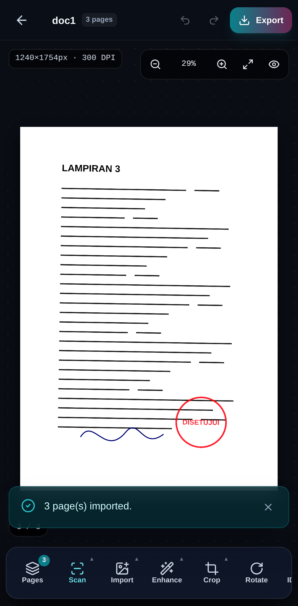 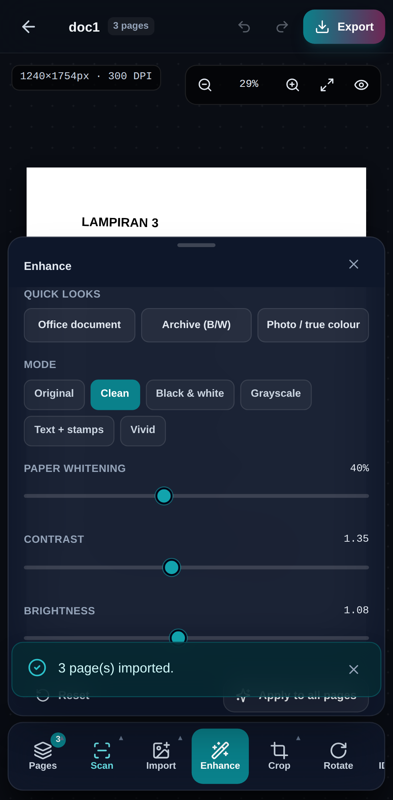 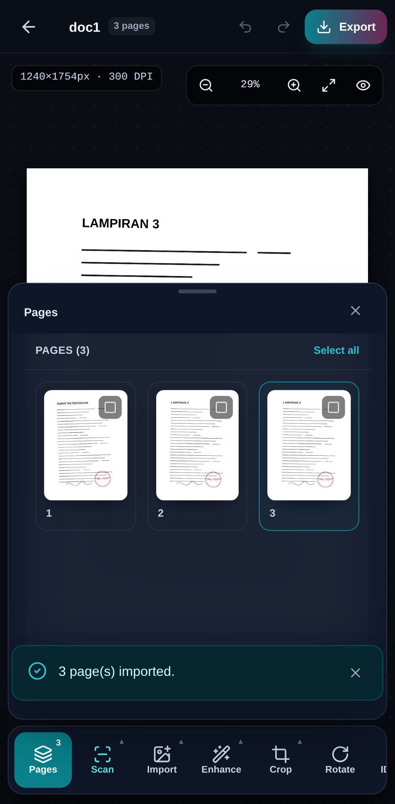
</p>

*Phone layout: trays become sheets above the dock; the pages rail opens from the first dock button.*

## Architecture

```
frontend/src/scan/
├── ScanStudio.jsx              routes /scan (library) and /scan/<docId> (workbench)
├── i18n.js                     studio.* translations, EN + ID
├── db/studioDb.js              IndexedDB: documents, pages (Blob + edits), settings
├── hooks/
│   ├── useStudioDocument.js    loads a document, mutations, autosave, thumbnails, undo/redo
│   └── useZoomPan.js           Ctrl+wheel / pinch zoom around the cursor, drag & two-finger pan
├── engine/
│   ├── render.js               page pipeline: rotate → deskew → crop → tone filters → pixel passes
│   ├── renderWorker.js         same pipeline in a Web Worker (OffscreenCanvas) + KTP composition
│   ├── renderClient.js         worker facade with main-thread fallback
│   ├── pdfExport.js            pdf-lib export (fit-to-paper or true scan size)
│   ├── tiff.js                 multi-page TIFF writer (LZW, RGB or 8-bit gray, DPI)
│   ├── zip.js                  stored ZIP writer for multi-image export
│   ├── fileSave.js             File System Access "Save as…" with download fallback
│   ├── hubClient.js            acquireScan() with ?wipe=true, printBlob() raw upload
│   └── paper.js                paper sizes, presets, filters
└── components/
    ├── Library.jsx             document grid, import, rename/pin/duplicate/delete, storage meter
    ├── Workbench.jsx           header, rail, stage, dock, trays, export & print dialogs, shortcuts
    ├── PagesRail.jsx           thumbnails, multi-select (Ctrl/Shift, long-press), drag reorder
    ├── Stage.jsx               canvas preview, HUD, crop handles
    ├── ToolDock.jsx / trays.jsx / ExportSheet.jsx / ui.jsx
```

The image algorithms (projection-profile deskew, Sauvola binarization, illumination whitening, dual-layer stamp preservation, CR80 card detection, 2-in-1 template) are the existing, unit-tested `frontend/src/utils/documentProcessor.js`.

### Data model (IndexedDB `mantaprint_scan_studio`)

| Store | Record |
|---|---|
| `documents` | `{ id, title, createdAt, updatedAt, pageIds[], preset, paperSize, pinned, cover, pageCount, sizeBytes }` |
| `pages` | `{ id, docId, blob (original JPEG/PNG), mime, width, height, dpi, source, role: normal/front/back/sheet, edits, thumb }` |
| `settings` | `{ key, value }` — last scan settings, KTP DPI |

`edits` is non-destructive: `{ rotation, deskew, crop:{x,y,w,h} (fractions of the rotated frame), brightness, contrast, bgClean, filter }`. The original blob is never modified; thumbnails and exports are rendered from it. Deleting a page only removes it from `pageIds` (undoable); unreferenced pages are purged when the document is closed.

### Hub contract

| Call | Purpose |
|---|---|
| `POST /api/scanner/scan` → `GET downloadUrl?wipe=true` | acquire one page; the hub shreds its RAM copy when the download completes |
| `GET /api/scanner/status` | scanner presence, ADF/duplex capabilities (already part of `/api/status`) |
| `POST /api/print/upload` (raw body, `X-Document-Name`) | print a rendered PDF |

Deprecated and unused by the studio: `/api/scanner/enhance`, `/merge`, `/ktp2in1`, `/blank-detect`, `/session-status`, `/wipe-session` (they answer with `Deprecation: true` and a `Sunset` header).

### Keyboard shortcuts

`Ctrl+Z` / `Ctrl+Y` undo/redo · `Ctrl+S` export · `Ctrl+P` print · `Ctrl+A` select all pages · `←/→` previous/next page · `R` / `Shift+R` rotate · `C` crop · `E` enhance · `+` `-` `0` zoom / fit · `Delete` remove page · `Esc` close tray.

## Testing

```bash
# unit tests (image algorithms, TIFF/ZIP encoders)
npm test --prefix frontend

# end-to-end smoke test + screenshots (needs `npm i -g playwright` and the bundled Chromium)
PORT=18090 node src/web/server/server.mjs &
BASE=http://127.0.0.1:18090 OUT=docs/images/scan-studio node qa/studio_e2e.mjs
```

The E2E script imports generated sample pages, applies enhance/crop/deskew, composes a KTP sheet, exports PDF and TIFF (and checks their signatures), verifies persistence across a reload, switches the language and repeats the core flow on a phone viewport.

## Known limits / next steps

- Importing PDFs is not supported yet (images only); `pdfjs-dist` would add ~1 MB to the bundle.
- The scanner "mock" mode of the hub is not used by the studio.
- Crop ratio presets assume a portrait A4 frame when deriving the height.
