# MantaPrint Hub — Web App UI (Home & Admin)

The hub serves one web app with three areas:

| Route | Who uses it | Purpose |
|---|---|---|
| `/` | Anyone on the local network | Print a file, open the scan studio, set up a phone or laptop |
| `/scan` | Anyone (unless disabled in admin) | MantaPageScan Studio — see [10-mantapagescan-studio.md](10-mantapagescan-studio.md) |
| `/admin` | Staff with the admin password (default credentials: `mantaprint` / `mantapgan`) | Printers, queue, scanner, network, settings, updates |

All three share one design language, taken from MantaPageScan Studio. Hub administration (hub name, mDNS broadcast names, queues, services) exists only in `/admin`; the homepage has no settings.

## Homepage (`/`)


The hub announces its shared printers over mDNS/AirPrint, so most phones and laptops list them without anyone opening this page. The homepage is for the other case: a network that blocks discovery (guest Wi-Fi, client isolation, VPN), where the printer has to be added **by address**.

1. **Choose a printer.** Only printers an admin has shared are listed, each with its live state. The choice fills in the addresses used in step 2.
2. **Add it on your device.** The tab for the visitor's OS is preselected (Android, iPhone/iPad, Windows, macOS, ChromeOS, Linux). Every tab gives the *manual* steps plus the exact values to copy for that OS:

   | OS | What the page gives |
   |---|---|
   | Android | Hub IP address for *Default Print Service › Add printer by IP address* |
   | iPhone / iPad | **Download AirPrint profile** — a `.mobileconfig` from `GET /api/airprint.mobileconfig?queue=…` with a `com.apple.airprint` payload (IP, port 631, `printers/<queue>`). iOS cannot add a printer by address any other way. |
   | Windows | `http://<ip>:631/printers/<queue>` for *Select a shared printer by name* (Microsoft IPP Class Driver) |
   | macOS, ChromeOS | Address and queue (`printers/<queue>`) for the IPP form |
   | Linux | IPP URL and an `lpadmin … -m everywhere` command |

   *Still not working?* (collapsed) covers guest networks and VPNs and offers printing from the browser.

**Print a file** and **Scan documents** are buttons in the header card, not page sections. Print a file opens a dialog (file, printer, copies, paper, pages, orientation, sides); the file is streamed to the hub as the raw request body. **Your print jobs** appears under the guide only once this browser has sent a job; the hub returns a per-job token the page uses to follow and cancel it. Nobody else's document names are shown: the public status stream and `/api/jobs` contain no titles or client addresses.

<p>
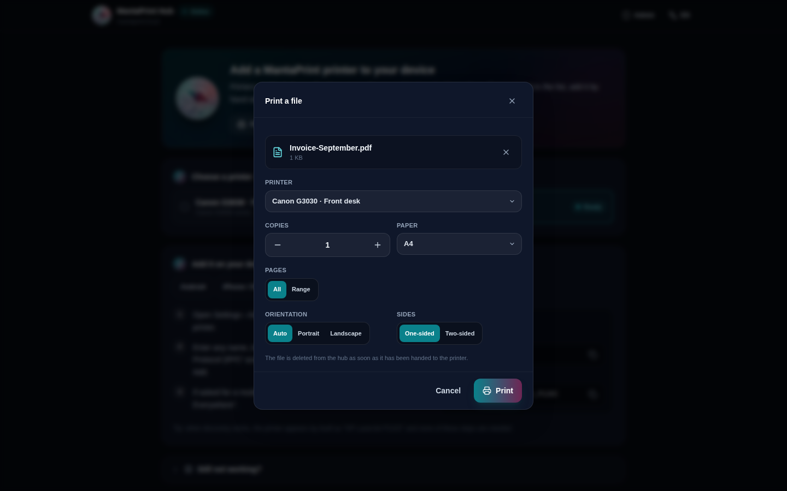 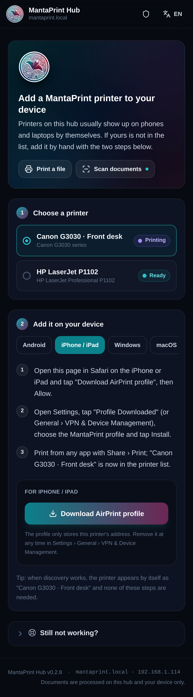 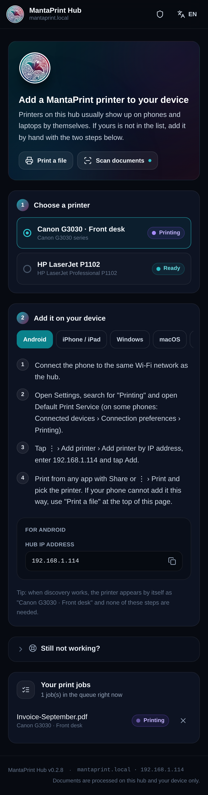
</p>

> The AirPrint profile is unsigned, so iOS shows it as *Unverified* before installing; that is expected for a profile served by a local device.

## Admin console (`/admin`)


Seven sections, a sidebar on desktop and a scrollable tab bar on phones. Every section starts with a title, a one-line description and at most two primary actions.

| Section | Contents |
|---|---|
| **Overview** | Printers online, jobs in progress, scanner, network. *Needs attention* collects what an admin should act on (default password, update available, no printer shared, printer error, service down, storage almost full), each linking to the right section. System vitals and the three services (CUPS, Avahi, IPP-over-USB) with a restart button each. |
| **Printers** | One list of every queue (USB and network) with state, share status and the name devices see. A row opens a side sheet: test page, pause/resume, make default, name, location, **share on the network** and **the broadcast (mDNS) name**, and the IPP addresses. *Add network printer* (with connection test) and *Rescan USB* live here. Below the list, **Found on your network** scans for printers (mDNS + SNMP), says whether each can already do AirPrint or which driver the hub would use, and adds one with a click; an optional switch adds suitable ones automatically. Network printers show *Offline* with their address when they stop answering. See `docs/12-driver-compatibility.md`. |
| **Queue** | Jobs in progress and recent history with document names (admins only), filter per printer, cancel one job, cancel all and clear history — both behind a confirmation. |
| **Scanner** | Scanner state (a ScanSnap that needs its firmware file gets a card explaining where to find it, with an upload for the `.nal` or the ScanSnap installer), access switches for the scan studio and for paired devices, paired devices (rename, revoke, restore, remove) and pairing by QR code or PIN. |
| **Network** | Ethernet, Wi-Fi and setup hotspot at a glance; Wi-Fi scan and join; DHCP or static IP. Ping and the network reset sit in collapsed sections. |
| **Settings** | **Hub name** (hostname announced over mDNS as `name.local`), default language, time zone, automatic or manual time, admin account and password, restart. |
| **Updates** | Installed version, *Check for updates*, *Install*, progress through the update steps, release notes. The installation log and snapshots (rollback) are collapsed. |

<p>
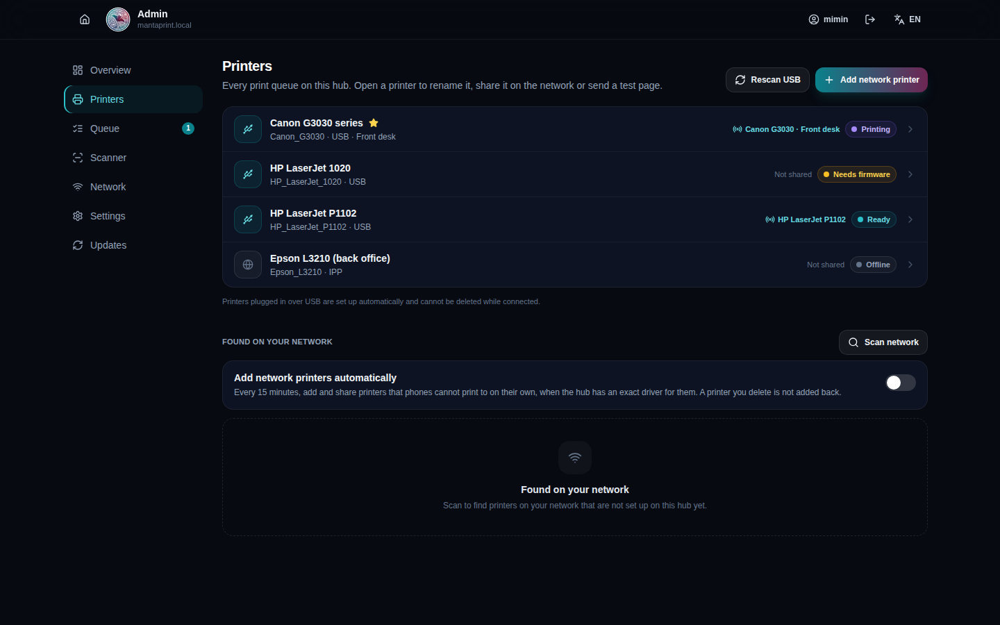 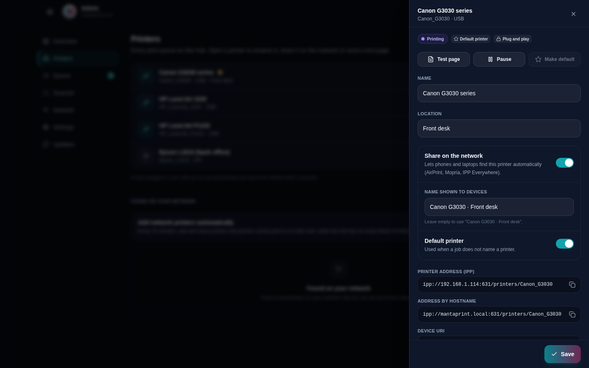
</p>
<p>
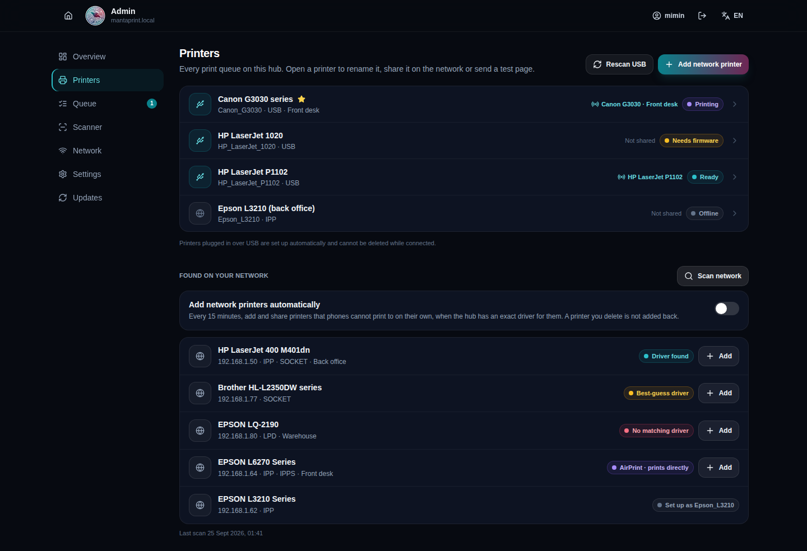 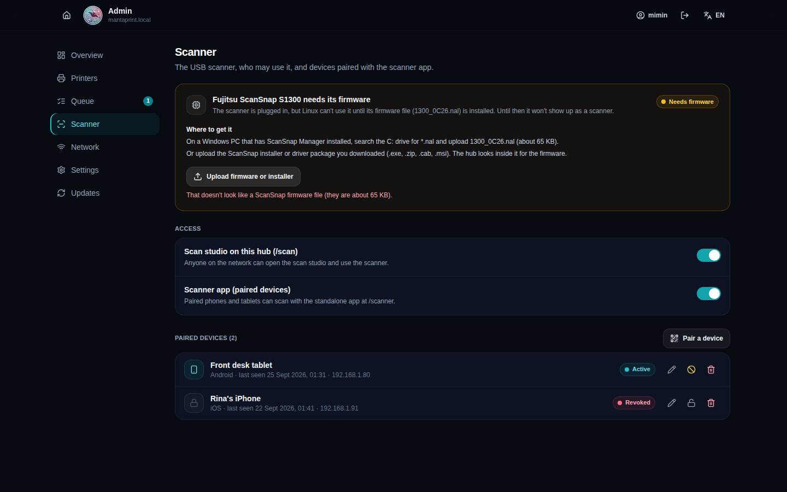
</p>
<p>
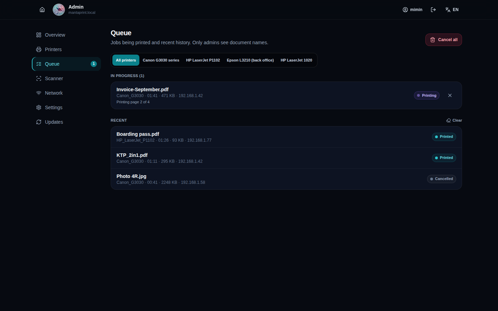 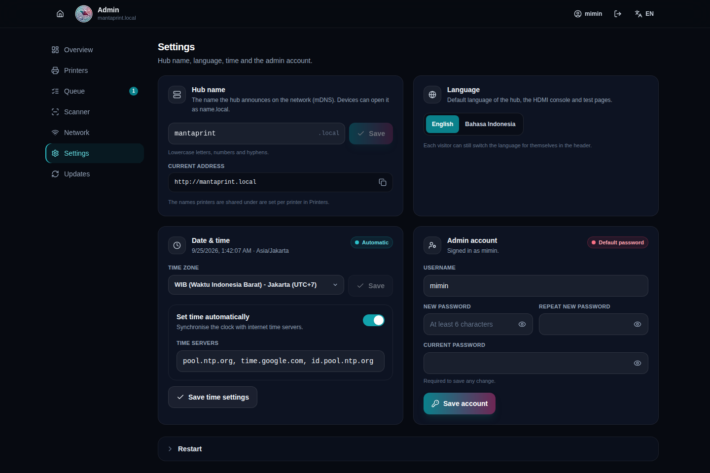
</p>
<p>
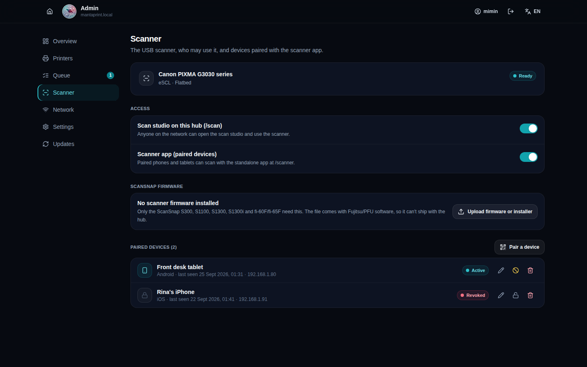 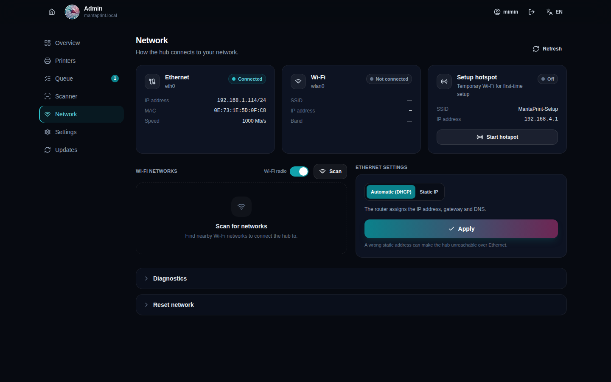
</p>
<p>
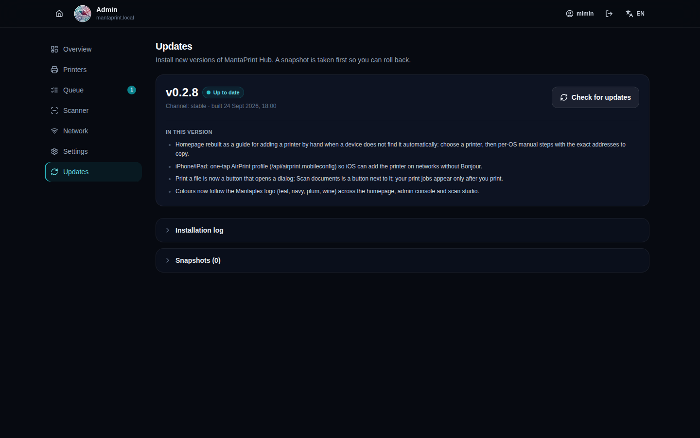 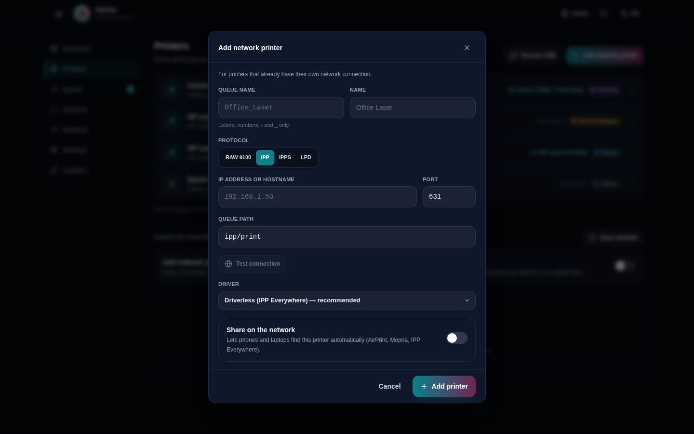
</p>
<p>
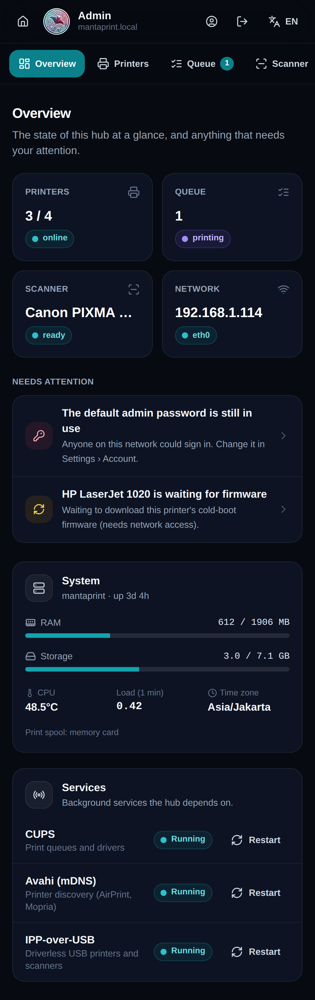 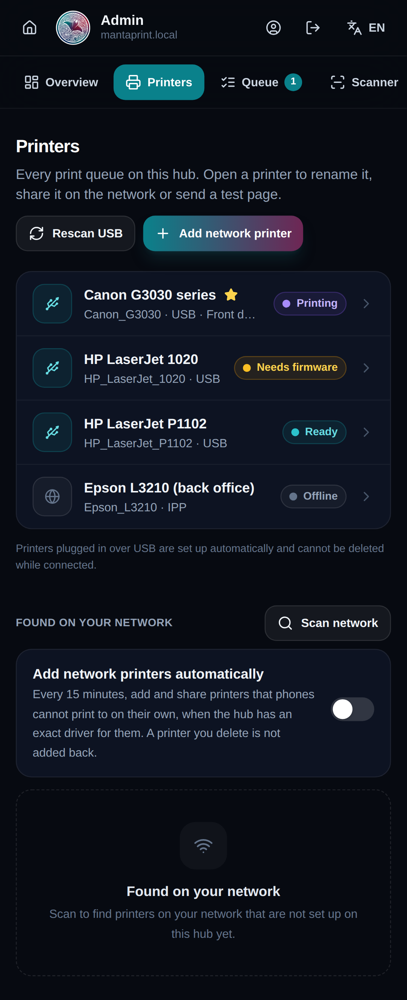 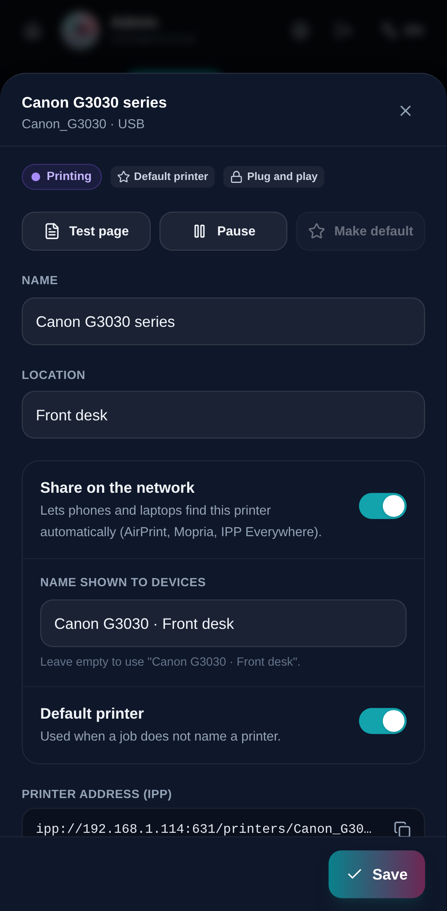 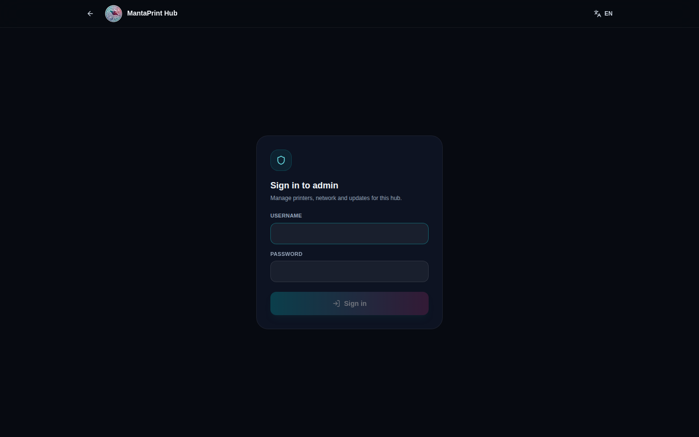
</p>

## Design language

The same rules as MantaPageScan Studio, now shared from `frontend/src/ui/`:

- **Colour.** Taken from the Mantaplex logo ring (teal → navy → plum → wine), defined as Tailwind scales `manta` (teal), `navy`, `plum` and `wine` in `frontend/tailwind.config.js`. Background `#070a11`, surfaces `slate-900/70`, borders `white/7%`. **Teal (`manta`) is the one UI accent** for selection, focus and "OK"; primary buttons use the teal → plum gradient, and navy/plum/wine only appear in brand gradients (homepage header card, step numbers). Amber means *attention*, rose means *danger or destructive*, violet means *in progress*. Colour is never the only signal: every status is a labelled pill.
- **Type & spacing.** 11 px uppercase labels, 14 px body, 18–20 px page titles. Cards are `rounded-2xl`; controls are at least 40–44 px tall.
- **Structure.** A 56 px sticky header (brand, context, actions, language). Pages are *title → description → content*. Rare or risky controls go into a collapsed *Disclosure*; destructive actions always ask for confirmation.
- **Phones.** Grids collapse to one column, side sheets become bottom sheets, admin navigation becomes a horizontal tab bar. The E2E test fails if any page scrolls horizontally.
- **Language.** English and Bahasa Indonesia for every string (`frontend/src/i18n/ui.js`); each visitor can switch in the header, and admins set the hub default.

### Building blocks (`frontend/src/ui/`)

| Component | Use |
|---|---|
| `Button`, `IconButton`, `Segmented`, `Switch`, `Slider`, `TextInput`, `Select`, `Field` | Controls |
| `Card`, `CardHeader`, `PageHeader`, `SectionLabel` | Layout |
| `List`, `ListRow`, `SettingRow` | Rows with a label on the left and a value or control on the right |
| `StatusPill`, `StatusDot`, `Badge`, `Meter` | Status |
| `Modal`, `SideSheet`, `Tray`, `Disclosure` | Overlays and progressive disclosure |
| `EmptyState`, `CopyField` | Empty lists, copyable addresses |

## Code map

```
frontend/src/
├── App.jsx                 routes / · /scan · /admin, live status (SSE + polling fallback), toasts
├── ui/                     design system (primitives.jsx, surfaces.jsx)
├── shell/                  AppHeader, fetch helpers (admin token, print upload, my jobs)
├── hub/                    homepage: Home, AddPrinterGuide, PrintDialog, MyJobs
├── admin/                  AdminApp shell, Login, sections/{Overview,Printers,Queue,Scanner,Network,Settings,Updates}
├── scan/                   MantaPageScan Studio
└── i18n/                   translations.js (common) · ui.js (hub, adm) · ../scan/i18n.js (studio)
```

## Server changes that come with the new UI

- Destructive queue actions (`cancel-all`, `clear-history`, printer attention flag, USB rescan, per-printer test page) require an admin token; the hub's own HDMI console on `127.0.0.1` keeps working.
- Cancelling a single job requires an admin token **or** the job's own token.
- `/api/status`, the SSE stream and the public `/api/jobs` no longer expose document titles, submitter IP addresses or job tokens.
- Fixed: status changes made from the admin were not pushed to open pages immediately (`broadcastStatusToSse` did not exist).
- Uploads accept a URL-encoded `X-Document-Name`, so file names with spaces or non-ASCII characters are kept.

## Testing

```bash
npm test --prefix frontend           # unit tests
node --test test/*.test.mjs          # hub server tests

# end-to-end smoke test + the screenshots on this page (Playwright + Chromium)
PORT=18090 node src/web/server/server.mjs &
BASE=http://127.0.0.1:18090 OUT=docs/images/ui node qa/ui_e2e.mjs
```

The E2E test signs in, walks every admin section on desktop and phone, opens the printer sheet and the add-printer dialog, checks that the guide's addresses follow the chosen printer and OS, prints a file through the homepage dialog and the real hub, checks the iPhone tab offers the AirPrint profile, switches the language, and fails on any console error or horizontal overflow. Hardware-dependent status (USB printers, scanner, jobs) is replaced with a demo fixture so screenshots show a working hub; screenshots are page captures without browser chrome.
