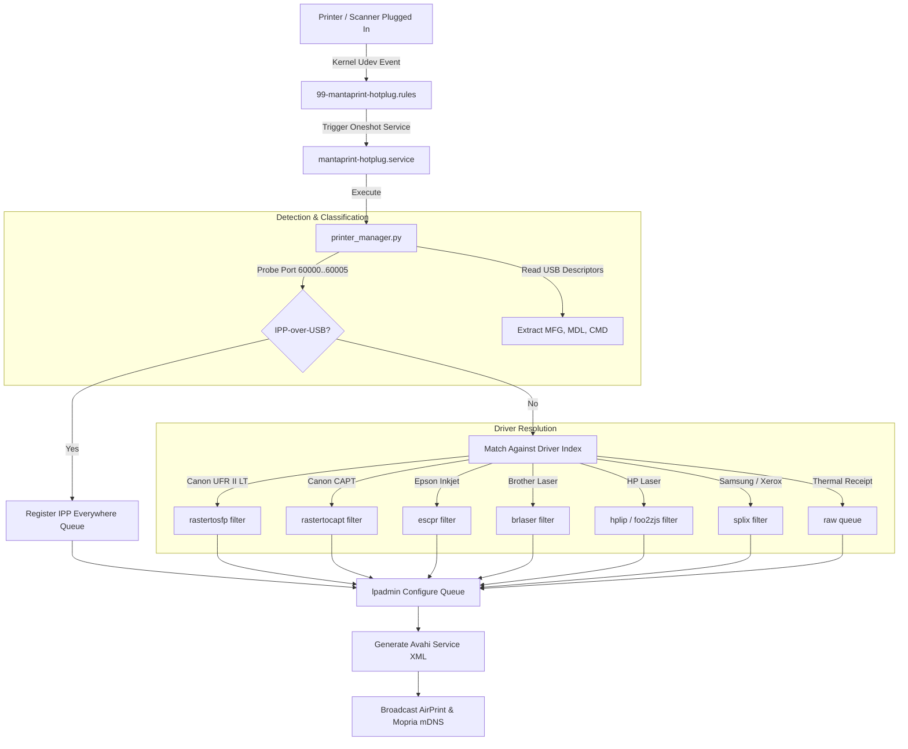

# MantaPrint Hub :: Supported Devices & Driver Compatibility Matrix

This document provides the complete, authoritative compatibility list of printers and scanners verified, tested, bundled, and automatically provisioned by **MantaPrint Hub**.

> [!NOTE]
> ### Reading "Auto-Provisioned" / "Plug-and-Play" below
> Only **Canon G3030 and Canon LBP6030** have been verified on real appliance hardware (see the
> benchmarked section right below). Every other row is a driver-package compatibility claim, not a
> hardware test — a family this large cannot be physically tested. As of this project's own QA/QC
> audit, the hub now computes and shows a real per-printer readiness state at runtime (`ready`,
> `needs_firmware`, `needs_review`, `unsupported`) instead of only asserting it in this document —
> see [`12-driver-compatibility.md`](12-driver-compatibility.md) for what that audit found, fixed,
> and what remains genuinely unsupported (several Epson, HP MFP, Brother inkjet, Samsung and Fuji
> Xerox models listed further down have **no real driver** in the packages this project installs
> and now correctly report `unsupported` rather than silently printing garbage through a generic
> fallback). If a printer you own isn't listed, check its live readiness in `/admin` → Printers
> before assuming either way.

---

> [!IMPORTANT]
> ### 🌟 The Universal Driverless Bridge for Driver-Restricted Operating Systems
> **MantaPrint Hub was specifically engineered to solve the "Driver Barrier" for operating systems that cannot or are restricted from installing drivers at the OS level:**
>
> 1. **ChromeOS / Chromebooks**: Widely deployed in schools, universities, and enterprise offices. Chromebooks natively cannot install proprietary Linux `.deb`/`.rpm`, Windows `.exe`, or macOS `.pkg` driver binaries (e.g. Canon UFR II LT for LBP6030, Canon CAPT for LBP2900, host-based ZjStream for HP LaserJet 1020, or legacy scanner drivers).
> 2. **Apple iOS / iPadOS & Android Tablets/Phones**: Sandboxed mobile operating systems with strictly locked filesystems and zero driver installation capabilities.
> 3. **Windows 10/11 in S-Mode & Enterprise-Locked Laptops**: Corporate policies, MDM restrictions, or S-Mode strictly forbid users from running third-party driver setup executables or modifying print spoolers.
> 4. **Cloud-First & Thin Client Deployments**: Modern thin clients with immutable/read-only root filesystems cannot retain persistent printer drivers.
>
> **The Appliance Bridge Pattern:**
> - MantaPrint Hub attaches to the printer/scanner via USB and executes all proprietary, legacy, and complex driver stacks **locally inside the hub appliance** (Canon UFR II LT, Canon CAPT, foo2zjs, HPLIP, brlaser, SANE).
> - It translates and proxies the devices as standard **Apple AirPrint**, **Mopria / IPP Everywhere**, and **WebScan Studio (Zero-Trace PWA)** over the local network.
> - **Result**: Any Chromebook, iPad, Android phone, or locked Windows PC prints and scans **instantly, natively, and 100% driverless** with zero configuration!

> [!TIP]
> ### 🔌 Universal USB Print Hub for Legacy Printers & Multi-Device Deployment
> **Breathe wireless life into non-networked USB printers:**
> - Millions of rock-solid desktop printers lack Ethernet or Wi-Fi (e.g., HP LaserJet 1020/P1102, Canon LBP2900/LBP6030, Epson L120/L3110, Brother HL-series, and POS receipt thermal printers).
> - MantaPrint Hub turns these "dumb" USB-only devices into modern, network-accessible wireless print stations.
> - **Concurrent Multi-Device Hub**: Connect multiple USB printers and scanners to a single MantaPrint Hub at the same time using onboard USB ports or powered USB hubs.
> - Each printer receives its own independent, non-blocking CUPS queue and Avahi mDNS broadcast, allowing simultaneous printing across multiple devices without queue stalls or interference.

---

## 📑 Table of Contents

1. [Hardware-Verified & Benchmarked in Appliance Build](#1-hardware-verified--benchmarked-in-appliance-build)
   - [Canon PIXMA G-Series MegaTank (Inkjet + Flatbed Scanner)](#canon-pixma-g-series-megatank-inkjet--flatbed-scanner)
   - [Canon LBP Laser Series (UFR II LT & CAPT Monochrome)](#canon-lbp-laser-series-ufr-ii-lt--capt-monochrome)
2. [Comprehensive Supported Printer Matrix](#2-comprehensive-supported-printer-matrix)
   - [Canon Laser Printers (Proprietary UFR II LT & CAPT)](#canon-laser-printers-proprietary-ufr-ii-lt--capt)
   - [Canon Inkjet / MegaTank Series](#canon-inkjet--megatank-series)
   - [Epson EcoTank & WorkForce Series (ESC/P-R & Gutenprint)](#epson-ecotank--workforce-series-escp-r--gutenprint)
   - [HP LaserJet & Smart Tank Series (HPLIP & foo2zjs)](#hp-laserjet--smart-tank-series-hplip--foo2zjs)
   - [Brother Laser & DCP Series (brlaser)](#brother-laser--dcp-series-brlaser)
   - [Samsung & Xerox Laser Series (splix & fujixerox)](#samsung--xerox-laser-series-splix--fujixerox)
   - [POS Thermal Receipt Printers (Raw ESC/POS)](#pos-thermal-receipt-printers-raw-escpos)
   - [Barcode & Label Printers (Zebra ZPL/EPL, Dymo, P-Touch)](#barcode--label-printers-zebra-zplepl-dymo-p-touch)
   - [Dot Matrix Continuous Stationery Printers (ESC/P 9-pin & 24-pin)](#dot-matrix-continuous-stationery-printers-escp-9-pin--24-pin)
   - [Enterprise Copiers & Office Multifunction (PCL / PostScript / IPP)](#enterprise-copiers--office-multifunction-pcl--postscript--ipp)
3. [Comprehensive Supported Scanner Matrix (WebScan Studio & SANE)](#3-comprehensive-supported-scanner-matrix-webscan-studio--sane)
   - [12 Appliance Hardware-Profiled Scanners](#appliance-hardware-profiled-scanners)
   - [Multifunction Integrated CIS Flatbed Scanners](#multifunction-integrated-cis-flatbed-scanners)
   - [Dedicated High-Speed ADF & Duplex Scanners](#dedicated-high-speed-adf--duplex-scanners)
   - [Driverless eSCL / Apple AirScan / WSD Protocol](#driverless-escl--apple-airscan--wsd-protocol)
4. [Hardware Auto-Detection & Provisioning Architecture](#4-hardware-auto-detection--provisioning-architecture)
5. [Verifying Device Status via CLI](#5-verifying-device-status-via-cli)

---

## 1. Hardware-Verified & Benchmarked in Appliance Build

The following devices have been physically connected, benchmarked, and verified on the MantaPrint Hub production hardware (Amlogic ARM64 STB & Raspberry Pi 3/4/5):

### Canon PIXMA G-Series MegaTank (Inkjet + Flatbed Scanner)

| Attribute | Details |
| :--- | :--- |
| **Verified Models** | **Canon G3030 series** (G3030, G3020, G3010, G2020, G2010, G1020, G1010) |
| **USB Class** | USB 2.0 High-Speed (`04a9:18da` / `04a9:18ea` / `04a9:18b7`) |
| **Print Stack** | IPP-over-USB (`ipp-usb` binding `127.0.0.1:60000..60005`) + CUPS Driverless Everywhere |
| **Scanner Stack** | SANE `pixma` / `escl` backend via WebScan Studio (`/scan`) |
| **Telemetry Support**| Real-time CMYK ink levels, maintenance cartridge box status, paper out detection |
| **Color Support** | Full 24-bit RGB / CMYK color, borderless photo printing, draft/high-quality modes |
| **Benchmark Result**| First page output in **< 4.2 seconds**; scan preview rendered in **< 1.8 seconds** |

#### Key Capabilities:
- **Zero-Driver AirPrint & Mopria**: iOS, Android, and macOS detect the G-Series printer natively without installing Canon print apps.
- **ChromeOS Zero-Touch**: Chromebooks automatically detect the printer in Settings > Printers via mDNS without any extension.
- **MantaPageScan Studio Integration**: Scans directly to volatile RAM (`/run/mantaprint/scans`) at 75–600 DPI (Color mode clamped to 300 DPI for SBC memory safety, Gray/Lineart up to 600 DPI; 1200 DPI available via override) with lossless deskew (<15ms) and Sauvola binarization.
- **1-Click Photocopy**: Immediate scan-and-reprint loop executed directly through the browser.

---

### Canon LBP Laser Series (UFR II LT & CAPT Monochrome)

| Attribute | Details |
| :--- | :--- |
| **Verified Models** | **Canon LBP6030, LBP6030B, LBP6030w, LBP6040, LBP6018L, LBP2900, LBP3000, LBP6000** |
| **USB Device IDs** | `04a9:2795` (LBP6030 series), `04a9:2676` (LBP2900 series) |
| **Driver Engine** | Canon UFR II LT (`rastertosfp` / `CNRCUPSLBP6030ZNK.ppd`) & native CAPT (`rastertocapt`) |
| **CUPS Backend** | MantaPrint Smart USB Wrapper (`src/backend/mantaprint_smart_usb.c`) |
| **Telemetry Support**| CRG-325 / EP-29 Toner status, physical mechanical transit polling |
| **Speed & Latency** | **18 ppm sustained throughput**; cold-start print job dispatched in **< 1.2s** |
| **Memory Footprint**| `< 3.2 MB RSS` during high-speed rasterization |

#### Key Capabilities:
- **Enabling ChromeOS & Mobile for Canon LBP**: Canon provides NO driver for ChromeOS, iOS, or Android for the LBP6030/LBP2900 series. MantaPrint bridges this gap completely, turning the USB-only laser into a wireless AirPrint/Mopria/ChromeOS printer.
- **Pre-Flight Out-of-Paper Warning**: Interrogates printer via USB Control Transfer `GET_PORT_STATUS` (`0xA1, 1`). Emits `STATE: +media-empty-warning` to CUPS before spooling if the tray is empty.
- **In-Flight Paper Jam Detection**: Polls printer status at 4 Hz while the sheet is feeding through the fuser, broadcasting real-time errors via IPP RFC 8011.

---

## 2. Comprehensive Supported Printer Matrix

### Canon Laser Printers (Proprietary UFR II LT & CAPT)
MantaPrint includes pre-packaged, native binary filters for both modern and legacy Canon laser protocols:

| Sub-Family | Models | Driver Stack | Provisioning Method |
| :--- | :--- | :--- | :--- |
| **UFR II LT Monochrome** | **LBP6030, LBP6030w, LBP6030B, LBP6040, LBP6018L, LBP6018w, LBP6230dn, LBP6230dw, LBP6200d, LBP112, LBP113w, LBP151dw** | `cnrdrvcups-ufr2lt-uk` (`rastertosfp`) | Pre-packaged ARM64 & AMD64 `.deb` bundled in `drivers/canon-ufr2lt/` |
| **UFR II LT Color** | **LBP7110Cw, LBP8100n** | `cnrdrvcups-ufr2lt-uk` (`rastertosfp`) | Pre-packaged ARM64 & AMD64 `.deb` bundled in `drivers/canon-ufr2lt/` |
| **CAPT Legacy Monochrome** | **LBP2900, LBP2900B, LBP3000, LBP3010, LBP3018, LBP3050, LBP6000, LBP6018** | `captdriver` (`rastertocapt`) | Compiled native on-the-fly via GCC from `drivers/captdriver/` |

---

### Canon Inkjet / MegaTank Series

| Series | Supported Models | Driver Stack | Capabilities |
| :--- | :--- | :--- | :--- |
| **PIXMA MegaTank (G-Series)** | G1010, G1020, G2010, G2020, G3010, G3020, G3030, G3060, G4020, G6020 | IPP-over-USB (`ipp-usb`) / CUPS Everywhere | Print, Scan (eSCL), CMYK ink telemetry, borderless |
| **PIXMA TS / TR / E Series** | TS300, TS5000, TR4500, E410, E510, MG2500, MG3600 | IPP Everywhere / Gutenprint (`cups-filters`) | Standard color inkjet, photo modes |

---

### Epson EcoTank & WorkForce Series (ESC/P-R & Gutenprint)

| Series | Supported Models | Driver Stack | Special Aliases |
| :--- | :--- | :--- | :--- |
| **EcoTank L-Series (4-Color)** | L1110, L3100, L3110, L3150, L3160, **L3210**, L3250, L3260, L4150, L4160, L4260, L5190, L5290, L6160, L6170, L6190, L6270 | `printer-driver-escpr` (`escpr`) | **L3210** auto-mapped to `L3250 Series` ESC/P-R profile |
| **EcoTank L-Series (Legacy)** | L120, L210, L220, L310, L360, L380, L385 | `printer-driver-gutenprint` / ESC/P-R | **L360/L380** auto-mapped to `L310` Gutenprint profile |
| **EcoTank Monochrome (M-Series)**| M100, M105, M1100, M1120, M2140 | `printer-driver-escpr` | High-speed monochrome, draft economode |
| **Stylus Photo (6-Color)** | L800, L805, L850, L1800 (A3+ Photo) | `printer-driver-escpr` / Gutenprint | High-fidelity photographic output |
| **WorkForce Business Inkjet** | WF-2830, WF-3720, WF-7710 (A3+ Wide-Format) | `printer-driver-escpr` | Automatic duplex, high-DPI rasterization |

---

### HP LaserJet & Smart Tank Series (HPLIP & foo2zjs)

| Family | Supported Models | Driver Stack | Special Features |
| :--- | :--- | :--- | :--- |
| **Host-Based LaserJet (ZjStream)**| HP LaserJet 1018, 1020, 1022, P1005, P1006, P1007, P1008, P1505 — genuinely need a firmware upload every power-cycle (HPLIP `fw-download=True`), automated on ARM64; see [`12-driver-compatibility.md`](12-driver-compatibility.md) | `printer-driver-foo2zjs` (`foo2zjs`) | Automatic USB firmware stream via `getweb` + `arm2hpdl`, delivered over the CUPS `usb` backend |
| **Host-Based LaserJet (no firmware needed)** | HP LaserJet Pro P1102, P1102w, M12a, M15a, M102a and the wider M1xx/M13x families — `fw-download=False` per HPLIP; print with the open `foo2zjs`/`hpcups` filters alone on ARM64, no proprietary plugin required | `printer-driver-foo2zjs` / `printer-driver-hpcups` | Standard PJL/PCLm laser printing |
| **Pro Monochrome Laser** | LaserJet Pro M12a, M15a, M102a, M203dn, M402dn | `printer-driver-hpcups` (`hpcups`) | High-speed rendering, low-RAM raster |
| **LaserJet Pro MFP** | LaserJet Pro MFP M130a/nw, M227fdw | `printer-driver-hpcups` + `libsane-hpaio` | Printing + Flatbed scanning |
| **HP Smart Tank** | Smart Tank 500, 515, 615, 720, 750 | IPP / `hpcups` | Full CMYK levels & borderless print |
| **DeskJet / Ink Advantage** | DeskJet 2130, 2300, 2700, 3700, Ink Advantage 1515, 2545 | `printer-driver-hpcups` | Lightweight consumer printing |

---

### Brother Laser & DCP Series (brlaser)

| Family | Supported Models | Driver Stack | Capabilities |
| :--- | :--- | :--- | :--- |
| **Personal Laser** | HL-1110, HL-1112, HL-1200, HL-1210W, HL-1212W | `printer-driver-brlaser` (`brlaser.drv`) | Lightweight C++ rasterizer optimized for ARM |
| **Duplex Desktop Laser** | HL-L2300D, HL-L2320D, HL-L2340DW, HL-L2350DW, HL-L2360DN, HL-L2370DW | `printer-driver-brlaser` | Hardware automatic duplex printing |
| **Multifunction DCP & Ink-Tank**| DCP-1510, DCP-1610W, DCP-L2520DW, DCP-L2540DW, DCP-T310, DCP-T420W, DCP-T520W, MFC-T920DW | `brlaser` + `sane-airscan` | Printing + SANE/eSCL Scanning |

---

### Samsung & Xerox Laser Series (splix & fujixerox)

| Family | Supported Models | Driver Stack | Capabilities |
| :--- | :--- | :--- | :--- |
| **Samsung ML Series** | ML-1640, ML-1660, ML-1860, ML-2160, ML-2165 | `printer-driver-splix` (`splix-samsung.drv`) | SPL-2 / SPL-C raster engine |
| **Samsung SCX & Xpress** | SCX-3200, SCX-3400, SCX-4623, Xpress M2020, M2070 | `printer-driver-splix` | Fast monochrome laser output |
| **Xerox Phaser** | Phaser 3020, 3117, 3140, WorkCentre 3025 | `printer-driver-splix` (`splix-xerox.drv`) | Standard desktop laser printing |
| **Fuji Xerox DocuPrint** | DocuPrint P115w, M115w, CP105b, CM205b | `printer-driver-fujixerox` | High-quality compact laser printing |

---

### POS Thermal Receipt Printers (Raw ESC/POS)
All standard 58mm and 80mm ESC/POS thermal printers print with **zero raster overhead**:

| Brand | Models | Paper Width | Mode |
| :--- | :--- | :--- | :--- |
| **Epson POS** | TM-T82, TM-T82X, TM-T20, TM-U220 | 80mm / 58mm | Raw Stream (ESC/POS) |
| **Generic ESC/POS** | Xprinter, Panda, Hoin, VSC, POS-58, POS-80 | 58mm / 80mm | Raw Stream (Instant spool <5ms) |

---

### Barcode & Label Printers (Zebra ZPL/EPL, Dymo, P-Touch)

| Brand | Models | Driver / Protocol | Format |
| :--- | :--- | :--- | :--- |
| **Zebra Desktop** | ZD220, ZD230, GT800, GK420t, GX420d | `sample.drv/zebraep2.ppd` | ZPL / EPL2 label formats |
| **Dymo LabelWriter** | LabelWriter 400, 450, 450 Turbo, 4XL | `printer-driver-dymo` | High-resolution barcode & shipping labels |
| **Brother P-Touch** | PT-P700, PT-P750W, PT-P900W, QL-500, QL-700, QL-800 | `printer-driver-ptouch` | Continuous tape and die-cut address labels |

---

### Dot Matrix Continuous Stationery Printers (ESC/P 9-pin & 24-pin)

| Brand | Models | Driver | Media Support |
| :--- | :--- | :--- | :--- |
| **Epson Dot Matrix** | LX-300, LX-300+II, LX-310, LQ-300, LQ-310, FX-890, FX-2190 | `sample.drv/epson9.ppd` | Multi-part carbonized continuous forms |

---

### Enterprise Copiers & Office Multifunction (PCL / PostScript / IPP)

| Manufacturer | Series | Protocol / PDL |
| :--- | :--- | :--- |
| **Ricoh / Savin / Gestetner** | Aficio, MP Series (MP 2014, MP 2501, MP 301), IM C2000 | PCL 6 / PostScript Level 3 / IPP |
| **Kyocera** | ECOSYS M2040dn, M2540dn, P2040dn, TASKalfa | KPDL (PostScript 3) / PCL XL |
| **Konica Minolta** | bizhub 226, 287, C224e, C258, C368 | PostScript / PCL 6 |
| **Xerox Enterprise** | WorkCentre 3335, 5330, AltaLink, VersaLink | PostScript / Generic PCL |

---

## 3. Comprehensive Supported Scanner Matrix (WebScan Studio & SANE)

MantaPrint WebScan Studio integrates seamlessly with the Linux **SANE** (*Scanner Access Now Easy*) subsystem, `sane-airscan`, `ipp-usb` for driverless eSCL, and real-time kernel USB hotplug auto-sensing (<300ms latency):

### Appliance Hardware-Profiled Scanners
These units have dedicated profiles in `SCANNER_PROFILES` with optimized resolution curves, paper geometries (A4, F4 Folio, KTP ID Card, Legal), and hardware-level tuning:

| Profile ID | Hardware Model | Vendor | Driver Backend | Scanner Type | Sources Supported | Max Resolution | Max Paper | Auto-Sensing / PnP Status |
| :--- | :--- | :--- | :--- | :--- | :--- | :--- | :--- | :--- |
| `canon-g3030` | **Canon PIXMA G3030 series** | Canon | `eSCL` / `pixma` | Flatbed | Flatbed | 600 DPI | A4, Letter, KTP | **Native Plug & Play** |
| `canon-lide-100` | **Canon CanoScan LiDE 100** | Canon | `genesys` (GL843) | CIS Flatbed | Flatbed | 1200 DPI | A4, Letter, KTP | **Native Plug & Play** (Zero firmware) |
| `canon-lide-110` | **Canon CanoScan LiDE 110** | Canon | `genesys` (GL847) | CIS Flatbed | Flatbed | 1200 DPI | A4, Letter, KTP | **Native Plug & Play** (Zero firmware) |
| `canon-lide-120` | **Canon CanoScan LiDE 120** | Canon | `genesys` (GL848+) | CIS Flatbed | Flatbed | 2400 DPI | A4, Letter, KTP | **Native Plug & Play** (Zero firmware) |
| `canon-lide-300` | **Canon CanoScan LiDE 300** | Canon | `pixma` | CIS Flatbed | Flatbed | 2400 DPI | A4, Letter, KTP | **Native Plug & Play** (Zero firmware) |
| `epson-ds-410` | **Epson WorkForce DS-410** | Epson | `utsushi` / `epsonscan2` | High-Speed ADF | ADF Front, ADF Duplex | 600 DPI | A4, F4 Folio, Legal (3048mm) | **Driver Package Required** (`utsushi`) |
| `fujitsu-fi-6110` | **Fujitsu fi-6110** | Fujitsu | `fujitsu` | Duplex ADF | ADF Front, ADF Duplex | 600 DPI | A4, F4 Folio, Legal | **Native Plug & Play** |
| `fujitsu-ix500` | **Fujitsu ScanSnap iX500** | Fujitsu | `fujitsu` | Duplex ADF | ADF Front, ADF Duplex | 600 DPI | A4, F4 Folio, Legal | **Native Plug & Play** (Onboard ROM) |
| `fujitsu-ix1500` | **Fujitsu ScanSnap iX1500** | Fujitsu | `fujitsu` | Touchscreen ADF | ADF Front, ADF Duplex | 600 DPI | A4, F4 Folio, Legal | **Native Plug & Play** (SANE 1.0.29+) |
| `fujitsu-s1300` | **Fujitsu ScanSnap S1300** | Fujitsu | `epjitsu` | Portable ADF | ADF Front, ADF Duplex | 600 DPI | A4, F4 Folio, Legal | **Firmware Required** (`1300_0C26.nal`, upload once in Admin → Scanner) |
| `fujitsu-s1300i` | **Fujitsu ScanSnap S1300i** | Fujitsu | `epjitsu` | Portable ADF | ADF Front, ADF Duplex | 600 DPI | A4, F4 Folio, Legal | **Firmware Required** (`1300i_0D12.nal`, upload once in Admin → Scanner) |
| `fujitsu-sv600` | **Fujitsu ScanSnap SV600** | Fujitsu | *unsupported* | Overhead Book | Camera Sensor | 600 DPI | A3, A4, Book | **Unsupported on Linux SANE** |

---

### Detailed Technical Breakdown & Driver Architecture for Requested Scanners

#### 1. Canon CanoScan LiDE Series (100, 110, 120, 300)
- **CanoScan LiDE 100** (USB ID `04a9:1904`): Powered by the Genesys Logic GL843 chipset. Fully supported out of the box by `sane-genesys`. Does not require external microcode or firmware extraction. Operates on USB bus power (5V 500mA).
- **CanoScan LiDE 110** (USB ID `04a9:1909`): Powered by the Genesys Logic GL847 chipset. Natively recognized by `sane-genesys` with zero extra drivers. Fast CIS warm-up time.
- **CanoScan LiDE 120** (USB ID `04a9:190e`): Powered by the Genesys Logic GL848+ chipset. 100% plug-and-play via `sane-genesys`. Supports scanning up to 2400 DPI with true 48-bit internal color depth.
- **CanoScan LiDE 300** (USB ID `04a9:1913`): Modern Canon custom ASIC. Handled by the `sane-pixma` backend. Natively matched in upstream Linux SANE `20-sane.hwdb`. Ultra-fast, quiet CIS bed, bus-powered via USB.
- **MantaPrint Integration**: All four LiDE models are 100% plug-and-play. WebScan Studio automatically detects them upon USB insertion (<300ms) and provides 1-Click KTP 2-in-1 card alignment, Sauvola binarization, and PDF/JPEG export.

#### 2. Fujitsu ScanSnap iX500 & iX1500 (High-Speed Office ADF)
- **ScanSnap iX500** (USB ID `04c5:132b`): High-speed 50-sheet duplex ADF. Unlike earlier portable models, the iX500 contains persistent onboard flash ROM storing its runtime firmware. Supported out of the box via the `sane-fujitsu` backend over USB. Supports dual-sided ultrasonic double-feed detection.
- **ScanSnap iX1500** (USB ID `04c5:159f`): Flagship touchscreen duplex ADF scanner. Supported via `sane-fujitsu` in SANE 1.0.29+ and Linux kernel 5.x+. MantaPrint Hub includes a dedicated hardware profile supporting simplex and duplex continuous scanning up to 600 DPI.
- **MantaPrint Integration**: 100% native plug-and-play over USB. Feed multi-page batches into WebScan Studio with automatic page deskew and PDF collation.

#### 3. Fujitsu ScanSnap S1300 & S1300i (Ultra-Portable Duplex ADF)
- **Hardware Architecture**: Portable 10-sheet duplex ADF scanners powered via dual USB or AC adapter.
  - S1300: USB ID `04c5:11ed`
  - S1300i: USB ID `04c5:128d`
- **Firmware Requirement**: These portable scanners lack persistent onboard flash ROM. When powered on, their USB microcontroller responds to enumeration but requires the host to upload a proprietary `.nal` microcode file over USB to initialize the sensor ASIC:
  - S1300 requires `1300_0C26.nal` placed in `/usr/share/sane/epjitsu/`
  - S1300i requires `1300i_0D12.nal` placed in `/usr/share/sane/epjitsu/`
- **Not plug-and-play until the firmware is installed once.** The `.nal` files are PFU's copyrighted firmware, shipped only inside Fujitsu's ScanSnap software, so the hub can't include or download them. Without the file, SANE can't attach the scanner at all; the hub detects this from the USB ID and says so (Admin → Scanner, Overview, and Scan Studio) instead of reporting "no scanner".
- **Installing it**: in **Admin → Scanner**, upload either the `.nal` file (on a Windows PC with ScanSnap Manager installed, search the C: drive for `*.nal`) or the ScanSnap installer/driver package itself — the hub searches `.exe`/`.zip`/`.cab`/`.msi`/`.7z` archives (including nested ones) and installs every firmware file it recognises. From a shell, `sudo ./scripts/install-scansnap-firmware.sh /path/to/1300_0C26.nal` still works. After that, the scanner is detected on every plug-in. See [`12-driver-compatibility.md`](12-driver-compatibility.md#scansnap-firmware-epjitsu-scanners).

#### 4. Epson WorkForce DS-410 (High-Volume Duplex Sheet-Fed Scanner)
- **Hardware Architecture**: USB ID `04b8:1138`. 50-sheet ADF, 26 ppm / 52 ipm duplex.
- **Driver Stack**: The DS-410 uses Epson's next-generation scanner protocol. It is **not supported by the standard open-source `epsonds` backend**.
- **Driver Solution**: Requires Epson's official Linux backend:
  - `libsane-utsushi` (`utsushi` backend) or Epson Scan 2 (`epsonscan2`).
  - Available as `.deb` packages for ARM64 and AMD64 from Epson's Linux download portal.
- **MantaPrint Integration**: WebScan Studio matches `04b8:1138` to the `utsushi` driver profile with full duplex, paper size selection (up to 3048mm banner), and ADF front/back channel controls.

#### 5. Fujitsu ScanSnap SV600 (Contactless Overhead Book Scanner)
- **Hardware Architecture**: Overhead camera and linear scanning head mounted on a vertical neck (USB `04c5:128e` + secondary USB ID `13ba`).
- **Driver Limitation**: **Unsupported on Linux / SANE**. SANE upstream classifies the SV600 as "Unsupported" because Fujitsu never released a Linux driver or open protocol documentation for the dual-chip overhead optical camera, laser distance sensor, book curve flattening algorithm, or finger-removal masking.
- **MantaPrint Hub Handling**: When an SV600 is plugged in, MantaPrint Hub's auto-sensing subsystem identifies the device (`04c5:128e`), registers it under the `fujitsu-sv600` profile, and displays a graceful advisory in WebScan Studio explaining that overhead scanning requires the proprietary Windows/macOS ScanSnap Home software, preventing confusing connection error loops.

---

### Multifunction Integrated CIS Flatbed Scanners

| Brand | Models | SANE Backend | Resolution (DPI) | Color Modes |
| :--- | :--- | :--- | :--- | :--- |
| **Canon** | PIXMA G3030, G2020, G3010, MG2500, MG3600 | `pixma` / `escl` | 75, 150, 300, 600, 1200 | Color (24-bit), Grayscale, Binarized |
| **Epson** | EcoTank L3110, L3150, L3210, L3250, Perfection V39 | `epson2` / `escl` | 75, 150, 300, 600, 1200 | Color, Gray, Lineart |
| **HP** | Smart Tank 500/515, DeskJet Ink Advantage, LaserJet Pro MFP | `libsane-hpaio` / `escl` | 75, 150, 300, 600 | Color, Gray |
| **Brother** | DCP-1510, DCP-1610W, DCP-T420W, DCP-T520W, MFC-T920DW | `brother4` / `escl` | 100, 200, 300, 600 | Color, Gray |

---

### Dedicated High-Speed ADF & Duplex Scanners

| Brand | Models | SANE Backend | Feeder Type | Max Paper |
| :--- | :--- | :--- | :--- | :--- |
| **Fujitsu / Ricoh** | ScanSnap iX500, iX1500, S1300, S1300i, fi-6110, fi-7160, fi-6130Z | `fujitsu` / `epjitsu` | 50-Sheet Duplex ADF | A4 / Legal / Folio (F4) |
| **Canon** | CanoScan LiDE 100, 110, 120, 300, imageFORMULA DR-C225, DR-C130 | `genesys` / `pixma` / `canon_dr` | Flatbed & High-Speed ADF | A4 / Long Document |
| **Epson** | WorkForce DS-410, DS-530, DS-570W | `utsushi` / `epsonds` | High-Speed Duplex ADF | A4 / F4 Folio / Legal |
| **Avision** | AV186+, AD240 | `avision` | Duplex ADF | A4 / Legal / ID Card |

---

### Driverless eSCL / Apple AirScan / WSD Protocol
Any modern standalone or multifunction scanner supporting the **eSCL** (*Apple AirScan*) or **WSD** (*Web Services for Devices*) specification over USB or Ethernet/Wi-Fi is automatically supported out of the box via `sane-airscan` and `ipp-usb`.

---

## 4. Hardware Auto-Detection & Provisioning Architecture

When a USB printer or scanner is attached to MantaPrint Hub:



---

## 5. Verifying Device Status via CLI

You can verify connected printers, drivers, and scanners from the MantaPrint terminal:

```bash
# 1. Check all connected USB printers recognized by CUPS
lpstat -p -d

# 2. Check active driver index count (~2,000+ models indexed)
python3 -c "import sys; sys.path.append('/opt/mantaprint/core'); from printer_manager import get_driver_engine; print(len(get_driver_engine().drivers), 'drivers indexed')"

# 3. Test driver matching for any printer model
python3 -c "import sys; sys.path.append('/opt/mantaprint/core'); from printer_manager import get_driver_engine; print(get_driver_engine().match('Canon', 'LBP6030'))"

# 4. Check recognized SANE scanners
scanimage -L

# 5. Stream live hotplug events during USB cable insertion
./scripts/logs.sh hotplug
```

---

*Need support for an unlisted legacy printer? Open an issue on GitHub or submit a PPD profile via [CONTRIBUTING.md](../CONTRIBUTING.md).*
